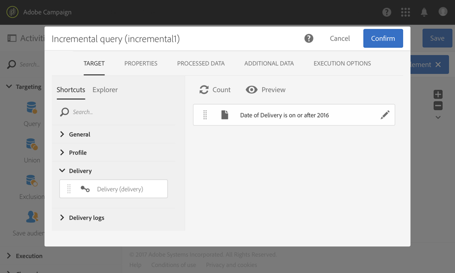
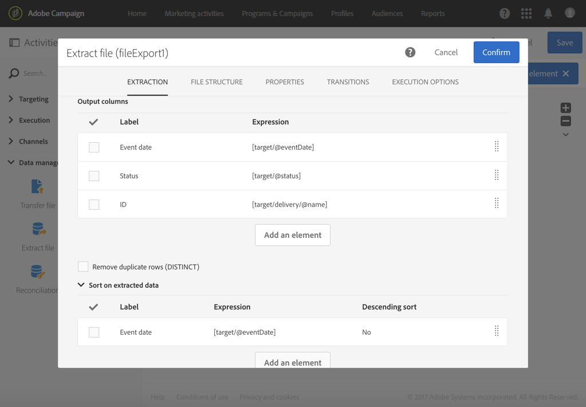
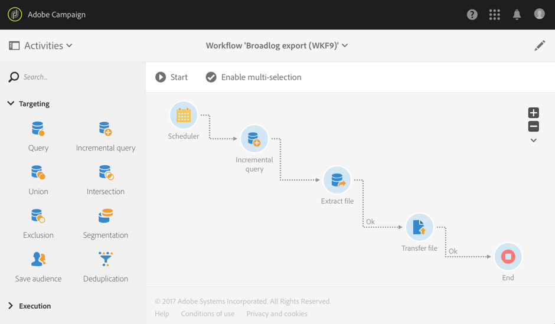

# Exportación de registros{#exporting-logs}

Los datos de registro, tanto si están relacionados con envíos como con suscripciones, se pueden exportar a través de un flujo de trabajo sencillo. Permite analizar los resultados de las campañas en su propia herramienta de creación de informes o inteligencia de negocios.

>[!CAUTION]
>
>Solo los [administradores](../../administration/using/users-management.md#functional-administrators) funcionales con el rol **[!UICONTROL Administration]** y acceso a las unidades **All** pueden acceder a los registros de envío, los registros de mensajes, los registros de seguimiento y los registros de exclusión o suscripción. Un usuario no administrador puede dirigirse a estos registros empezando por una tabla vinculada (perfiles, envío).

Utilizando un(a) **[!UICONTROL Incremental query]** que solo recupera nuevos registros cada vez que se ejecuta el flujo de trabajo y una simple actividad **[!UICONTROL Extract file]** para definir las columnas de salida, puede obtener un archivo con el formato y todos los datos que necesite. A continuación, utilice una actividad **[!UICONTROL Transfer file]** para recuperar el archivo final. Cada ejecución de flujo de trabajo está planificada por un **[!UICONTROL Scheduler]**.

La operación de exportación de registros la pueden realizar los usuarios estándar. Solo un administrador funcional puede administrar recursos privados como: broadlogs, registros de seguimiento, registros de exclusión, registros de suscripción y registros de historial de suscripción en **Perfiles**.

1. Cree un nuevo flujo de trabajo como se detalla en [esta sección](../../automating/using/building-a-workflow.md#creating-a-workflow).
1. Agregue una actividad **[!UICONTROL Scheduler]** y configúrela según sus necesidades. A continuación se muestra un ejemplo de una ejecución mensual.

   

1. Agregue una actividad **[!UICONTROL Incremental query]** y configúrela para que seleccione los registros que necesite. Por ejemplo, para seleccionar todos los broadlogs nuevos o actualizados (registros de envío de perfil):

   * En la ficha **[!UICONTROL Properties]**, cambie el recurso de destino a **Registros de envío** (broadLogRcp).

     

   * En la pestaña **[!UICONTROL Target]**, establezca una condición para recuperar todos los registros de envío que correspondan a envíos realizados en 2016 o posterior. Para obtener más información, consulte la sección [Edición de consultas](../../automating/using/editing-queries.md#creating-queries).

     

   * En la ficha **[!UICONTROL Processed data]**, seleccione **[!UICONTROL Use a date field]** y elija el campo **lastModified**. En las siguientes ejecuciones del flujo de trabajo, solo se recuperan los registros que se hayan modificado o creado después de la última ejecución.

     

     Después de la primera ejecución del flujo de trabajo, puede ver en esta pestaña la última fecha de ejecución que se utiliza en la siguiente ejecución. Se actualiza automáticamente cada vez que se ejecuta el flujo de trabajo. Todavía tiene la posibilidad de anular este valor introduciendo manualmente uno nuevo para que se ajuste a sus necesidades.

1. Agregue una actividad **[!UICONTROL Extract file]** que exportará los datos consultados en un archivo:

   * En la ficha **[!UICONTROL Extraction]**, especifique el nombre del archivo.

     Si selecciona la opción **[!UICONTROL Add date and time to the file name]**, este nombre se completará automáticamente con la fecha de la exportación para garantizar que todos los archivos extraídos sean únicos. Seleccione las columnas que desea exportar en el archivo. Puede seleccionar aquí datos procedentes de recursos relacionados, como información de envío o de perfil.

     >[!NOTE]
     >
     >Para exportar un identificador único para cada registro, seleccione el elemento **[!UICONTROL Delivery log ID]**.

     Para organizar el archivo final, puede aplicar una ordenación. Por ejemplo, en la fecha de registro, como se muestra en el ejemplo siguiente.

     

   * En la ficha **[!UICONTROL File structure]**, defina el formato del archivo de salida para que coincida con sus necesidades.

     Marque la opción **[!UICONTROL Export labels instead of internal values of enumerations]** en caso de exportar valores de enumeración. Esta opción permite recuperar etiquetas más cortas, que son fáciles de entender, en lugar de identificadores.

1. Agregue una actividad **[!UICONTROL Transfer file]** y configúrela para transferir el archivo recién creado del servidor de Adobe Campaign a otra ubicación donde pueda acceder, como un servidor SFTP.

   * En la ficha **[!UICONTROL General]**, seleccione **[!UICONTROL File upload]**, ya que el propósito es enviar el archivo de Adobe Campaign a otro servidor.
   * En la ficha **[!UICONTROL Protocol]**, especifique los parámetros de transferencia y seleccione la [cuenta externa](../../administration/using/external-accounts.md#creating-an-external-account) que desea utilizar.

1. Agregue una actividad **[!UICONTROL End]** para asegurarse de que finaliza correctamente y guarde el flujo de trabajo.

   

Ahora puede ejecutar el flujo de trabajo y recuperar el archivo de salida en el servidor externo.

**Temas relacionados:**

[Flujos de trabajo](../../automating/using/get-started-workflows.md)
