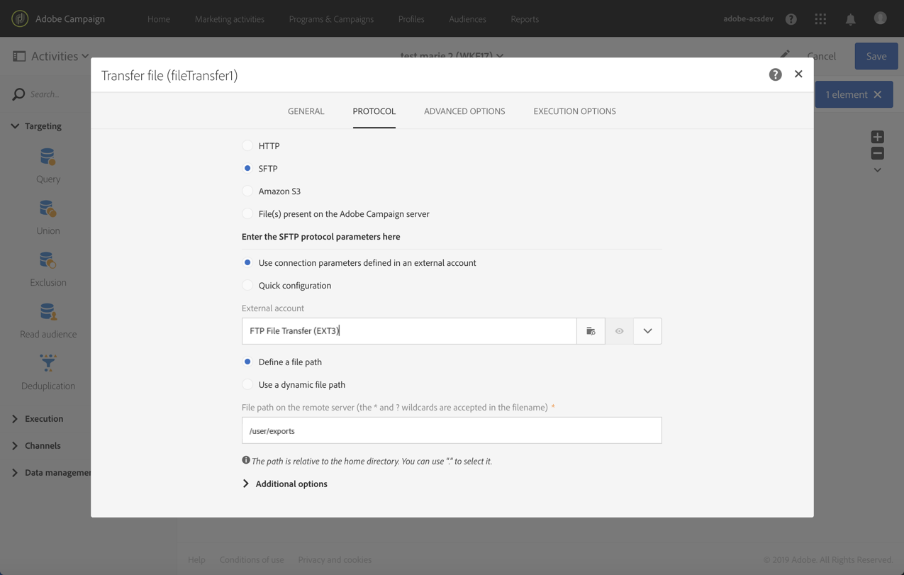

# Exportación de perfiles en un archivo externo {#exporting-profiles-external-file}

El siguiente ejemplo ilustra cómo configurar una **[!UICONTROL Extract file]** actividad después de una **[!UICONTROL Query]** actividad.

El objetivo de este flujo de trabajo es exportar una lista de perfiles en forma de archivo externo para que los datos puedan utilizarse fuera del Adobe Campaign.

1. Arrastre y suelte una actividad de archivo  Extract en el flujo de trabajo y colóquela después de la actividad de [Consulta](../../automating/using/query.md) .

   En este ejemplo, la consulta se realiza en todos los perfiles de 18 a 30 años.

1. Abra la **[!UICONTROL Extract file]** actividad para editarla.
1. Asigne un nombre al archivo de salida.
1. Añadir columnas de salida.

   En este ejemplo, el correo electrónico, la edad, la fecha de nacimiento, el nombre y los apellidos de los perfiles se agregan como columnas de salida.

   

1. Haga clic en la **[!UICONTROL File structure]** ficha para definir:

   * Formato de salida CSV

      

   * Formato de fecha

      

1. Confirme su actividad.
1. Arrastre y suelte una actividad de archivo  Transfer después de la **[!UICONTROL Extract file]** actividad para recuperar el archivo de extracción en una cuenta externa.
1. Abra la actividad y elija la **[!UICONTROL File upload]** acción.

   

1. Seleccione la cuenta externa e introduzca la ruta de la carpeta en el servidor.

   

1. Confirme la actividad y guarde el flujo de trabajo.
1. Inicie el flujo de trabajo.

   Cuando el flujo de trabajo se haya ejecutado correctamente, el archivo extraído estará disponible en la cuenta externa.
