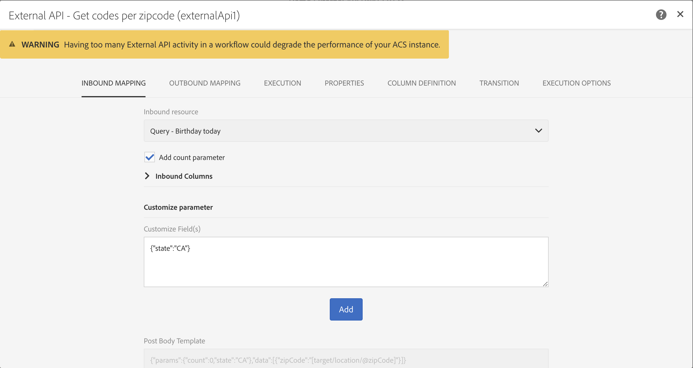

# API externa {#external-api}

## Descripción {#description}

La **[!UICONTROL External API]** actividad introduce datos en el flujo de trabajo desde un sistema **** externo a través de una llamada de API **** HTTP.

Los extremos externos del sistema pueden ser extremos de API públicos, sistemas de administración de clientes o instancias de aplicaciones sin servidor (por ejemplo, [Adobe I/O Runtime](https://www.adobe.io/apis/experienceplatform/runtime.html)), por mencionar algunas categorías.

>[!NOTE]
>
>Por motivos de seguridad, el uso de JSSP no es compatible con Campaign Standard. Si necesita ejecutar código, puede llamar a una instancia de Adobe I/O Runtime a través de la actividad de API externa.

Las principales características de esta actividad son:

* Capacidad para pasar datos en formato JSON a un extremo de API REST de terceros
* Capacidad para recibir una respuesta JSON, asignarla a tablas de salida y pasar a otras actividades de flujo de trabajo.
* Administración de errores con una transición específica de salida

### Transición de Beta a GA {#from-beta-to-ga}

Con la versión Campaign Standard 20.3, la capacidad de API externa ha pasado de la versión beta a la versión general de disponibilidad (GA).

Como consecuencia, si estuviera utilizando actividades de API externas beta, debe reemplazarlas con actividades de API externas de GA en todos los flujos de trabajo.  Los Flujos de trabajo que utilizan la versión beta de la API externa dejarán de funcionar a partir de la versión 20.3.

Al reemplazar actividades de API externas, agregue la nueva actividad de API externa al flujo de trabajo, copie manualmente los detalles de configuración y, a continuación, elimine la actividad antigua.

>[!NOTE]
>
>No podrá copiar los valores del encabezado sobre los valores del encabezado ya que están enmascarados dentro de la actividad.

A continuación, vuelva a configurar otras actividades en el flujo de trabajo que apunten a la actividad de la API externa beta y/o utilicen datos de ella para que apunten a la nueva actividad de la API externa o los utilicen en su lugar. Ejemplos de actividades: envío de correo electrónico (campos de personalización), actividad de enriquecimiento, etc.

### Limitaciones y barandillas {#guardrails}

Para esta actividad se han establecido las siguientes barreras:

* Límite de tamaño de datos de respuesta http de 50 MB
* El tiempo de espera de la solicitud es de 10 minutos
* No se permiten redirecciones HTTP
* Se rechazan las direcciones URL que no son HTTPS
* &quot;Aceptar: application/json&quot; y &quot;Content-Type: el encabezado de respuesta &quot;application/json&quot; está permitido

>[!CAUTION]
>
>Tenga en cuenta que la actividad está diseñada para obtener datos de toda la campaña (último conjunto de ofertas, puntuaciones más recientes, etc.), no para recuperar información específica para cada perfil, ya que esto puede resultar en la transferencia de grandes cantidades de datos. Si el caso de uso lo requiere, se recomienda utilizar la actividad [Transferir archivo](../../automating/using/transfer-file.md) .

Se han establecido medidas de protección específicas para el JSON:

* **Profundidad** máxima de JSON: limitar la profundidad máxima de un JSON personalizado anidado que se puede procesar a 10 niveles.
* **Longitud** máxima de clave JSON: limitar la longitud máxima de la clave interna generada a 255. Esta clave está asociada con el ID de columna.
* **Se permiten** las claves de Duplicado máximas de JSON:  limitar el número total máximo de nombres de propiedades JSON de duplicado, que se utilizan como ID de columna, a 150.

La actividad no es compatible con la estructura JSON como:

* Combinación de objetos de matriz con otros elementos que no son de matriz
* El objeto de matriz JSON está anidado en uno o varios objetos de matriz intermedios.

## Configuración {#configuration}

Arrastre y suelte una **[!UICONTROL External API]** actividad en el flujo de trabajo y abra la actividad para inicio de la configuración.

### Asignación de entrada

La asignación entrante es una tabla temporal generada por una actividad entrante anterior que se mostrará y enviará como JSON en la interfaz de usuario.
En función de esta tabla temporal, el usuario puede realizar modificaciones en los datos de entrada.

La lista desplegable Recurso **** entrante permite seleccionar la actividad de consulta que creará la tabla temporal.

La casilla de verificación **Añadir parámetro** de recuento agregará un valor de recuento para cada fila proveniente de la tabla temporal. Tenga en cuenta que esta casilla de verificación solo está disponible si la actividad entrante está generando una tabla temporal.

La sección Columnas **de** entrada permite al usuario agregar cualquier campo de la tabla de transición de entrada. Las columnas seleccionadas serán las claves del objeto de datos. El objeto de datos del JSON será una lista de matriz que contenga datos para las columnas seleccionadas de cada fila de la tabla de transición entrante.

El cuadro de texto **personalizar parámetro** le permite agregar un JSON válido con los datos adicionales que necesita la API externa. Estos datos adicionales se agregarán al objeto params en el JSON generado.

### Asignación de salida

Esta ficha le permite definir la estructura **de** JSON de muestra devuelta por la llamada de API.

El analizador JSON está diseñado para admitir tipos de patrones de estructura JSON estándar, con algunas excepciones. Un ejemplo de patrón estándar es:`{“data”:[{“key”:“value”}, {“key”:“value”},...]}`

La definición JSON de muestra debe tener las **siguientes características**:

* **Los elementos** de matriz deben contener propiedades de primer nivel (no se admiten niveles más profundos).
   **Los nombres** de propiedades terminarán convirtiéndose en nombres de columna para el esquema de salida de la tabla temporal de salida.
* **Los elementos** JSON que se van a capturar deben tener 10 niveles o menos de anidación dentro de la respuesta JSON.
* **La definición del nombre** de columna se basa en el primer elemento de la matriz de &quot;datos&quot;.
La definición de columnas (agregar/quitar) y el valor de tipo de la propiedad se pueden editar en la ficha Definición **de** columna.

**Acoplar el comportamiento de la casilla de verificación** :

Casilla Acoplar (predeterminada: sin marcar) para indicar si desea acoplar el JSON a un mapa clave/valor o no.

* Cuando la **casilla de verificación está deshabilitada** (sin marcar), el JSON de muestra se analizará para buscar un objeto de matriz. El usuario deberá proporcionar una versión recortada del formato JSON de muestra de respuesta de API para que Adobe Campaign pueda determinar exactamente qué matriz le interesa utilizar. En el momento de la creación del flujo de trabajo, se determinará y registrará la ruta al objeto de matriz anidado, de modo que se pueda utilizar en el momento de la ejecución para acceder a ese objeto de matriz desde el cuerpo de respuesta JSON recibido de la llamada de API.

* Cuando la **casilla de verificación está activada** (activada), el JSON de muestra se acoplará y todas las propiedades especificadas en el JSON de muestra proporcionado se utilizarán para crear columnas de la tabla temporal de salida y se mostrarán en la ficha Definiciones de columna. Tenga en cuenta que si hay algún objeto de matriz en el JSON de muestra, también se acoplarán todos los elementos de esos objetos de matriz.

Si se valida **el** análisis, aparece un mensaje que le invita a personalizar la asignación de datos en la ficha &quot;Definición de columna&quot;. En otros casos, se muestra un mensaje de error.

### Ejecución

Esta ficha permite definir el extremo **** HTTPS que enviará datos a ACS. Si es necesario, puede introducir la información de autenticación en los campos siguientes.

### Propiedades

Esta ficha le permite controlar las propiedades **** generales de la actividad de API externa, como la que se muestra en la interfaz de usuario. El ID interno no se puede personalizar.

### Definición de columna

>[!NOTE]
>
>Esta ficha aparece cuando se completa y valida el formato **de datos de** respuesta en la ficha Asignación de salida.

La ficha Definición **de** columna permite especificar con precisión la estructura de datos de cada columna para importar datos que no contengan errores y hacer que coincidan con los tipos que ya están presentes en la base de datos de Adobe Campaign para futuras operaciones.

Por ejemplo, puede cambiar la etiqueta de una columna y seleccionar su tipo (cadena, entero, fecha, etc.) o incluso especificar el procesamiento de errores.

For more information, refer to the [Load File](../../automating/using/load-file.md) section.

### Transición

Esta ficha le permite activar la transición **** saliente y su etiqueta. Esta transición específica resulta útil en caso de **tiempo de espera** o si la carga útil supera el límite **de tamaño de** datos.

### Opciones de ejecución

Esta ficha está disponible en la mayoría de las actividades de flujo de trabajo. Para obtener más información, consulte la sección Propiedades [de la](../../automating/using/executing-a-workflow.md#activity-properties) Actividad.

## Resolución de problemas

Se han agregado dos tipos de mensajes de registro a esta nueva actividad de flujo de trabajo: información y errores. Pueden ayudarle a solucionar problemas potenciales.

### Información

Estos mensajes de registro se utilizan para registrar información sobre puntos de comprobación útiles durante la ejecución de la actividad de flujo de trabajo. Específicamente, los siguientes mensajes de registro se utilizan para registrar el primer intento, así como un intento de reintento (y el motivo del error en el primer intento) para acceder a la API.

<table> 
 <thead> 
  <tr> 
   <th> Formato del mensaje  </th> 
   <th> Ejemplo  </th> 
  </tr> 
 </thead> 
 <tbody> 
  <tr> 
   <td> Invocando dirección URL de API '%s'.</td> 
   <td> 
Invocando la dirección URL de la API 'https://example.com/api/v1/web-coupon?count=2'.
</td> 
  </tr> 
  <tr> 
   <td> Reintentando la dirección URL de la API '%s', error en el intento anterior ('%s').</td> 
   <td> 
Reintentando la URL de la API 'https://example.com/api/v1/web-coupon?count=2', error en el intento anterior ('HTTP - 401').
</td>
  </tr> 
  <tr> 
   <td> Transfiriendo contenido de '%s' (%s / %s).</td> 
   <td> 
Transferencia de contenido desde 'https://example.com/api/v1/web-coupon?count=2' (1234 / 1234).
</td> 
  </tr>
 </tbody> 
</table>

### Errores

Estos mensajes de registro se utilizan para registrar información sobre las condiciones de error inesperadas, lo que puede provocar que la actividad del flujo de trabajo falle.

<table> 
 <thead> 
  <tr> 
   <th> Código - Formato del mensaje  </th> 
   <th> Ejemplo  </th> 
  </tr> 
 </thead> 
 <tbody> 
  <tr> 
   <td> WKF-560250 - Se ha superado el límite del cuerpo de la solicitud de API (límite: '%d').</td> 
   <td> 
Se excedió el límite del cuerpo de la solicitud de API (límite: '5242880').
</td> 
  </tr> 
  <tr> 
   <td> WKF-560239: respuesta de API superada límite (límite: '%d').</td> 
   <td> 
Se ha superado el límite de respuesta de API (límite: 5242880').
</td> 
  </tr> 
  <tr> 
   <td> WKF-560245 - No se pudo analizar la dirección URL de la API (error: '%d').</td> 
   <td> 
No se pudo analizar la dirección URL de la API (error: '-2010').

   
 Nota: Este error se registra cuando la dirección URL de la API falla en las reglas de validación.
</td>
  </tr> 
  <tr>
   <td> WKF-560244 - El host de URL de API no debe ser 'localhost' ni literal de dirección IP (host de URL: '%s').</td> 
   <td> 
El host de URL de API no debe ser 'localhost' ni literal de dirección IP (host de URL: 'localhost').

    
El host de URL de API no debe ser 'localhost' ni literal de dirección IP (host de URL: "192.168.0.5").

    
El host de URL de API no debe ser 'localhost' ni literal de dirección IP (host de URL: '[2001]').
</td>
  </tr> 
  <tr> 
   <td> WKF-560238 - La dirección URL de la API debe ser una dirección URL segura (https) (dirección URL solicitada: '%s').</td> 
   <td> 
La dirección URL de API debe ser una dirección URL segura (https) (dirección URL solicitada: "https://example.com/api/v1/web-coupon?count=2').
</td> 
  </tr> 
  <tr> 
   <td> WKF-560249 - Error al crear el cuerpo de solicitud JSON. Error al agregar '%s'.</td> 
   <td> 
No se pudo crear el cuerpo de solicitud JSON. Error al agregar 'params'.

    
No se pudo crear el cuerpo de solicitud JSON. Error al agregar 'datos'.
</td>
  </tr> 
  <tr> 
   <td> WKF-560246 - La clave de encabezado HTTP es incorrecta (clave de encabezado: '%s').</td> 
   <td> 
La clave de encabezado HTTP es mala (clave de encabezado: '%s').

   
 Nota: Este error se registra cuando la clave de encabezado personalizada falla en la validación según <a href="https://tools.ietf.org/html/rfc7230#section-3.2.html">RFC</a>
</td> 
  </tr>
 <tr> 
   <td> WKF-560248 - No se permite la clave de encabezado HTTP (clave de encabezado: '%s').</td> 
   <td> 
No se permite la clave de encabezado HTTP (clave de encabezado: 'Accept').
</td> 
  </tr> 
  <tr> 
   <td> WKF-560247 - El valor del encabezado AHTTP es incorrecto (valor del encabezado: '%s').</td> 
   <td> 
El valor del encabezado HTTP es malo (valor del encabezado: '%s'). 

    
Nota: Este error se registra cuando el valor del encabezado personalizado falla en la validación según <a href="https://tools.ietf.org/html/rfc7230#section-3.2.html">RFC</a>
</td> 
  </tr> 
  <tr> 
   <td> WKF-560240 - La carga útil JSON tiene una propiedad incorrecta '%s'.</td> 
   <td> 
La carga útil de JSON tiene una propiedad 'blah' incorrecta.
</td>
  </tr> 
  <tr>
   <td> WKF-560241 - Formato JSON incorrecto o inaceptable.</td> 
   <td> 
Formato JSON incorrecto o formato inaceptable.

   
Nota: Este mensaje solo se aplica al análisis del cuerpo de respuesta desde la API externa y se registra al intentar validar si el cuerpo de respuesta se ajusta al formato JSON establecido por esta actividad.
</td>
  </tr>
  <tr> 
   <td> WKF-560246 - Error de Actividad (motivo: '%s').</td> 
   <td> 
Cuando falla la actividad debido a la respuesta de error HTTP 401: error de Actividad (motivo: 'HTTP - 401')

        
Cuando falla la actividad debido a una llamada interna fallida: error de Actividad (motivo: 'Rc - -Nn').

        
Cuando falla la actividad debido a un encabezado Content-Type no válido. - Error de Actividad (motivo: 'Content-Type - application/html').
</td> 
  </tr>
 </tbody> 
</table>

<!--
## Example: Managing coupons with External API Activity

This example illustrates how to **add coupon value** retrieving by a REST call to profiles and then sending an email containing these coupon values.

The workflow is presented as follows:

1. Drag and drop an **External API** activity
    1. Parse the JSON sample responsa as {"data":[{"code":"value"}]}.
    1. Add the **Rest endpoint URL** and define authentication setting if needed
    
    1. In the **column definition** tab, add a new column called **code** that will store the code value.
        
    1. Enabled an **outbound transition** to manage request failures.
1. Drag and drop a **Query** activity
    1. Configure the **Target** tab to query all the **@adobe.com** email. For different Query samples, refer to the [Query](../../automating/using/query.md) section.
    1. In the **additional data** tab, add a new column based on **rowId()** function. This additional column allows you to reconciliate coupon code with the profile ID..
        

        >[!NOTE]
        >
        >This reconciliation approach means that the profile query number is equal to the number of coupon values returned by the REST call.
1. Once this two activities are configured, drag and drop an **Enrichment** activity to associate coupon values with profiles.
    1. Select the previous Query activity in the **primarySet** field.
        
    1. Create a new relation in the **Advanced relations** tab, and add the following reconciliation criteria:
    1. **@expr1** coming grom the Query activity in the source expression field.
    1. **@lineNum** as an expression that returns the line number for each coupon value in the destination field.
        
        More information on the enrichment activity are available [here](../../automating/using/enrichment.md)

    1. The transition **Data Structure** will contain:
        
1. Finally drag and drop a **Send via Email** activity.
    You can modify your email template by adding the **code** personnalized field.

-->
