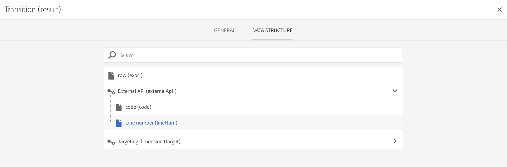

# API externa {#external-api}

## Descripción {#description}

La actividad de **[!UICONTROL External API]** introduce datos en el flujo de trabajo desde un **sistema externo** a través de una llamada de **API HTTP**.

Los extremos externos del sistema pueden ser extremos de API públicos, sistemas de administración de clientes o instancias de aplicaciones sin servidor (por ejemplo, [Adobe I/O Runtime](https://www.adobe.io/apis/experienceplatform/runtime.html)), por mencionar algunas categorías.

>[!NOTE]
>
>Por motivos de seguridad, el uso de JSSP no es compatible con Campaign Standard. Si necesita ejecutar código, puede llamar a una instancia de Adobe I/O Runtime a través de la actividad de API externa.

Las principales características de esta actividad son:

* Capacidad para pasar datos en formato JSON a un extremo de API de REST de terceros.
* Capacidad para recibir una respuesta JSON, asignarla a tablas de salida y pasar a otras actividades de flujo de trabajo.
* Administración de errores con una transición específica de salida.

### Transición de beta a GA {#from-beta-to-ga}

Con la versión Campaign Standard 20.3, la funcionalidad de API externa ha pasado de la versión beta a la versión general de disponibilidad (GA).

>[!CAUTION]
>
>Como consecuencia, si estuviera utilizando actividades de API externas beta, debe reemplazarlas con actividades de API externas de GA en todos los flujos de trabajo.  Los flujos de trabajo que utilizan la versión beta de la API externa dejarán de funcionar a partir de la versión 20.3.

Al reemplazar actividades de API externas, añada la nueva actividad de API externa al flujo de trabajo, copie manualmente los detalles de configuración y, a continuación, elimine la actividad antigua.

>[!NOTE]
>
>No podrá copiar sobre los valores del encabezado, ya que están enmascarados dentro de la actividad.

A continuación, vuelva a configurar otras actividades en el flujo de trabajo que apunten a la actividad de la API externa beta o utilicen datos de ella para que apunten a la nueva actividad de la API externa o los utilicen en su lugar. Ejemplos de actividades: envío de correo electrónico (campos de personalización), actividad de enriquecimiento, etc.

### Limitaciones y barreras {#guardrails}

Esta actividad se rige por las siguientes medidas de protección:

* Límite de tamaño de datos de respuesta http de 50 MB (se recomiendan 5 MB)
* El tiempo de espera de la solicitud es de 10 minutos.
* No se permiten redirecciones HTTP.
* Se rechazan las direcciones URL que no son HTTPS.
* Están permitidos el encabezado de solicitud “Accept: application/json” y el encabezado de respuesta “Content-Type: application/json”.

>[!NOTE]
>
>A partir de la versión 20.4 de Campaña, el límite de tamaño de datos de respuesta http y las protecciones de tiempo de espera de respuesta se reducirán a 5 MB y 1 minuto, respectivamente.  Aunque este cambio solo afectará a las nuevas actividades de API externas, se recomienda enfáticamente que las implementaciones actuales de la actividad de API externa se alineen con estas nuevas protecciones para seguir las optimizaciones.

Se han establecido medidas de protección específicas para archivos JSON:

* **Profundidad máxima de JSON**: limitar la profundidad máxima de un archivo JSON personalizado anidado que se puede procesar a 10 niveles.
* **Longitud máxima de clave JSON**: limitar la longitud máxima de la clave interna generada a 255. Esta clave está asociada al ID de columna.
* **Se permiten las claves de duplicado máximas de JSON**: limitar el número total máximo de nombres de propiedades JSON de duplicado, que se utilizan como ID de columna, a 150.

La actividad no es compatible con la estructura JSON como:

* Combinación de objetos de matriz con otros elementos que no son de matriz.
* El objeto de matriz JSON está anidado en uno o varios objetos de matriz intermedios.

>[!CAUTION]
>
>La actividad de API externa está pensada para obtener datos de toda la campaña (último conjunto de ofertas, puntuaciones más recientes, etc.), no para recuperar información específica para cada perfil, ya que esto puede resultar en la transferencia de grandes cantidades de datos. Si fuera necesario, se recomienda utilizar la actividad [Transferir archivo](../../automating/using/transfer-file.md).

## Configuración {#configuration}

Arrastre y suelte una actividad de **[!UICONTROL External API]** en el flujo de trabajo y ábrala para comenzar con la configuración.

### Asignación de entrada

La asignación de entrada es una tabla temporal generada por una actividad de entrada anterior que se muestra y envía como JSON en la interfaz de usuario.
En función de esta tabla temporal, el usuario puede realizar modificaciones en los datos de entrada.

La lista desplegable **Recurso de entrada** permite seleccionar la actividad de consulta que crea la tabla temporal.

La casilla de verificación **Añadir parámetro de recuento** añade un valor de recuento para cada fila proveniente de la tabla temporal. Tenga en cuenta que esta casilla de verificación solo está disponible si la actividad de entrada genera una tabla temporal.

La sección **Columnas de entrada** permite al usuario añadir cualquier campo de la tabla de transición de entrada. Las columnas seleccionadas son las claves del objeto de datos. El objeto de datos en el archivo JSON es una lista de matriz que contiene datos para las columnas seleccionadas de cada fila de la tabla de transición de entrada.

El cuadro de texto **Personalizar parámetro** le permite añadir un archivo JSON válido con los datos adicionales que necesita la API externa. Estos datos adicionales se añaden al objeto parámetros en el archivo JSON generado.

### Asignación de salida

Esta pestaña le permite definir la **estructura JSON** de muestra devuelta por la llamada de API.

El analizador JSON está diseñado para admitir tipos de patrones de estructura JSON estándar, con algunas excepciones. Un ejemplo de patrón estándar es: `{“data”:[{“key”:“value”}, {“key”:“value”},...]}`

La definición JSON de muestra debe tener las **siguientes características**:

* **Los elementos de matriz** deben contener propiedades de primer nivel (no se admiten niveles más profundos).
   **Los nombres de propiedades** terminan convirtiéndose en nombres de columna para el esquema de salida de la tabla temporal.
* **Los elementos JSON** que se van a recopilar deben tener 10 niveles o menos de anidación dentro de la respuesta JSON.
* **La definición del nombre de columna** se basa en el primer elemento de la matriz de “datos”.
La definición de columnas (añadir/quitar) y el valor de tipo de la propiedad se pueden editar en la pestaña **Definición de columna**.

El comportamiento de la **casilla Acoplar**:

La casilla Acoplar (sin marcar por defecto) sirve para indicar si desea acoplar el archivo JSON a un mapa de clave/valor o no.

* Cuando la **casilla de verificación está desactivada** (sin marcar), el archivo JSON de muestra se analiza para buscar un objeto de matriz. El usuario debe proporcionar una versión recortada como muestra de la respuesta de API en formato JSON para que Adobe Campaign pueda determinar exactamente qué matriz le interesa utilizar. En el momento de la creación del flujo de trabajo, se determina y registra la ruta al objeto de matriz anidado, de modo que se pueda utilizar en el momento de la ejecución para acceder a ese objeto de matriz desde el cuerpo de respuesta JSON recibido de la llamada de API.

* Cuando la **casilla de verificación está activada** (marcada), el archivo JSON de muestra se acopla y todas las propiedades especificadas en el archivo de muestra proporcionado se utilizan para crear columnas de la tabla temporal de salida y se muestran en la pestaña Definiciones de columna. Tenga en cuenta que si hay algún objeto de matriz en el archivo JSON de muestra, también se acoplan todos los elementos de esos objetos de matriz.

Si se **valida el análisis**, aparece un mensaje que le invita a personalizar la asignación de datos en la pestaña “Definición de columna”. En otros casos, se muestra un mensaje de error.

### Ejecución

Esta pestaña permite definir el **extremo HTTPS** que envía datos a ACS. Si es necesario, puede introducir la información de autenticación en los campos siguientes.

### Propiedades

Esta pestaña le permite controlar las **propiedades generales** de la actividad de API externa, como las que se muestran en la interfaz de usuario. El ID interno no se puede personalizar.

### Definición de columna

>[!NOTE]
>
>Esta pestaña aparece cuando se completa y valida el **formato de datos de respuesta** en la pestaña Asignación de salida.

La pestaña **Definición de columna** le permite especificar con precisión la estructura de datos de cada columna para importar datos que no contengan errores y hacer que coincidan con los tipos que ya están presentes en la base de datos de Adobe Campaign para futuras operaciones.

Por ejemplo, puede cambiar la etiqueta de una columna y seleccionar su tipo (cadena, entero, fecha, etc.) o incluso especificar el procesamiento de errores.

Para obtener más información, consulte la sección [Cargar archivo](../../automating/using/load-file.md).

### Transición

Esta pestaña le permite activar la **transición de salida** y su etiqueta. Esta transición específica resulta útil en caso de **tiempo de espera** o si la carga supera el **límite de tamaño de datos**.

### Opciones de ejecución

Esta pestaña está disponible en la mayoría de las actividades de flujo de trabajo. Para obtener más información, consulte la sección [Propiedades de actividad](../../automating/using/activity-properties.md).

## Resolución de problemas

Se han añadido dos tipos de mensajes de registro a esta nueva actividad de flujo de trabajo: información y errores. Pueden ayudarle a solucionar problemas potenciales.

### Información

Estos mensajes de registro se utilizan para registrar información sobre puntos de comprobación útiles durante la ejecución de la actividad del flujo de trabajo. Específicamente, los siguientes mensajes de registro se utilizan para registrar el primer intento, así como un intento de reintento (y el motivo del error en el primer intento) para acceder a la API.

<table> 
 <thead> 
  <tr> 
   <th> Formato del mensaje  </th> 
   <th> Ejemplo  </th> 
  </tr> 
 </thead> 
 <tbody> 
  <tr> 
   <td> Invocando dirección URL de API “%s”.</td> 
   <td> 
Invocando la dirección URL de la API “https://example.com/api/v1/web-coupon?count=2”.
</td> 
  </tr> 
  <tr> 
   <td> Reintentando la dirección URL de la API “%s”, error en el intento anterior (“%s”).</td> 
   <td> 
Reintentando la URL de la API “https://example.com/api/v1/web-coupon?count=2”, error en el intento anterior (“HTTP - 401”).
</td>
  </tr> 
  <tr> 
   <td> Transfiriendo contenido de “%s” (%s / %s).</td> 
   <td> 
Transferencia de contenido desde “https://example.com/api/v1/web-coupon?count=2” (1234 / 1234).
</td> 
  </tr>
 </tbody> 
</table>

### Errores

Estos mensajes de registro se utilizan para registrar información sobre las condiciones de error inesperadas, lo que puede provocar que la actividad del flujo de trabajo falle.

<table> 
 <thead> 
  <tr> 
   <th> Código: formato del mensaje  </th> 
   <th> Ejemplo  </th> 
  </tr> 
 </thead> 
 <tbody> 
  <tr> 
   <td> WKF-560250: se ha superado el límite del cuerpo de la solicitud de API (límite: “%d”).</td> 
   <td> 
Se ha superado el límite del cuerpo de la solicitud de API (límite: “5242880”).
</td> 
  </tr> 
  <tr> 
   <td> WKF-560239: se ha superado el límite de respuesta de API (límite: “%d”).</td> 
   <td> 
Se ha superado el límite de respuesta de API (límite: “5242880”).
</td> 
  </tr> 
  <tr> 
   <td> WKF-560245: no se ha podido analizar la dirección URL de la API (error: “%d”).</td> 
   <td> 
No se ha podido analizar la dirección URL de la API (error: “-2010”).

   
 Nota: Este error se registra cuando la dirección URL de la API falla en las reglas de validación.
</td>
  </tr> 
  <tr>
   <td> WKF-560244: el host de URL de API no debe ser “localhost” ni literal de dirección IP (host de URL: “%s”).</td> 
   <td> 
El host de URL de API no debe ser “localhost” ni literal de dirección IP (host de URL: “localhost”).

    
El host de URL de API no debe ser “localhost” ni literal de dirección IP (host de URL: “192.168.0.5”).

    
El host de URL de API no debe ser “localhost” ni literal de dirección IP (host de URL: “[2001]”).
</td>
  </tr> 
  <tr> 
   <td> WKF-560238: la dirección URL de API debe ser una dirección URL segura (https) (dirección URL solicitada: “%s”).</td> 
   <td> 
La dirección URL de API debe ser una dirección URL segura (https) (dirección URL solicitada: “https://example.com/api/v1/web-coupon?count=2”).
</td> 
  </tr> 
  <tr> 
   <td> WKF-560249: error al crear el cuerpo de la solicitud JSON. Error al añadir “%s”.</td> 
   <td> 
No se ha podido crear el cuerpo de la solicitud JSON. Error al añadir “parámetros”.

    
No se ha podido crear el cuerpo de la solicitud JSON. Error al añadir “datos”.
</td>
  </tr> 
  <tr> 
   <td> WKF-560246: la clave de encabezado HTTP no es correcta (clave de encabezado: “%s”).</td> 
   <td> 
La clave de encabezado HTTP no es correcta (clave de encabezado: “%s”).

   
 Nota: Este error se registra cuando la clave de encabezado personalizada falla en la validación según <a href="https://tools.ietf.org/html/rfc7230#section-3.2.html">RFC</a>.
</td> 
  </tr>
 <tr> 
   <td> WKF-560248: no se permite la clave de encabezado HTTP (clave de encabezado: “%s”).</td> 
   <td> 
No se permite la clave de encabezado HTTP (clave de encabezado: “Accept”).
</td> 
  </tr> 
  <tr> 
   <td> WKF-560247: el valor del encabezado AHTTP no es correcto (valor del encabezado: “%s”).</td> 
   <td> 
El valor del encabezado HTTP no es correcto (valor del encabezado: “%s”). 

    
Nota: Este error se registra cuando el valor del encabezado personalizado falla en la validación según <a href="https://tools.ietf.org/html/rfc7230#section-3.2.html">RFC</a>.
</td> 
  </tr> 
  <tr> 
   <td> WKF-560240: la carga JSON tiene una propiedad “%s” incorrecta.</td> 
   <td> 
La carga de JSON tiene una propiedad “blah” incorrecta.
</td>
  </tr> 
  <tr>
   <td> WKF-560241: formato JSON no correcto o no compatible.</td> 
   <td> 
Formato JSON no correcto o no compatible.

   
Nota: Este mensaje solo se aplica al análisis del cuerpo de respuesta desde la API externa y se registra al intentar validar si el cuerpo de respuesta se ajusta al formato JSON establecido por esta actividad.
</td>
  </tr>
  <tr> 
   <td> WKF-560246: error de actividad (motivo: “%s”).</td> 
   <td> 
Cuando falla la actividad debido a la respuesta de error HTTP 401: error de actividad (motivo: “HTTP - 401”)

        
Cuando falla la actividad debido a una llamada interna fallida: error de actividad (motivo: “iRc - -Nn”).

        
Cuando falla la actividad debido a un encabezado de Content-Type no válido: error de actividad (motivo: “Content-Type - application/html”).
</td> 
  </tr>
 </tbody> 
</table>

<!--
## Example: Managing coupons with External API Activity

This example illustrates how to **add coupon value** retrieving by a REST call to profiles and then sending an email containing these coupon values.

The workflow is presented as follows:

1. Drag and drop an **External API** activity
    1. Parse the JSON sample responsa as {"data":[{"code":"value"}]}.
    1. Add the **Rest endpoint URL** and define authentication setting if needed
    
    1. In the **column definition** tab, add a new column called **code** that will store the code value.
        
    1. Enabled an **outbound transition** to manage request failures.
1. Drag and drop a **Query** activity
    1. Configure the **Target** tab to query all the **@adobe.com** email. For different Query samples, refer to the [Query](../../automating/using/query.md) section.
    1. In the **additional data** tab, add a new column based on **rowId()** function. This additional column allows you to reconciliate coupon code with the profile ID..
        

        >[!NOTE]
        >
        >This reconciliation approach means that the profile query number is equal to the number of coupon values returned by the REST call.
1. Once this two activities are configured, drag and drop an **Enrichment** activity to associate coupon values with profiles.
    1. Select the previous Query activity in the **primarySet** field.
        
    1. Create a new relation in the **Advanced relations** tab, and add the following reconciliation criteria:
    1. **@expr1** coming grom the Query activity in the source expression field.
    1. **@lineNum** as an expression that returns the line number for each coupon value in the destination field.
        
        More information on the enrichment activity are available [here](../../automating/using/enrichment.md)

    1. The transition **Data Structure** will contain:
        
1. Finally drag and drop a **Send via Email** activity.
    You can modify your email template by adding the **code** personnalized field.

-->
