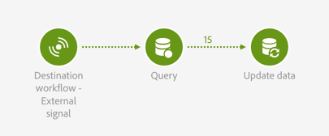

# Señal externa{#external-signal}

## Descripción {#description}


La **[!UICONTROL External signal]** actividad desencadena un flujo de trabajo cuando algunas condiciones se cumplen correctamente en otro flujo de trabajo o desde una llamada a la API de REST.

## Contexto de uso {#context-of-use}

La **[!UICONTROL External signal]** actividad se utiliza para organizar y orquestar diferentes procesos que forman parte del mismo proceso del cliente en diferentes flujos de trabajo. Permite iniciar un flujo de trabajo desde otro, lo que permite soportar viajes de clientes más complejos, al tiempo que se puede supervisar y reaccionar mejor en caso de problemas.

La **[!UICONTROL External signal]** actividad está diseñada para colocarse como la primera actividad de un flujo de trabajo. Se puede activar a partir de la **[!UICONTROL End]** actividad de otro flujo de trabajo o de una llamada a la API de REST (para obtener más información sobre esto, consulte la documentación [de la](../../api/using/managing-workflows.md)API).

Al activarse, los parámetros externos se pueden definir y estar disponibles en las variables de eventos de flujo de trabajo. El proceso para llamar a un flujo de trabajo con parámetros externos se detalla en [esta sección](../../automating/using/calling-a-workflow-with-external-parameters.md).

>[!NOTE]
>
>La actividad no se puede activar con más frecuencia que cada 10 minutos.

Tenga en cuenta que una **[!UICONTROL External signal]** actividad se puede activar desde varios eventos diferentes. En ese caso, el **[!UICONTROL External signal]** se activa en cuanto se ejecuta uno de los flujos de trabajo de origen o la llamada de API. No es necesario que todos los flujos de trabajo de origen hayan finalizado.

## Configuración {#configuration}

Al configurar una señal externa, es importante configurar primero la actividad en el flujo de trabajo de destino **[!UICONTROL External signal]** . Una vez finalizada esta configuración, la actividad de este flujo de trabajo estará disponible para configurar la **[!UICONTROL External signal]** **[!UICONTROL End]** actividad del flujo de trabajo de origen.

1. Arrastre y suelte una **[!UICONTROL External signal]** actividad en el flujo de trabajo de destino.
1. Seleccione la actividad y, a continuación, ábrala con el  botón de las acciones rápidas que aparecen.
1. Edite la etiqueta de la actividad. Esta etiqueta es necesaria al configurar el flujo de trabajo de origen que activa el **[!UICONTROL External signal]**.

   Si desea llamar al flujo de trabajo con parámetros, utilice el **[!UICONTROL Parameters]** área para declararlos. Para obtener más información, consulte [esta sección](../../automating/using/calling-a-workflow-with-external-parameters.md#declaring-the-parameters-in-the-external-signal-activity).

   

1. Confirme la configuración de la actividad, agregue cualquier otra actividad que necesite y guarde el flujo de trabajo.

   >[!NOTE]
   >
   >Si desea activar el flujo de trabajo de destino desde otro flujo de trabajo, siga los pasos siguientes. Si desea activar el flujo de trabajo de destino desde una llamada a la API de REST, consulte la documentación [de la](../../api/using/managing-workflows.md) API para obtener más información.

1. Abra el flujo de trabajo de origen y seleccione una **[!UICONTROL End]** actividad. Si no hay ninguna **[!UICONTROL End]** actividad disponible, agregue una después de la última actividad de una rama del flujo de trabajo.

   Algunas actividades no tienen ninguna transición de salida de forma predeterminada. Desde la **[!UICONTROL Properties]** ficha de estas actividades, puede agregar una transición de salida.

   Por ejemplo, en una **[!UICONTROL Update data]** actividad, vaya a la **[!UICONTROL Transitions]** ficha y marque la **[!UICONTROL Add an outbound transition without the population]** opción. Esta opción permite agregar una transición que no contenga datos y que no consuma espacio innecesario en el sistema. Solo se utiliza para conectar la actividad adicional **[!UICONTROL End]** que activa el flujo de trabajo de destino.

   

1. En la **[!UICONTROL External signal]** ficha de la **[!UICONTROL End]** actividad, seleccione el flujo de trabajo de destino, así como la **[!UICONTROL External signal]** actividad que se activará en ese flujo de trabajo.

   Cuando se establece una **[!UICONTROL End]** actividad para activar otro flujo de trabajo, su icono se actualiza con un símbolo de señal adicional.

   Si desea llamar al flujo de trabajo con parámetros, utilice el **[!UICONTROL Parameters and values]** área. Para obtener más información, consulte [esta sección](../../automating/using/calling-a-workflow-with-external-parameters.md#defining-the-parameters-when-calling-the-workflow).

   

1. Guarde el flujo de trabajo de origen.

Una vez ejecutada la actividad del flujo de trabajo de origen o la llamada a la API de REST, el flujo de trabajo de destino se activa automáticamente a partir de la **[!UICONTROL End]** **[!UICONTROL External signal]** actividad.

>[!NOTE]
>
>El flujo de trabajo de destino debe iniciarse manualmente para poder activarse. Cuando se inicia, el **[!UICONTROL External activity]** se activa y espera la señal desde el flujo de trabajo de origen.

## Ejemplo {#example}

El siguiente ejemplo ilustra la actividad en un caso de uso típico **[!UICONTROL External signal]** . La importación de datos se realiza en un flujo de trabajo de origen. Una vez completada la importación y actualizada la base de datos, se activa un segundo flujo de trabajo. Este segundo flujo de trabajo se utiliza para actualizar un agregado de los datos importados.

El flujo de trabajo de origen se presenta de la siguiente manera:

* Una actividad de [carga de archivos](../../automating/using/load-file.md) carga un archivo que contiene nuevos datos de compra. Tenga en cuenta que la [base de datos se ha ampliado](../../developing/using/data-model-concepts.md) en consecuencia, ya que los datos de compra no están presentes de forma predeterminada en el datamart.

   Por ejemplo:

   ```
   tcode;tdate;customer;product;tamount
   aze123;21/05/2015;dannymars@example.com;A2;799
   aze124;28/05/2015;dannymars@example.com;A7;8
   aze125;31/07/2015;john.smith@example.com;A7;8
   aze126;14/12/2015;john.smith@example.com;A10;4
   aze127;02/01/2016;dannymars@example.com;A3;79
   aze128;04/03/2016;clara.smith@example.com;A8;149
   ```

* Una actividad de [reconciliación](../../automating/using/reconciliation.md) crea los vínculos entre los datos importados y la base de datos para que los datos de transacciones estén correctamente conectados a perfiles y productos.
* Una actividad de [actualización de datos](../../automating/using/update-data.md) inserta y actualiza el recurso de transacciones de la base de datos con los datos entrantes.
* Una **[!UICONTROL End]** actividad desencadena el flujo de trabajo de destino, que se utiliza para actualizar los agregados.


El flujo de trabajo de destino se presenta de la siguiente manera:

* Una **[!UICONTROL External signal]** actividad espera a que el flujo de trabajo de origen finalice correctamente.
* Una actividad de [consulta](../../automating/using/query.md#enriching-data) segmenta los perfiles y los enriquece con un conjunto de colecciones para recuperar la fecha de la última compra.
* Una actividad de [actualización de datos](../../automating/using/update-data.md) almacena los datos adicionales en un campo personalizado dedicado. Tenga en cuenta que el recurso de perfil se ha ampliado para agregar el campo Fecha **de la** última compra.



