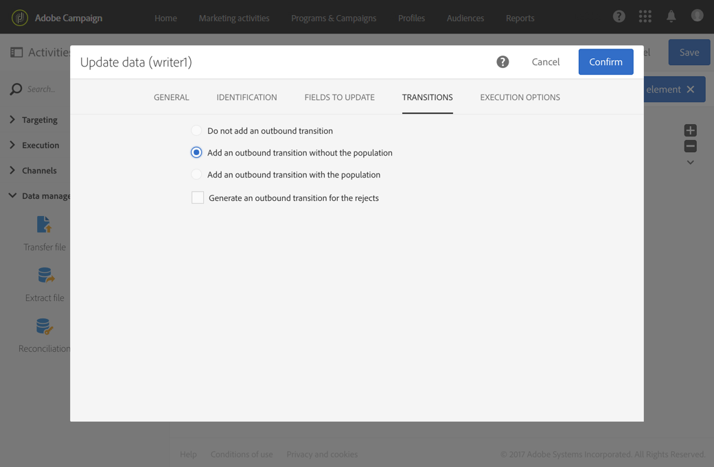

# Señal externa{#external-signal}

## Descripción {#description}

La **[!UICONTROL External signal]** actividad desencadena un flujo de trabajo cuando algunas condiciones se cumplen correctamente en otro flujo de trabajo o desde una llamada a la API de REST.

## Contexto de uso {#context-of-use}

La **[!UICONTROL External signal]** actividad se utiliza para organizar y orquestar diferentes procesos que forman parte del mismo viaje del cliente a diferentes flujos de trabajo. Permite el inicio de un flujo de trabajo desde otro, lo que permite soportar viajes de clientes más complejos, mientras que se puede supervisar y reaccionar mejor en caso de problemas.

La **[!UICONTROL External signal]** actividad está diseñada para colocarse como la primera actividad de un flujo de trabajo. Se puede activar a partir de la **[!UICONTROL End]** actividad de otro flujo de trabajo o de una llamada de API de REST (para obtener más información sobre esto, consulte la documentación [de la](../../api/using/triggering-a-signal-activity.md)API).

Al activarse, los parámetros externos se pueden definir y estar disponibles en las variables de eventos de flujo de trabajo. El proceso para llamar a un flujo de trabajo con parámetros externos se detalla en [esta sección](../../automating/using/calling-a-workflow-with-external-parameters.md).

>[!NOTE]
>
>La actividad no se puede activar con más frecuencia que cada 10 minutos.

Tenga en cuenta que una **[!UICONTROL External signal]** actividad se puede activar desde varios eventos diferentes. En ese caso, el **[!UICONTROL External signal]** se activa en cuanto se ejecuta uno de los flujos de trabajo de origen o la llamada de API. No requiere que todos los flujos de trabajo de origen estén finalizados.

**Temas relacionados**

* [Caso de uso: actividad de señales externas e importación](../../automating/using/external-signal-data-import.md)de datos.
* [Caso de uso: Llamar a un flujo de trabajo para crear una audiencia a partir de un archivo utilizando parámetros externos](../../automating/using/calling-a-workflow-with-external-parameters.md#use-case)

## Configuración {#configuration}

Al configurar una señal externa, es importante configurar primero la **[!UICONTROL External signal]** actividad en el flujo de trabajo de destino. Una vez que se haya realizado esta configuración, la **[!UICONTROL External signal]** actividad de este flujo de trabajo estará disponible para configurar la **[!UICONTROL End]** actividad del flujo de trabajo de origen.

1. Arrastre y suelte una **[!UICONTROL External signal]** actividad en el flujo de trabajo de destino.
1. Seleccione la actividad y, a continuación, ábrala con el  botón de las acciones rápidas que aparecen.
1. Edite la etiqueta de la actividad. Esta etiqueta es necesaria al configurar el flujo de trabajo de origen que activa el **[!UICONTROL External signal]**.

   Si desea llamar al flujo de trabajo con parámetros, utilice el **[!UICONTROL Parameters]** área para declararlos. Para obtener más información, consulte [esta sección](../../automating/using/calling-a-workflow-with-external-parameters.md#declaring-the-parameters-in-the-external-signal-activity).

   

1. Confirme la configuración de la actividad, agregue cualquier otra actividad que necesite y guarde el flujo de trabajo.

   >[!NOTE]
   >
   >Si desea activar el flujo de trabajo de destino desde otro flujo de trabajo, siga los pasos siguientes. Si desea activar el flujo de trabajo de destino desde una llamada a la API de REST, consulte la documentación [de la](../../api/using/triggering-a-signal-activity.md) API para obtener más información.

1. Abra el flujo de trabajo de origen y seleccione una **[!UICONTROL End]** actividad. Si no hay ninguna **[!UICONTROL End]** actividad disponible, agregue una tras la última actividad de una rama del flujo de trabajo.

   Algunas actividades no tienen ninguna transición de salida de forma predeterminada. Desde la **[!UICONTROL Properties]** ficha de estas actividades, puede agregar una transición saliente.

   Por ejemplo, en una **[!UICONTROL Update data]** actividad, vaya a la **[!UICONTROL Transitions]** ficha y marque la **[!UICONTROL Add an outbound transition without the population]** opción. Esta opción permite agregar una transición que no contenga datos y que no consuma espacio innecesario en el sistema. Solo se utiliza para conectar la **[!UICONTROL End]** actividad adicional que activa el flujo de trabajo de destino.

   

1. En la **[!UICONTROL External signal]** ficha de la **[!UICONTROL End]** actividad, seleccione el flujo de trabajo de destino, así como la **[!UICONTROL External signal]** actividad que se activará en dicho flujo de trabajo.

   Cuando se establece una **[!UICONTROL End]** actividad para activar otro flujo de trabajo, este se actualiza con un símbolo de señal adicional.

   Si desea llamar al flujo de trabajo con parámetros, utilice el **[!UICONTROL Parameters and values]** área. Para obtener más información, consulte [esta sección](../../automating/using/calling-a-workflow-with-external-parameters.md#defining-the-parameters-when-calling-the-workflow).

   

1. Guarde el flujo de trabajo de origen.

Una vez ejecutada la **[!UICONTROL End]** actividad del flujo de trabajo de origen o la llamada de API REST, el flujo de trabajo de destino se activa automáticamente desde la **[!UICONTROL External signal]** actividad.

>[!NOTE]
>
>El flujo de trabajo de destino debe iniciarse manualmente para poder activarse. Cuando se inicia, el **[!UICONTROL External activity]** se activa y espera la señal desde el flujo de trabajo de origen.
