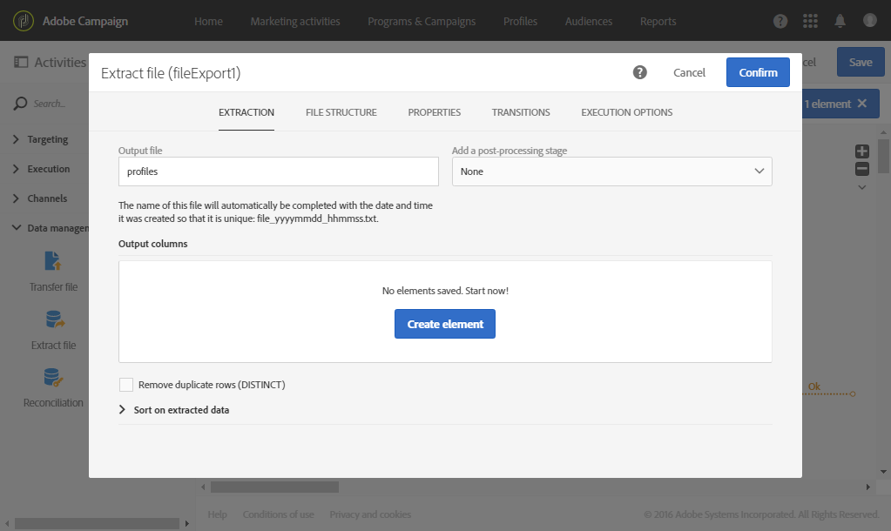

# Extraer archivo{#extract-file}

## Descripción {#description}

La **[!UICONTROL Extract file]** actividad permite exportar datos desde Adobe Campaign en forma de archivo externo.

## Contexto de uso {#context-of-use}

La forma en que se extraerán los datos se define al configurar la actividad.

>[!CAUTION]
>
>La **[!UICONTROL Extract file]** actividad debe colocarse después de una **[!UICONTROL Query]** actividad para poder utilizarse.

**Temas relacionados:**

* [Caso de uso: Exportación de perfiles en un archivo externo](../../automating/using/exporting-profiles-in-file.md)

## Configuración {#configuration}

1. Arrastre y suelte una **[!UICONTROL Extract file]** actividad en el flujo de trabajo.

   

1. Seleccione la actividad y, a continuación, ábrala con el  botón de las acciones rápidas que aparecen.
1. Introduzca la etiqueta del archivo **** Output. La etiqueta del archivo se completará automáticamente con la fecha y hora en que se creó para que sea única. Por ejemplo: destinatarios_20150815_081532.txt para un archivo generó el 15 de agosto de 2015 a las 08:15:32.

   >[!NOTE]
   >
   >Es posible utilizar la **[!UICONTROL formatDate]** función de este campo para especificar el nombre del archivo.

1. Si lo desea, puede comprimir el archivo de salida seleccionando **[!UICONTROL Compression]** en el **[!UICONTROL Add a pre-processing step]** campo. El archivo de salida se comprimirá en un archivo GZIP (.gz).

   El **[!UICONTROL Add a pre-processing step]** campo también permite cifrar un archivo antes de extraerlo. Para obtener más información sobre cómo trabajar con archivos cifrados, consulte [esta sección](../../automating/using/managing-encrypted-data.md)

1. Haga clic en el botón  o **[!UICONTROL Add an element]** para agregar una columna de salida.

   

   Se abrirá una nueva ventana.

   

1. Introduzca una expresión. Para ello, puede seleccionar una expresión existente o crear una nueva mediante el editor **de** expresiones.
1. Confirme su expresión.

   La expresión se agrega a las columnas de salida.

1. Cree tantas columnas como necesite. Puede editar las columnas haciendo clic en sus expresiones y etiquetas.

   Si va a exportar perfiles y desea utilizarlos en una herramienta externa, asegúrese de exportar un identificador único. De forma predeterminada, no todos los perfiles tienen un identificador único, según la forma en que se agreguen a la base de datos. Para obtener más información, consulte la sección [Generación de un ID único para perfiles](../../developing/using/configuring-the-resource-s-data-structure.md#generating-a-unique-id-for-profiles-and-custom-resources) .

1. Haga clic en la **[!UICONTROL File structure]** ficha para configurar los formatos de salida, fecha y número del archivo que se exportará.

   Marque la **[!UICONTROL Export labels instead of internal values of enumerations]** opción en caso de exportar valores de lista desglosada. Esta opción permite recuperar etiquetas más cortas que son fáciles de entender en lugar de identificadores.

1. En la **[!UICONTROL Properties]** ficha, seleccione la **[!UICONTROL Do not generate a file if the inbound transition is empty]** opción para evitar la creación y carga de archivos vacíos en los servidores SFTP si la transición de entrada está vacía.
1. Confirme la configuración de la actividad y guarde el flujo de trabajo.
