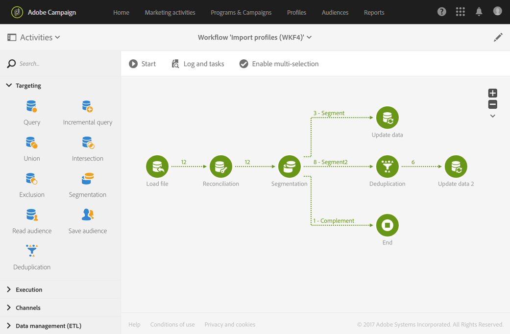

# Importing data{#importing-data}

## Collecting data {#collecting-data}

Puede recopilar datos de un archivo para procesarlos o importarlos en la base de datos de Adobe Campaign.

* The **[!UICONTROL Load file]** activity allows you to import data in one structured form to use this data in Adobe Campaign. Los datos se importan temporalmente y es necesario otra actividad para integrarlos de forma definitiva en la base de datos de Adobe Campaign.
* The **[!UICONTROL Transfer file]** activity allows you to receive or send files, test whether there are files present, or list files in Adobe Campaign.

   You can use this activity before a **[!UICONTROL Load file]** in case you need to retrieve the file from an external source.

## Import best practices {#import-best-practices}

Ser cauteloso y seguir las pocas reglas simples detalladas a continuación ayudará mucho a garantizar la coherencia de los datos dentro de la base de datos y a evitar errores comunes durante la actualización de la base de datos o las exportaciones de datos.

### Using import templates {#using-import-templates}

Most import workflows should contain the following activities: **[!UICONTROL Load file]**, **[!UICONTROL Reconciliation]**, **[!UICONTROL Segmentation]**, **[!UICONTROL Deduplication]**, **[!UICONTROL Update data]**.

El uso de plantillas de importación facilita la preparación de importaciones similares y la coherencia de los datos en la base de datos.

In many projects, imports are built without **[!UICONTROL Deduplication]** activity because the files used in the project do not have duplicates. A veces, los duplicados no aparecen para importar distintos archivos. La anulación de duplicación es difícil. Por lo tanto, un paso de anulación de duplicación es una buena medida en todos los flujos de trabajo de importación.

No descansa en suponer que los datos entrantes son coherentes y correctos, o que el departamento de TI o el supervisor de Adobe Campaign lo harán. Durante el proyecto, tenga en cuenta la limpieza de datos. Elimine, concilie y mantenga la coherencia al importar datos.

An example of a generic workflow template designed for importing data is available in the [Example: Import workflow template](../../automating/using/importing-data.md#example--import-workflow-template) section.

>[!NOTE]
>
>You can also use [import templates](../../automating/using/importing-data-with-import-templates.md). Son plantillas de flujo de trabajo definidas por un administrador que, una vez activadas, solo ofrecen la posibilidad de especificar el archivo que contiene los datos que se van a importar.

### Using flat file formats {#using-flat-file-formats}

El formato más eficaz para las importaciones es archivos planos. Los archivos planos pueden importarse en modo masivo a nivel de base de datos.

Por ejemplo:

* Separador: tab o punto y coma
* Primera línea con encabezados
* Sin delimitador de cadena
* Formato de fecha: AAAA/MM/DD HH: mm: SS

Ejemplo de archivo que se va a importar:

```
lastname;firstname;birthdate;email;crmID
Smith;Hayden;23/05/1989;hayden.smith@example.com;124365
Mars;Daniel;17/11/1987;dannymars@example.com;123545
Smith;Clara;08/02/1989;hayden.smith@example.com;124567
Durance;Allison;15/12/1978;allison.durance@example.com;120987
```

### Using compression {#using-compression}

Utilice archivos compactados para importar y exportar cuando sea posible. Se admite GZIP de forma predeterminada. You can add pre-processing when importing files or post-processing when extracting data, respectively in the **[!UICONTROL Load file]** and **[!UICONTROL Extract file]** workflow activities.

### Importing in Delta mode {#importing-in-delta-mode}

Las importaciones normales deben realizarse en modo delta. Significa que solo se han modificado los datos nuevos o modificados a Adobe Campaign, en vez de toda la tabla siempre.

Las importaciones completas deben usarse solo para carga inicial.

### Maintaining consistency {#maintaining-consistency}

Para mantener la coherencia de los datos en la base de datos de Adobe Campaign, siga los principios a continuación:

* Si los datos importados coinciden con una tabla de referencia en Adobe Campaign, debe conciliarse con esa tabla en el flujo de trabajo. Los registros que no coinciden deben rechazarse.
* Ensure that the imported data is always **"normalized"** (email, phone number, direct mail address) and that this normalization is reliable and will not change over the years. Si no es así, es probable que algunos duplicados aparezcan en la base de datos, y, dado que Adobe Campaign no proporciona herramientas para realizar coincidencias "borrosas", será muy difícil administrarlas y eliminarlas.
* Los datos transaccionales deben tener una clave de reconciliación y deben conciliarse con los datos existentes para evitar la creación de duplicados.
* **Importar archivos relacionados en orden**. Si la importación está compuesta por varios archivos que dependen entre sí, el flujo de trabajo debe asegurarse de que los archivos se importan en el orden correcto. Cuando un archivo falla, no se importan los demás archivos.
* **Elimine,** concilie y mantenga la coherencia al importar datos.

## Example: Import workflow template {#example--import-workflow-template}

El uso de una plantilla de importación es una práctica recomendada si necesita importar archivos con la misma estructura de forma regular.

En este ejemplo se muestra cómo predefinir un flujo de trabajo que se puede reutilizar para importar perfiles provenientes de una CRM en la base de datos de Adobe Campaign.

1. Create a new workflow template from **[!UICONTROL Resources > Templates > Workflow templates]**.
1. Agregue las siguientes actividades:

   * **[!UICONTROL Load file]**: Defina la estructura esperada del archivo que contiene los datos que se van a importar.

      >[!NOTE]
      >
      >Solo puede importar datos desde un único archivo. If the workflow has multiple **[!UICONTROL Load file]** activities, the same file will be used each time.

   * **[!UICONTROL Reconciliation]**: Concilie los datos importados con datos de base de datos.
   * **[!UICONTROL Segmentation]**: Cree filtros para procesar registros de diferentes maneras dependiendo de si se pueden reconciliar o no.
   * **[!UICONTROL Deduplication]**: Elimine los datos del archivo entrante antes de insertarlo en la base de datos.
   * **[!UICONTROL Update data]**: Actualice la base de datos con los perfiles importados.
   

1. Configure the **[!UICONTROL Load file]** activity:

   * Para definir la estructura esperada, cargue un archivo de ejemplo. El archivo de ejemplo debe contener sólo unas pocas líneas, pero todas las columnas necesarias para la importación. Compruebe y edite el formato de archivo para asegurarse de que el tipo de cada columna esté correctamente configurado: texto, fecha, entero, etc. Por ejemplo:

      ```
      lastname;firstname;birthdate;email;crmID
      Smith;Hayden;23/05/1989;hayden.smith@mailtest.com;123456
      ```

   * In the **[!UICONTROL File to load]** section, select **[!UICONTROL Upload a new file from the local machine]** and leave the field blank. Cada vez que se crea un nuevo flujo de trabajo a partir de esta plantilla, puede especificar el archivo que desea, ya que corresponde a la estructura definida.

      Puede utilizar cualquiera de las opciones pero debe modificar la plantilla en consecuencia. For example, if you select **[!UICONTROL Use the file specified in the inbound transition]**, you can add a **[!UICONTROL Transfer file]** activity before to retrieve the file to import from a FTP/SFTP server.

      If you want users to be able to download a file containing errors that occurred during an import, check the **[!UICONTROL Keep the rejects in a file]** option and specify the **[!UICONTROL File name]**.

      

1. Configure the **[!UICONTROL Reconciliation]** activity. La finalidad de esta actividad en este contexto es identificar los datos entrantes.

   * In the **[!UICONTROL Relations]** tab, select **[!UICONTROL Create element]** and define a link between the imported data and the recipients targeting dimension (see [Targeting dimensions and resources](../../automating/using/query.md#targeting-dimensions-and-resources)). In this example, the **CRM ID** custom field is used to create the join condition. Utilice el campo o la combinación de campos que necesite siempre que permita identificar registros únicos.
   * In the **[!UICONTROL Identification]** tab, leave the **[!UICONTROL Identify the document from the working data]** option unchecked.
   

1. Configure the **[!UICONTROL Segmentation]** activity to retrieve reconciled recipients in one transition and recipients that could not be reconciled but who have enough data in a second transition.

   La transición con destinatarios conciliados se puede utilizar para actualizar la base de datos. La transición con destinatarios desconocidos se puede utilizar para crear nuevas entradas de destinatario en la base de datos si hay un conjunto mínimo de información disponible en el archivo.

   Los destinatarios que no se pueden reconciliar y no tienen datos suficientes se seleccionan en una transición saliente complementaria y pueden exportarse en un archivo independiente o simplemente ignorarse.

   * In the **[!UICONTROL General]** tab of the activity, set the **[!UICONTROL Resource type]** to **[!UICONTROL Temporary resource]** and select **[!UICONTROL Reconciliation]** as the targeted set.
   * In the **[!UICONTROL Advanced options]** tab, check the **[!UICONTROL Generate complement]** option to be able to see if any record cannot be inserted in the database. Si lo necesita, puede aplicar más procesamiento a los datos complementarios: exportación de archivos, actualización de lista, etc.
   * In the first segment of the **[!UICONTROL Segments]** tab, add a filtering condition on the inbound population to select only records for which the profile's CRM ID is not equal to 0. De esta forma, se seleccionan en ese subconjunto los datos del archivo que se reconcilian con perfiles de la base de datos.

      

   * Agregue un segundo segmento que seleccione registros no conciliados que tengan datos suficientes para insertarse en la base de datos. Por ejemplo: dirección de correo electrónico, nombre y apellido. Los registros que no se concilian tienen el valor de ID de CRM de su perfil igual a 0.

      

   * All records that are not selected in the first two subsets are selected in the **[!UICONTROL Complement]**.

1. Configure the **[!UICONTROL Update data]** activity located after the first outbound transition of the **[!UICONTROL Segmentation]** activity configured previously.

   * Select **[!UICONTROL Update]** as **[!UICONTROL Operation type]** since the inbound transition only contains recipients already present in the database.
   * In the **[!UICONTROL Identification]** tab, select **[!UICONTROL Using reconciliation criteria]** and define a key between the **[!UICONTROL Dimension to update]** - Profiles in this case - and the link created in the **[!UICONTROL Reconciliation]** activity. In this example, the **CRM ID** custom field is used.

      

   * In the **[!UICONTROL Fields to update]** tab, indicate the fields from the Profiles dimension to update with the value of the corresponding column from the file. Si los nombres de las columnas del archivo son idénticos o casi idénticos a los de los campos de dimensión destinatarios, puede utilizar el botón varita mágica para coincidir automáticamente con los distintos campos.

      

      >[!NOTE]
      >
      >Si planea enviar correos electrónicos directos a estos perfiles, asegúrese de incluir una dirección postal, ya que esta información es esencial para el proveedor de correo directo. Also make sure that the **[!UICONTROL Address specified]** box in your profiles' information is checked. To update this option from a workflow, simply add an element to the fields to update, and specify **1** as **[!UICONTROL Source]** and select the **[postalAddress/@addrDefined]** field as **[!UICONTROL Destination]**. For more on direct mail and the use of the **[!UICONTROL Address specified]** option, see [this document](../../channels/using/about-direct-mail.md#recommendations).

1. Configure the **[!UICONTROL Deduplication]** activity located after the transition containing unreconciled profiles:

   * In the **[!UICONTROL Properties]** tab, set the **[!UICONTROL Resource type]** to the temporary resource generated from the **[!UICONTROL Reconciliation]** activity of the workflow.

      

   * En este ejemplo, el campo de correo electrónico se utiliza para encontrar perfiles únicos. Puede utilizar cualquier campo que esté seguro y parte de una combinación única.
   * Choose a **[!UICONTROL Deduplication method]**. En este caso, la aplicación decide automáticamente qué registros se conservan en caso de duplicados.
   

1. Configure the **[!UICONTROL Update data]** activity located after the **[!UICONTROL Deduplication]** activity configured previously.

   * Select **[!UICONTROL Insert only]** as **[!UICONTROL Operation type]** since the inbound transition only contains profiles not present in the database.
   * In the **[!UICONTROL Identification]** tab, select **[!UICONTROL Using reconciliation criteria]** and define a key between the **[!UICONTROL Dimension to update]** - Profiles in this case - and the link created in the **[!UICONTROL Reconciliation]** activity. In this example, the **CRM ID** custom field is used.

      

   * In the **[!UICONTROL Fields to update]** tab, indicate the fields from the Profiles dimension to update with the value of the corresponding column from the file. Si los nombres de las columnas del archivo son idénticos o casi idénticos a los de los campos de dimensión destinatarios, puede utilizar el botón varita mágica para coincidir automáticamente con los distintos campos.

      

      >[!NOTE]
      >
      >Si planea enviar correos electrónicos directos a estos perfiles, asegúrese de incluir una dirección postal, ya que esta información es esencial para el proveedor de correo directo. Also make sure that the **[!UICONTROL Address specified]** box in your profiles' information is checked. To update this option from a workflow, simply add an element to the fields to update, and specify **1** as **[!UICONTROL Source]** and select the **[postalAddress/@addrDefined]** field as **[!UICONTROL Destination]**. For more on direct mail and the use of the **[!UICONTROL Address specified]** option, see [this document](../../channels/using/about-direct-mail.md#recommendations).

1. After the third transition of the **[!UICONTROL Segmentation]** activity, add a **[!UICONTROL Extract file]** activity and a **[!UICONTROL Transfer file]** activity if you want to keep track of data not inserted in the database. Configure esas actividades para exportar la columna que necesita y para transferir el archivo en un servidor FTP o SFTP donde pueda recuperarlo.
1. Add an **[!UICONTROL End]** activity and save the workflow template.

La plantilla ahora se puede utilizar y está disponible para cada nuevo flujo de trabajo. All is needed is then to specify the file containing the data to import in the **[!UICONTROL Load file]** activity.



