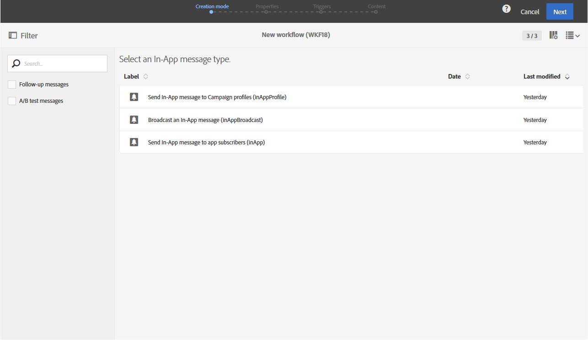

# Entrega en la aplicación{#in-app-delivery}

## Descripción {#description}

La variable **Entrega en la aplicación** actividad le permite configurar el envío de un mensaje en la aplicación dentro de un flujo de trabajo. La mensajería en la aplicación permite mostrar un mensaje cuando el usuario está activo dentro de la aplicación. Para obtener más información sobre la entrega en la aplicación, consulte esta [sección](../../channels/using/about-in-app-messaging.md).

## Contexto de uso {#context-of-use}

La variable **[!UICONTROL In-App delivery]** la actividad se utiliza generalmente para automatizar el envío de un mensaje en la aplicación a una audiencia de destino calculada en el mismo flujo de trabajo.

Los destinatarios se definen antes de la actividad en el mismo flujo de trabajo, a través de actividades de segmentación como consultas, intersecciones, etc.

La preparación del mensaje se activa según los parámetros de ejecución del flujo de trabajo. En el panel de mensajes, puede seleccionar si desea solicitar o no una confirmación manual para enviar el mensaje (requerido de forma predeterminada). Puede realizar el inicio del flujo de trabajo manualmente o colocar una actividad de planificador en el flujo de trabajo para automatizar la ejecución.

## Configuración {#configuration}

1. Arrastre y suelte una **[!UICONTROL Query]** al flujo de trabajo. Tenga en cuenta que la variable **[!UICONTROL Query]** dimensión de segmentación de actividades en la variable **[!UICONTROL Properties]** La pestaña debe actualizarse según la plantilla elegida en el paso 4:

   * La dimensión de segmentación debe establecerse en **[!UICONTROL mobileApp (mobileAppV5)]** para el **[!UICONTROL Target all users of a Mobile app (inAppBroadcast)]** plantilla.
   * La dimensión de segmentación debe establecerse en **[!UICONTROL profile (profile)]** para el **[!UICONTROL Target users based on their Campaign profile (inAppProfile)]** plantilla.
   * La dimensión de segmentación debe establecerse en **[!UICONTROL subscriptions to an application (nms:appSubscriptionRcp:appSubscriptionRcpDetail)]** para el **[!UICONTROL Target users based on their Mobile profile (inApp)]** plantilla.

1. Arrastre y suelte una actividad de **[!UICONTROL In-App delivery]** en el flujo de trabajo.
1. Seleccione la actividad y, a continuación, ábrala con el botón , en las acciones rápidas que aparecerán.

   >[!NOTE]
   >
   >Puede acceder a las propiedades generales y a las opciones avanzadas de la actividad (y no al propio envío) mediante el botón  de las acciones rápidas de la actividad.

   

1. Seleccione el tipo de mensaje en la aplicación. Esto dependerá de los datos segmentados en su **[!UICONTROL Query]** actividad.

   * **[!UICONTROL Target users based on their Campaign profile (inAppProfile)]**: Este tipo de mensaje le permite dirigirse a perfiles de Adobe Campaign que se han suscrito a su aplicación móvil y personalizar mensajes en la aplicación con atributos de perfil disponibles en Campaign.
   * **[!UICONTROL Target all users of a Mobile app (inAppBroadcast)]**: Este tipo de mensaje le permite enviar un mensaje a todos los usuarios de la aplicación móvil aunque no tengan un perfil existente en Campaign.
   * **[!UICONTROL Target users based on their Mobile profile (inApp)]**: Este tipo de mensaje le permite dirigirse a todos los usuarios de una aplicación móvil que tengan un perfil móvil en Campaign, ya sea conocido o desconocido, y personalizar los mensajes en la aplicación con cualquier atributo de perfil que se haya obtenido desde un dispositivo móvil.

   

1. Introduzca las propiedades de los mensajes en la aplicación y seleccione la aplicación móvil en la **[!UICONTROL Associate a Mobile App to a delivery]** campo .
1. En la pestaña **[!UICONTROL Triggers]**, arrastre y suelte el evento que activará el mensaje. Hay tres categorías de eventos disponibles:
1. Defina el contenido en la aplicación. Consulte la sección sobre [Personalización en la aplicación](../../channels/using/customizing-an-in-app-message.md).
1. De forma predeterminada, la actividad **[!UICONTROL In-App delivery]** no incluye ninguna transición de salida. Si desea añadir una transición de salida a la actividad **[!UICONTROL In-App delivery]**, vaya a la pestaña **[!UICONTROL General]** de las opciones de actividad avanzadas (botón  en las acciones rápidas de la actividad) y, a continuación, marque una de las siguientes opciones:

   * **[!UICONTROL Add outbound transition without the population]**: esto le permite generar una transición de salida que contiene exactamente la misma población que la transición de entrada.
   * **[!UICONTROL Add outbound transition with the population]**: esto le permite generar una transición de salida que contiene la población a la que se ha enviado el mensaje. Los miembros del objetivo excluidos durante la preparación del envío se excluyen de esta transición.

   

1. Confirme la configuración de la actividad y guarde el flujo de trabajo.

Cuando vuelva a abrir la actividad, le lleva directamente al panel en la aplicación. Solo se puede editar su contenido.

De forma predeterminada, iniciar un flujo de trabajo de envío solo activa la preparación del mensaje. El envío de mensajes creados a partir de un flujo de trabajo aún debe confirmarse una vez iniciado el flujo de trabajo. Sin embargo, desde el panel del mensaje, y solo si el mensaje se ha creado a partir de un flujo de trabajo, puede desactivar la opción **[!UICONTROL Request confirmation before sending messages]**. Al desmarcar esta opción, los mensajes se envían sin previo aviso una vez que se ha realizado la preparación.

## Observaciones {#remarks}

Se puede acceder a los envíos creados dentro de un flujo de trabajo en la lista de actividad de marketing de la aplicación. Puede vista del estado de ejecución del flujo de trabajo mediante el panel. Los vínculos del panel de resumen de notificaciones push le permiten acceder directamente a los elementos vinculados (flujo de trabajo, campaña, etc.).

En los envíos principales, a los que se puede acceder desde la lista de actividad de marketing, se puede ver el número total de envíos que se han procesado (según el periodo de acumulación especificado cuando **[!UICONTROL In-App delivery]** actividad configurada). Para ello, abra la vista de detalles del bloque del envío principal **[!UICONTROL Deployment]** seleccionando .
