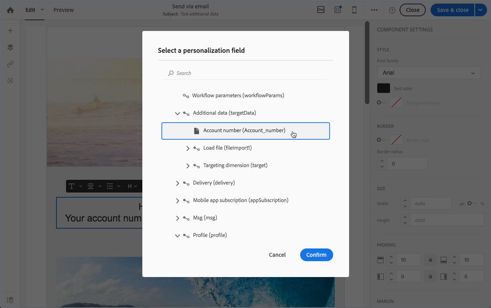

# Cargar archivo {#load-file}

## Descripción {#description}

La **[!UICONTROL Load file]** actividad permite importar datos en un formulario estructurado para utilizarlos en Adobe Campaign. Los datos se importan temporalmente y se necesita otra actividad para integrarlos definitivamente en la base de datos de Adobe Campaign.

## Contexto de uso {#context-of-use}

La forma en que se extraerán los datos se define al configurar la actividad. El archivo que se va a cargar puede ser una lista de contactos, por ejemplo.

>[!CAUTION]
>
>Sólo se tienen en cuenta los archivos de estructura &quot;planos&quot;, como .txt, .csv, etc., por ejemplo los archivos.

Se puede:

* Utilice la estructura de archivos para aplicarla a los datos de otro archivo (recuperados mediante la **[!UICONTROL Transfer file]** actividad) o
* Utilice la estructura y los datos del archivo para importarlos a Adobe Campaign.

## Configuración {#configuration}

La configuración de actividad incluye dos pasos. En primer lugar, debe definir la estructura de archivos esperada cargando un archivo de muestra. Una vez hecho esto, puede especificar el origen del archivo cuyos datos se importarán.

>[!NOTE]
>
>Los datos del archivo de muestra se utilizan para configurar la actividad, pero no se importan. Se recomienda utilizar un archivo de muestra que contenga pocos datos.

1. Arrastre y suelte una **[!UICONTROL Load file]** actividad en el flujo de trabajo.
1. Seleccione la actividad y, a continuación, ábrala con el  botón de las acciones rápidas que aparecen.
1. Cargue el archivo de muestra que le permitirá definir la estructura esperada al importar el archivo final.

   

   Una vez cargado el archivo de datos, aparecen dos fichas nuevas en la actividad: **[!UICONTROL File structure]** y **[!UICONTROL Column definition]**.

1. Vaya a la **[!UICONTROL File structure]** ficha para vista de la estructura que se detecta automáticamente desde el archivo de muestra.

   Si la estructura de archivos se detectó incorrectamente, dispone de varias opciones para corregir los posibles errores:

   * Puede elegir utilizar la estructura de otro archivo seleccionando la **[!UICONTROL Detect structure from a new file]** opción.
   * Puede modificar los parámetros de detección predeterminados para adaptarlos al archivo. El **[!UICONTROL File type]** campo permite especificar si el archivo que desea importar está compuesto por columnas de longitud fija. En ese caso, también debe especificar el número máximo de caracteres para cada columna de la **[!UICONTROL Column definition]** ficha.

      Todas las opciones de detección necesarias para recuperar correctamente los datos del archivo se reagrupan en **[!UICONTROL File format]**. Puede modificarlas y, a continuación, volver a detectar la estructura del último archivo cargado en la actividad teniendo en cuenta estas nuevas opciones. Para ello, utilice el **[!UICONTROL Apply configuration]** botón . Por ejemplo, puede especificar un separador de columnas diferente.

      >[!NOTE]
      >
      >Esta operación tiene en cuenta el último archivo que se cargó en la actividad. Si el archivo detectado es grande, la previsualización de datos solo mostrará las primeras 30 líneas.

      

      En la **[!UICONTROL File format]** sección, la **[!UICONTROL Check columns from file against column definitions]** opción le permite verificar que las columnas del archivo que está cargando corresponden a la definición de la columna.

      Si el número o el nombre de las columnas no coinciden con la definición de la columna, aparecerá un mensaje de error al ejecutar el flujo de trabajo. Si la opción no está activada, se mostrarán advertencias en el archivo de registro.

      

1. Vaya a la **[!UICONTROL Column definition]** ficha para comprobar el formato de los datos de cada columna y ajustar los parámetros si es necesario.

   La **[!UICONTROL Column definition]** ficha permite especificar con precisión la estructura de datos de cada columna para importar datos que no contengan errores (por ejemplo, mediante el uso de la administración nula) y hacer que coincida con los tipos que ya están presentes en la base de datos de Adobe Campaign para futuras operaciones.

   Por ejemplo, puede cambiar la etiqueta de una columna y seleccionar su tipo (cadena, entero, fecha, etc.) o incluso especificar el procesamiento de errores.

   For more information, refer to the [Column format](#column-format) section.

   

1. En la **[!UICONTROL Execution]** ficha, especifique si el archivo se va a procesar para cargar datos:

   * Proviene de una transición de entrada en el flujo de trabajo.
   * Es el que cargó durante el paso anterior.
   * Es un nuevo archivo que se carga desde el equipo local. La **[!UICONTROL Upload a new file from local machine]** opción aparece si la carga de un primer archivo ya estaba definida en el flujo de trabajo. Esto le permite cargar otro archivo para procesarlo si el archivo actual no se ajusta a sus necesidades.

      

1. Si el archivo desde el que desea cargar los datos está comprimido en un archivo GZIP (.gz), seleccione la **[!UICONTROL Decompression]** opción en el **[!UICONTROL Add a pre-processing step]** campo. Esto le permite descomprimir el archivo antes de cargar los datos. Esta opción solo está disponible si el archivo procede de la transición de entrada de la actividad.
1. La **[!UICONTROL Keep the rejects in a file]** opción le permite descargar un archivo que contenga errores producidos durante la importación y aplicarle una etapa posterior al procesamiento. Cuando se activa la opción, se cambia el nombre de la transición saliente por &quot;Rechaza&quot;.

   >[!NOTE]
   >
   >La **[!UICONTROL Add date and time to the file name]** opción le permite agregar una marca de hora al nombre del archivo que contiene los rechazos.

   

1. Confirme la configuración de la actividad y guarde el flujo de trabajo.

Si se produce algún error con la actividad después de ejecutar el flujo de trabajo, consulte los registros para obtener más detalles sobre los valores incorrectos en el archivo. For more on workflows logs, refer to [this section](../../automating/using/monitoring-workflow-execution.md).

## Formato de columna {#column-format}

Al cargar un archivo de muestra, el formato de columna se detecta automáticamente con los parámetros predeterminados para cada tipo de datos. Puede modificar estos parámetros predeterminados para especificar los procesos concretos que se aplican a los datos, especialmente cuando hay un error o un valor vacío.

Para ello, seleccione **[!UICONTROL Edit properties]** entre las acciones rápidas de la columna cuyo formato desee definir. Se abrirá la ventana de detalles del formato de columna.

A continuación, puede modificar el formato de cada columna.

El formato de columna permite definir el valor de procesamiento de cada columna:

* **[!UICONTROL Ignore column]**:: no procesa esta columna durante la carga de datos.
* **[!UICONTROL Data type]**: especifica el tipo de datos esperados para cada columna.
* **[!UICONTROL Format and separators]**, **Propiedades**: especifique las propiedades de un texto, el formato de hora, fecha y valor numérico, así como el separador especificado por el contexto de columna.

   * **[!UICONTROL Maximum number of characters]**:: especifica el número máximo de caracteres para las columnas de tipo de cadena.

      Este campo debe rellenarse al cargar archivos formados por columnas de longitud fija.

   * **[!UICONTROL Letter case management]**:: define si es necesario aplicar un proceso de mayúsculas y minúsculas a los datos de **texto** .
   * **[!UICONTROL White space management]**:: especifica si determinados espacios deben ignorarse en una cadena para datos de **texto** .
   * **[!UICONTROL Time format]**, **[!UICONTROL Date format]**: especifique el formato para los datos de **fecha**, **hora** y **fecha y hora** .
   * **[!UICONTROL Format]**:: permite definir el formato de los valores numéricos para los datos de números **** enteros **y** flotantes.
   * **[!UICONTROL Separator]**:: define el separador especificado por el contexto de columna (separador de miles o separador decimal para valores numéricos, separador de fechas y hora) para **datos de fecha**, **hora**, **fecha y hora**, **entero** y número **** flotante.

* **[!UICONTROL Remapping of values]**:: este campo solo está disponible en la configuración de detalles de la columna. Permite transformar determinados valores al importarlos. Por ejemplo, se puede transformar “tres” en “3”.
* **[!UICONTROL Error processing]**:: define el comportamiento si se encuentra un error.

   * **[!UICONTROL Ignore the value]**:: se omite el valor. Se genera una advertencia en el registro de ejecución del flujo de trabajo.
   * **[!UICONTROL Reject the line]**:: la línea completa no se procesa.
   * **[!UICONTROL Use a default value]**:: reemplaza el valor que causa el error por un valor predeterminado, definido en el **[!UICONTROL Default value]** campo.
   * **[!UICONTROL Use a default value in case the value is not remapped]**:: reemplaza el valor que causa el error por un valor predeterminado, definido en el **[!UICONTROL Default value]** campo, a menos que se haya definido una asignación para el valor erróneo (consulte la **[!UICONTROL Remapping of values]** opción anterior).
   * **[!UICONTROL Reject the line when there is no remapping value]**:: la línea completa no se procesa a menos que se haya definido una asignación para el valor erróneo (consulte la **[!UICONTROL Remapping of values]** opción anterior).
   >[!NOTE]
   >
   >**[!UICONTROL Error processing]** se refieren a errores relacionados con los valores del archivo importado. Por ejemplo, se encontró un tipo de datos defectuoso (&quot;cuatro&quot; en letras para una columna &quot;Entero&quot;), una cadena que contiene más caracteres que el número máximo autorizado, una fecha con separadores defectuosos, etc. Sin embargo, esta opción no afecta a los errores generados por la administración de valores vacía.

* **[!UICONTROL Default value]**: especifica el valor predeterminado de acuerdo con el procesamiento de error seleccionado.
* **[!UICONTROL Empty value management]**:: especifica cómo administrar valores vacíos durante la carga de datos.

   * **[!UICONTROL Generate an error for numerical fields]**: genera un error solo para los campos numéricos; en caso contrario, inserta un valor NULL.
   * **[!UICONTROL Insert NULL in the corresponding field]**:: autoriza valores vacíos. Por lo tanto, se inserta el valor NULL.
   * **[!UICONTROL Generate an error]**:: genera un error si un valor está vacío.

## Ejemplo 1: Actualización de la base de datos {#example-1-update-the-database}

La actividad del archivo de carga estructura principalmente los datos de una actividad de archivo de transferencia para integrarlos en los datos existentes.

El siguiente ejemplo muestra el resultado de una actividad de archivos de carga descargada automáticamente mediante una actividad de archivos de transferencia, seguida de una actividad de datos de actualización. Este flujo de trabajo pretende enriquecer la base de datos de Adobe Campaign con nuevos perfiles o actualizar los perfiles existentes utilizando los datos recuperados del archivo importado.

1. Arrastre y suelte una **[!UICONTROL Transfer file]** actividad en el flujo de trabajo y configúrela de forma que recupere el archivo que desee.
1. Arrastre y suelte una **[!UICONTROL Load file]** actividad en el flujo de trabajo y colóquela después de la **[!UICONTROL Transfer file]** actividad.
1. Seleccione la actividad y, a continuación, ábrala con el  botón de las acciones rápidas que aparecen.
1. En la **[!UICONTROL File to load]** sección de la **[!UICONTROL Execution]** ficha, marque la **[!UICONTROL Use the file specified in the inbound transition]** opción.

   

1. Configure la actividad como se especificó anteriormente.
1. Arrastre y suelte una **[!UICONTROL Update data]** actividad en el flujo de trabajo, colóquela después de la **[!UICONTROL Load file]** actividad y, a continuación, configúrela. Refer to [Update data](../../automating/using/update-data.md).

Una vez iniciado el flujo de trabajo, los datos del archivo cargado se extraen y se utilizan para enriquecer la base de datos de Adobe Campaign.

## Ejemplo 2: Envío de un correo electrónico con campos enriquecidos {#example-2-email-with-enriched-fields}

<!--A new example showing how to send an email containing additional data retrieved from a load file activity has been added. [Read more](example-2-email-with-enriched-fields)-->

La actividad del archivo de carga también permite enviar un correo electrónico enriquecido con datos adicionales de un archivo externo en el mismo flujo de trabajo.

El ejemplo siguiente muestra cómo enviar un correo electrónico con datos adicionales recuperados de un archivo externo a través de la actividad de cargar archivo. En este ejemplo, el archivo externo contiene una lista de perfiles con su número de cuenta asociado. Desea importar estos datos para enviar un correo electrónico a cada perfil con su número de cuenta.

1. Arrastre y suelte una **[!UICONTROL Query]** actividad en el flujo de trabajo y ábrala para definir el destinatario principal.

   <!--The Query activity is presented in the [Query](../../automating/using/query.md) section.-->

1. Arrastre y suelte una **[!UICONTROL Load file]** actividad para asignar algunos datos a un perfil. En este ejemplo, cargue un archivo que contenga los números de cuenta correspondientes a algunos perfiles de la base de datos.

   

1. Arrastre y suelte una **[!UICONTROL Enrichment]** actividad en el flujo de trabajo y vincule el archivo de carga y las actividades de consulta.

1. En la **[!UICONTROL Advanced relations]** ficha de la actividad enriquecimiento, seleccione los campos **[!UICONTROL 0 or 1 cardinality simple link]** y defina los campos que se utilizarán para la reconciliación. Aquí utilizamos el apellido para reconciliar los datos con los perfiles de la base de datos.

   

1. En la **[!UICONTROL Additional data]** ficha, seleccione los elementos que desee utilizar en el correo electrónico. Aquí seleccione Número de cuenta (columna del archivo que recuperó a través de la actividad del archivo de carga).

   

   <!---->

   Para obtener más información sobre esto, consulte la sección [Enriquecimiento](../../automating/using/enrichment.md) .

1. Arrastre y suelte una **[!UICONTROL Segmentation]** actividad en el flujo de trabajo y ábrala para refinar el destinatario principal.

   

   Para obtener más información sobre esto, consulte la sección [Segmentación](../../automating/using/segmentation.md) .

1. Arrastre y suelte una **[!UICONTROL Email delivery]** actividad en el flujo de trabajo y ábrala.

   <!--The Email delivery activity is presented in the [Email delivery](../../automating/using/email-delivery.md) section.-->

1. Añada un campo de personalización y seleccione los datos adicionales definidos en la actividad de enriquecimiento (aquí Número de cuenta) del **[!UICONTROL Additional data (targetData)]** nodo. Esto permite recuperar dinámicamente el número de cuenta de cada perfil del contenido del correo electrónico.

   

1. Guarde el correo electrónico y el inicio del flujo de trabajo.

El correo electrónico se envía al destinatario. Cada perfil recibe el correo electrónico con su correspondiente número de cuenta.

