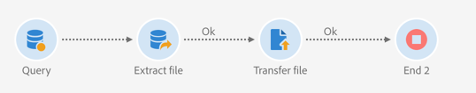

# Administración de datos cifrados {#managing-encrypted-data}

## Acerca de las etapas de preprocesamiento {#about-preprocessing-stages}

En algunos casos, es posible que los datos que desea importar los servidores de Campaña deban cifrarse, por ejemplo, si contienen datos PII.

Para poder cifrar datos salientes o descifrar datos entrantes, debe administrar las claves GPG mediante el [Panel de control de Campaign](https://docs.adobe.com/content/help/es-ES/control-panel/using/instances-settings/gpg-keys-management.html).

>[!NOTE]
>
>Panel de control de Campaign está disponible para todos los clientes alojados en AWS (excepto para los clientes que alojan sus instancias de marketing on-Premise).

Si no cumple los requisitos para utilizar Panel de control de Campaign, debe ponerse en contacto con el Servicio de atención al cliente de Adobe para que le proporcionen los comandos de cifrado y descifrado necesarios. Para ello, envíe una solicitud que indique:

* La **etiqueta** que se mostrará en la interfaz de Campaña para utilizar el comando. Por ejemplo, &quot;Cifrar archivo&quot;.
* El **comando** que se va a instalar en la instancia.

Una vez procesada la solicitud, los comandos de cifrado/descifrado estarán disponibles en el **[!UICONTROL Pre-processing stage]** campo desde las **[!UICONTROL Load file]** actividades y **[!UICONTROL Extract file]** . Puede utilizarlos para descifrar o cifrar los archivos que desea importar o exportar.

**Temas relacionados:**

* [Cargar archivo](../../automating/using/load-file.md)
* [Extraer archivo](../../automating/using/extract-file.md)

## Caso de uso: importación de datos cifrados con una clave generada por el Panel de control de Campaign{#use-case-gpg-decrypt}

En este caso de uso, crearemos un flujo de trabajo para importar datos cifrados en un sistema externo utilizando una clave generada en el Panel de control de Campaign.

En [esta sección](https://docs.adobe.com/content/help/en/campaign-standard-learn/tutorials/administrating/control-panel/gpg-key-management/decrypting-data.html) también hay disponible un vídeo de tutorial que muestra cómo utilizar una clave GPG para desencriptar datos.

Los pasos para realizar este caso de uso son los siguientes:

1. Utilice el Panel de control de Campaign para generar un par de claves (pública/privada). Encontrará los pasos detallados en la documentación [del](https://docs.adobe.com/content/help/es-ES/control-panel/using/instances-settings/gpg-keys-management.html#decrypting-data) Panel de control de Campaign.

   * La clave pública se comparte con el sistema externo, que la utiliza para cifrar los datos que se enviarán a Campaign.
   * Campaign utiliza la clave privada para descifrar los datos cifrados entrantes.

   

1. En el sistema externo, utilice la clave pública descargada del Panel de control de Campaign para cifrar los datos que se van a importar a Campaign Standard.

1. En Campaign Standard, cree un flujo de trabajo para importar los datos cifrados y descifrarlos con la clave privada que se ha instalado mediante el Panel de control de Campaign. Para ello, crearemos un flujo de trabajo de la siguiente manera:

   

   * **[!UICONTROL Transfer file]** actividad: transfiere el archivo de un origen externo a Campaign. En este ejemplo, queremos transferir el archivo desde un servidor SFTP.
   * **[!UICONTROL Load file]** actividad: carga los datos del archivo en la base de datos y los descifra utilizando la clave privada generada en el Panel de control de Campaign.

1. Abra la actividad **[!UICONTROL Transfer file]** y configúrela según sus necesidades. Los conceptos globales sobre cómo configurar la actividad están disponibles en [esta sección](../../automating/using/load-file.md).

   En la **[!UICONTROL Protocol]** ficha, especifique los detalles sobre el servidor sftp y el archivo .gpg cifrado que desea transferir.

   

1. Abra la actividad **[!UICONTROL Load file]** y configúrela según sus necesidades. Los conceptos globales sobre cómo configurar la actividad están disponibles en [esta sección](../../automating/using/load-file.md).

   Añada una fase de preprocesamiento a la actividad para descifrar los datos entrantes. Para ello, seleccione la **[!UICONTROL Decryption GPG]** opción de la lista.

   >[!NOTE]
   >
   >Tenga en cuenta que no es necesario especificar la clave privada que se utilizará para descifrar los datos. La clave privada se almacena en Panel de control de Campaign, lo que detectará automáticamente la clave que se utilizará para descifrar el archivo.

   

1. Haga clic en **[!UICONTROL OK]** para confirmar esta configuración.

1. Ahora puede ejecutar el flujo de trabajo.

## Caso de uso: codificación y exportación de datos con una clave instalada en el Panel de control de Campaign {#use-case-gpg-encrypt}

En este caso de uso, crearemos un flujo de trabajo para codificar y exportar los datos con una clave instalada en el Panel de control de Campaign.

En [esta sección](https://docs.adobe.com/content/help/en/campaign-standard-learn/tutorials/administrating/control-panel/gpg-key-management/using-a-gpg-key-to-encrypt-data.html) también hay disponible un vídeo de tutorial que muestra cómo utilizar una clave GPG para cifrar datos.

Los pasos para realizar este caso de uso son los siguientes:

1. genere un par de claves GPG (públicas/privadas) utilizando una utilidad GPG, luego instale la clave pública en Panel de control de Campaign. Encontrará los pasos detallados en la documentación [del](https://docs.adobe.com/content/help/es-ES/control-panel/using/instances-settings/gpg-keys-management.html#encrypting-data) Panel de control de Campaign.

   

1. En Campaign Standard, cree un flujo de trabajo para exportar los datos y cifrarlos con la clave privada que se ha instalado mediante el Panel de control de Campaign. Para ello, crearemos un flujo de trabajo de la siguiente manera:

   

   * **[!UICONTROL Query]** actividad: En este ejemplo, queremos ejecutar una consulta para un destinatario de los datos de la base de datos que queremos exportar.
   * **[!UICONTROL Extract file]** actividad: Codifica y extrae los datos en un archivo.
   * **[!UICONTROL Transfer file]** actividad: Transfiere el archivo que contiene los datos cifrados a un servidor SFTP.

1. Configure la actividad **[!UICONTROL Query]** para destinatario de los datos deseados de la base de datos. Para obtener más información, consulte [esta sección](../../automating/using/query.md).

1. Abra la **[!UICONTROL Extract file]** actividad y configúrela según sus necesidades (archivo de salida, columnas, formato, etc.). Los conceptos globales sobre cómo configurar la actividad están disponibles en [esta sección](../../automating/using/extract-file.md).

   Añada una etapa de preprocesamiento a la actividad para cifrar los datos que se van a extraer. Para ello, seleccione la clave de GPG de cifrado que desee utilizar para cifrar los datos.

   

   >[!NOTE]
   >
   >El valor entre paréntesis es el **comentario** que definió al generar el par de claves con la herramienta de cifrado GPG. Asegúrese de seleccionar la clave coincidente correcta; de lo contrario, el destinatario no podrá descifrar el archivo.

1. Abra la actividad **[!UICONTROL Transfer file]** y especifique el servidor SFTP al que desea enviar el archivo. Los conceptos globales sobre cómo configurar la actividad están disponibles en [esta sección](../../automating/using/transfer-file.md).

   

1. Ahora puede ejecutar el flujo de trabajo. Una vez ejecutado, el destinatario de datos de la consulta se exportará al servidor SFTP en un archivo .gpg cifrado.
