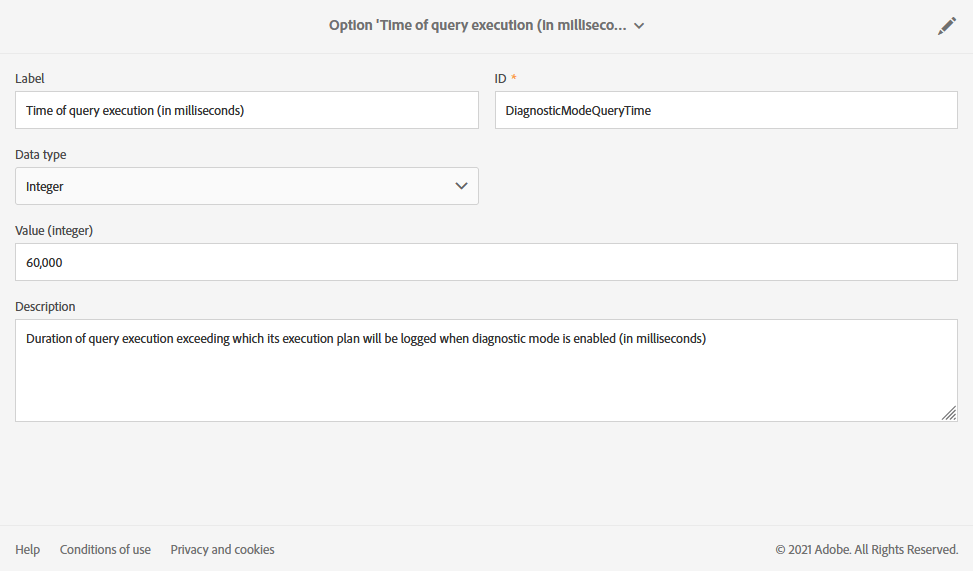

# Administración de opciones de ejecución {#managing-execution-options}

Para modificar las opciones de ejecución de un flujo de trabajo, utilice el botón  para acceder a las propiedades del flujo de trabajo y seleccione la sección **[!UICONTROL Execution]**.

Las opciones posibles son las siguientes:

* **[!UICONTROL Default affinity]**: este campo le permite forzar la ejecución de un flujo de trabajo o una actividad de flujo de trabajo en un equipo concreto.

* **[!UICONTROL History in days]**: especifica el número de días después de los cuales se debe purgar el historial. El historial contiene elementos relacionados con el flujo de trabajo: registros, tareas, eventos (objetos técnicos vinculados a la operación de flujo de trabajo), así como archivos descargados por la actividad **[!UICONTROL Transfer file]**. El valor predeterminado es de 30 días para las plantillas de flujo de trabajo integradas.

  La depuración del historial la realiza el flujo de trabajo técnico Database cleanup, que se ejecuta de forma predeterminada todos los días (consulte [Lista de flujos de trabajo técnicos](../../administration/using/technical-workflows.md)).

  >[!IMPORTANT]
  >
  >Si se deja en blanco el campo **[!UICONTROL History in days]**, su valor se considerará como &quot;1&quot;, lo que significa que el historial se purgará después de 1 día.

* **[!UICONTROL Save SQL queries in the log]**: permite guardar las consultas SQL del flujo de trabajo en los registros.

* **[!UICONTROL Diagnostic mode (Log execution plan of long running queries and give recommendations)]**: marque esta opción si desea registrar todo el plan de ejecución. Está desactivada de forma predeterminada.

  Para obtener más información sobre esta opción, consulte esta [sección](#diagnostic-mode).

* **[!UICONTROL Keep interim results]**: marque esta opción si desea ver los detalles de las transiciones.

  >[!CAUTION]
  >
  >Esta opción consume mucho espacio en el disco y está diseñada para ayudarle a crear un flujo de trabajo y garantizar una configuración y un comportamiento adecuados. Deje sin marcar las instancias de producción.

* **[!UICONTROL Execute in the engine (do not use in production)]**: permite ejecutar el flujo de trabajo localmente para fines de prueba en el entorno de desarrollo.

* **[!UICONTROL Severity]**: permite especificar un nivel de prioridad para ejecutar flujos de trabajo en la instancia de Adobe Campaign. Los equipos de Adobe solo utilizan este campo con fines de monitorización.

La sección **[!UICONTROL Error management]** proporciona opciones adicionales que le permiten administrar cómo se comportan los flujos de trabajo en caso de errores. Estas opciones se detallan en la sección [Administración de errores](../../automating/using/monitoring-workflow-execution.md#error-management).

## Modo de diagnóstico {#diagnostic-mode}

>[!CAUTION]
>
>Esta opción puede afectar significativamente al rendimiento del flujo de trabajo y debe utilizarse con moderación.

Cuando está habilitada, la opción **[!UICONTROL Diagnostic mode (Log execution plan of long running queries and give recommendations)]** en la sección **[!UICONTROL Execution]** de las propiedades del flujo de trabajo registra todo el plan de ejecución si una consulta tarda más de un minuto.

Después de activar esta opción e iniciar el flujo de trabajo, si la consulta tarda más de un minuto, se registra el plan de ejecución. A continuación, puede recuperar el plan de ejecución mediante un EXPLAIN ANALYZE.

Para obtener más información, consulte [Documentación de PostgreSQL](https://www.postgresql.org/docs/9.4/using-explain.html).

Si tiene una exploración de secuencia en esta consulta, **[!UICONTROL Diagnostic mode]** también proporcionará recomendaciones para crear un índice con la ayuda de una expresión de filtro.

>[!NOTE]
>
> Estas recomendaciones están pensadas solo para fines de referencia y deben utilizarse con cuidado según el caso de uso.

Durante la ejecución del flujo de trabajo se deben cumplir las dos condiciones siguientes para almacenar en déclencheur las recomendaciones:

* El análisis de secuencia tarda más del 40 % del tiempo de la consulta.

* Las filas resultantes después de la exploración de secuencia son inferiores al 1 % del total de filas presentes en la tabla.

Puede administrar la opción en el menú avanzado seleccionando **[!UICONTROL Administration]** > **[!UICONTROL Application settings]** > **[!UICONTROL Options]**:

* **[!UICONTROL Time of query execution (in milliseconds)(DiagnosticModeQueryTime)]**: en el campo **[!UICONTROL Value]**, puede establecer una nueva hora para la ejecución de la consulta. Si la ejecución de la consulta supera este valor, se registrará el plan de ejecución.

  

* **[!UICONTROL Percentage of seq scan time (DiagnosticModeSeqScanPercentage)]**: en el campo **[!UICONTROL Value]**, puede cambiar el porcentaje de tiempo de consulta que debe tardar el análisis de secuencia en generarse la recomendación.

  
