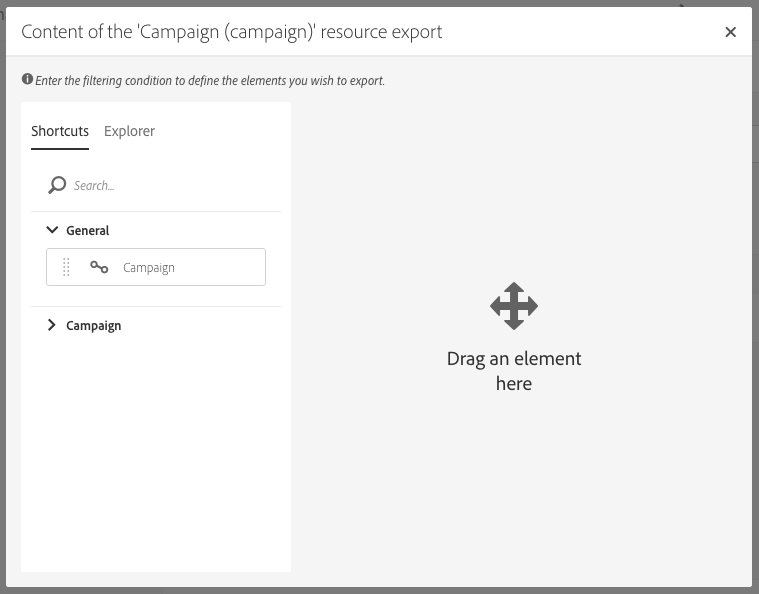

# Administración de paquetes{#managing-packages}

Los administradores pueden definir paquetes para intercambiar recursos entre distintas instancias de Adobe Campaign a través de archivos XML estructurados. Pueden ser datos o parámetros de configuración.

Esto puede resultar útil para transferir datos de un servidor a otro, o para replicar la configuración de una instancia.

Los paquetes están disponibles en los menús **[!UICONTROL Administration]** > **[!UICONTROL Deployment]** > **[!UICONTROL Package exports]** o **[!UICONTROL Package imports]**. Los dos menús funcionan de manera similar.

Los elementos de cada lista se muestran de forma predeterminada según la fecha de modificación o instalación, desde la más reciente hasta la menos reciente.

Para mostrar y modificar el contenido de un elemento, haga clic en su etiqueta. Consulte las secciones [Exportación de un paquete](#exporting-a-package) e [Importación de un paquete](#importing-a-package) .

## Exportaciones de paquetes {#package-exports}

### Paquetes estándar {#standard-packages}

**[!UICONTROL Platform]** y **[!UICONTROL Administration]** son dos paquetes integrados, y cada uno de ellos tiene una lista predefinida de los recursos que se exportarán. Pueden abrirse en modo de solo lectura y solo son adecuados para la exportación.

>[!IMPORTANT]
>
>La exportación de paquetes no está autorizada si los recursos exportados tienen ID predeterminados. Por lo tanto, los ID de los recursos exportables deben cambiarse con un nombre que sea diferente al de las plantillas que ofrece Adobe Campaign Standard como estándar. Por ejemplo, para exportar perfiles de prueba, no debe utilizarse ningún ID que contenga el valor &quot;SDM&quot; o &quot;sdm&quot;.
>
>Al intentar exportar paquetes que contienen ID predeterminados, puede ver errores como: &quot;El tipo de entidad &#39;Marcas (marca)&#39; utiliza un ID predeterminado (&#39;BRD1&#39;) que puede provocar un conflicto al importar el paquete. Cambie este nombre y repita la operación&quot;.

Los pasos de exportación del paquete se describen en la sección [Exportación de un paquete](#exporting-a-package) .

* El paquete de **[!UICONTROL Platform]** reagrupa todos los recursos añadidos durante la configuración técnica: recursos personalizados, conjuntos de recursos personalizados, activadores y opciones de aplicación con el tipo **[!UICONTROL System]**.
* El paquete **[!UICONTROL Administration]** reagrupa todos los objetos añadidos durante la configuración de empresa, como: plantillas de campaña, plantillas de contenido, plantillas de envíos, plantillas de página de destino, plantillas de programa y plantillas de flujo de trabajo.

  También incluye los siguientes objetos: bloques de contenido, asignaciones de destino, cuentas externas, unidades organizativas, opciones de aplicación con el tipo **[!UICONTROL User]**, funciones, tipologías, reglas de tipología y usuarios.

>[!NOTE]
>
>El contenido de estos dos paquetes no puede modificarse. Por el contrario, estos paquetes siempre contienen los datos más actualizados disponibles. Puede [crear sus propios paquetes](#creating-a-package) para exportar elementos específicos.

### Creación de un paquete {#creating-a-package}

Debe crear un paquete si necesita exportar conjuntos específicos de datos.

Para crearlo, necesita derechos de administración.

1. En **[!UICONTROL Administration]** > **[!UICONTROL Deployment]** > **[!UICONTROL Package exports]**, haga clic en el botón **[!UICONTROL Create]** en la lista de contenido del paquete.

   El elemento se creará inmediatamente. Para cancelar la creación, vuelva a la lista y marque la casilla correspondiente para eliminarla.

1. En la pantalla de contenido del paquete, especifique un nombre y un ID.
1. Haga clic en el botón **[!UICONTROL Edit properties]** si desea añadir una descripción y restringir el acceso a ciertos usuarios.

   

1. Utilice el botón **[!UICONTROL Create element]** de la pestaña **[!UICONTROL Export content]** para seleccionar los recursos que desea exportar.

   

1. Los recursos se muestran en orden alfabético y se pueden filtrar por nombre. Su nombre técnico se muestra entre corchetes. Seleccione un elemento de la lista y confirme.

   

1. El nombre del recurso se muestra en la pestaña **[!UICONTROL Export content]**. Para modificar un recurso, marque la casilla correspondiente y utilice el botón **[!UICONTROL Show detail of the element selected]**.

   

1. El uso del editor de consultas permite filtrar los elementos que se exportarán. Para obtener más información, consulte la sección [Edición de consultas](../../automating/using/editing-queries.md#creating-queries).

   

   >[!NOTE]
   >
   >Puede exportar hasta 5000 objetos por recurso.

1. Una vez especificados todos los recursos que se exportarán, guarde la selección.

El paquete se habrá creado y estará listo para ser exportado.

### Exportación de un paquete {#exporting-a-package}

Exportar un paquete le permite guardar un estado específico de un recurso que podrá volver a importar en otra instancia o más tarde en la misma instancia.

>[!CAUTION]
>
>La exportación de paquetes no está autorizada si los recursos exportados tienen ID integrados. Por lo tanto, los ID de los recursos exportables deben cambiarse con un nombre que sea diferente al de las plantillas que ofrece Adobe Campaign Standard como estándar. Por ejemplo, para exportar perfiles de prueba, no debe utilizarse ningún ID que contenga el valor &quot;SDM&quot; o &quot;sdm&quot;.

1. En **[!UICONTROL Administration]** > **[!UICONTROL Deployment]** > **[!UICONTROL Package exports]**, seleccione un paquete para acceder a su información.
1. Compruebe que el paquete contiene los datos que necesita.
1. Haga clic en el botón **[!UICONTROL Start export]**.

El archivo exportado se almacena en la carpeta de descarga del explorador en uso. Se le denomina automáticamente &quot;package_xxx.xml&quot;, donde &quot;xxx&quot; corresponde al ID del paquete.

Una vez finalizada la operación, aparecen varias secciones:

* **[!UICONTROL Export status]**: esta sección muestra si la operación se ha realizado correctamente.

  

* Puede consultar los diferentes pasos de la exportación en la pestaña **[!UICONTROL Log]**. Contiene los estados de todas las exportaciones anteriores.

  

>[!NOTE]
>
>Al seleccionar un elemento de la lista de contenido del paquete que ya se ha exportado, las pestañas **[!UICONTROL Log]** y **[!UICONTROL Last export]** siguen estando disponibles.

## Importaciones de paquetes {#package-imports}

### Actualizaciones del sistema {#system-updates}

La lista de importación de paquetes anterior a cualquier elemento contiene las importaciones automáticas vinculadas a las actualizaciones realizadas por Adobe.

La pestaña **[!UICONTROL Execution logs]** almacena todos los pasos de la importación. El panel lateral muestra información general.

>[!NOTE]
>
>Estos elementos son accesibles en modo de solo lectura.

### Importación de paquetes {#importing-a-package}

Un administrador puede importar manualmente un paquete originado en una exportación ejecutada anteriormente desde una instancia de Adobe Campaign. Para obtener más información, consulte la sección [Exportaciones de paquetes ](#package-exports).

La importación manual del paquete consta de dos pasos: primero, debe cargar un archivo para luego poder importar su contenido.

1. En **[!UICONTROL Administration]** > **[!UICONTROL Deployment]** > **[!UICONTROL Package imports]**, haga clic en el botón **[!UICONTROL Create]** de la lista de importación de paquetes.

   El elemento se creará inmediatamente. Para cancelar la creación, vuelva a la lista y marque la casilla correspondiente para eliminarla.

1. Especifique un nombre y un ID para la nueva importación.
1. Seleccione el archivo que desea cargar arrastrándolo y soltándolo, o haciendo clic en el vínculo **[!UICONTROL Select from folder]**.

   Los archivos importados deben tener formato XML o ZIP (con un archivo XML).

   

   >[!NOTE]
   >
   >Para reemplazar el documento cargado, comience por eliminar el archivo usando el icono X a la derecha de su nombre y, a continuación, repita la operación.

1. Una vez cargado el archivo, importe su contenido en la base de datos mediante el botón **[!UICONTROL Start import]**.

   

Una vez finalizada la operación, aparecen varias secciones:

* **[!UICONTROL Import status]**: esta sección muestra si la operación se ha realizado correctamente.
* Puede consultar los diferentes pasos de la importación en la pestaña **[!UICONTROL Execution logs]**. Esto es de especial importancia para errores de visualización.

  

Una vez importado un paquete, no se puede volver a importar desde el mismo elemento. Solo puede modificar su etiqueta y su ID.

Para volver a importar el mismo paquete, debe volver a la lista de importación de paquetes, crear un elemento y, a continuación, cargar el archivo seleccionado de nuevo.
