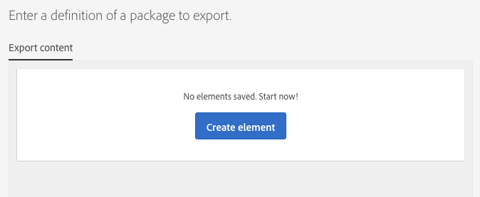

# Administración de paquetes{#managing-packages}

Los administradores pueden definir paquetes para intercambiar recursos entre distintas instancias de Adobe Campaign a través de archivos XML estructurados. Pueden ser parámetros de configuración o datos.

Esto puede resultar útil para transferir datos de un servidor a otro o para replicar la configuración de una instancia.

Los paquetes están disponibles en los menús **[!UICONTROL Administration]** &gt; **[!UICONTROL Deployment]** &gt; **[!UICONTROL Package exports]** o **[!UICONTROL Package imports]** . Los dos menús funcionan de manera similar.

Los elementos de cada lista se muestran de forma predeterminada según la fecha de modificación o instalación, desde la más reciente hasta la menos reciente.

Para mostrar y modificar el contenido de un elemento, haga clic en su etiqueta. Consulte las secciones [Exportación de un paquete](#exporting-a-package) e [Importación de un paquete](#importing-a-package) .

## Exportaciones de paquetes {#package-exports}

### Paquetes estándar {#standard-packages}

**[!UICONTROL Platform]** y **[!UICONTROL Administration]** son dos paquetes integrados, cada uno con una lista predefinida de los recursos que se van a exportar. Pueden abrirse en modo de sólo lectura y sólo son adecuadas para la exportación.

>[!CAUTION]
>
>La exportación de paquetes no está autorizada si los recursos exportados tienen ID predeterminados. Por lo tanto, las ID de los recursos exportables deben cambiarse con un nombre que sea diferente de las plantillas proporcionadas como estándar por Adobe Campaign Standard. Por ejemplo, para exportar perfiles de prueba, no debe utilizarse un ID que contenga el valor "SDM" o "sdm". Al intentar exportar paquetes que contienen ID predeterminados, puede ver errores como: "El tipo de entidad 'Marcas (marca)' utiliza un ID predeterminado ('BRD1') que puede provocar un conflicto al importar el paquete. Cambie este nombre y repita la operación".

Los pasos de exportación del paquete se describen en la sección [Exportación de un paquete](#exporting-a-package) .

* El **[!UICONTROL Platform]** paquete reagrupa todos los recursos agregados durante la configuración técnica: recursos personalizados, conjuntos de recursos personalizados, activadores y opciones de aplicación con el **[!UICONTROL System]** tipo.
* El **[!UICONTROL Administration]** paquete reagrupa todos los objetos agregados durante la configuración comercial, como: plantillas de campaña, plantillas de contenido, plantillas de entrega, plantillas de página de aterrizaje, plantillas de programa y plantillas de flujo de trabajo.

   También incluye los siguientes objetos: bloques de contenido, asignaciones de objetivo, cuentas externas, unidades organizativas, opciones de aplicación con el **[!UICONTROL User]** tipo, funciones, tipologías, reglas de tipología y usuarios.

>[!NOTE]
>
>El contenido de estos dos paquetes no puede modificarse. Por el contrario, estos paquetes siempre contienen los datos más actualizados disponibles. Puede [crear sus propios paquetes](#creating-a-package) para exportar elementos específicos.

### Creación de un paquete {#creating-a-package}

Debe crear un paquete si necesita exportar conjuntos específicos de datos.

Para crear un paquete, necesita los derechos de administración.

1. En **[!UICONTROL Administration]** &gt; **[!UICONTROL Deployment]** &gt; **[!UICONTROL Package exports]**, haga clic en el **[!UICONTROL Create]** botón de la lista de contenido del paquete.

   El elemento se crea inmediatamente. Para cancelar la creación, vuelva a la lista y marque la casilla correspondiente para eliminarla.

1. En la pantalla de contenido del paquete, especifique un nombre y un ID.
1. Haga clic en el **[!UICONTROL Edit properties]** botón si desea agregar una descripción y restringir el acceso a ciertos usuarios.

   

1. Utilice el **[!UICONTROL Create element]** botón de la **[!UICONTROL Export content]** ficha para seleccionar los recursos que desea exportar.

   

1. Los recursos se muestran en orden alfabético y se pueden filtrar por nombre. Su nombre técnico aparece entre paréntesis. Seleccione un elemento de la lista y confirme.

   

1. El nombre del recurso se muestra en la **[!UICONTROL Export content]** ficha. Para modificar un recurso, marque la casilla correspondiente y utilice el **[!UICONTROL Show detail of the element selected]** botón .

   

1. El uso del editor de consultas permite filtrar los elementos que se van a exportar. For more on this, refer to the [Editing queries](../../automating/using/editing-queries.md#creating-queries) section.

   

   >[!NOTE]
   >
   >Puede exportar hasta 5000 objetos por recurso.

1. Una vez especificados todos los recursos que se van a exportar, guarde la selección.

El paquete se ha creado y está listo para ser exportado.

### Exportación de un paquete {#exporting-a-package}

Exportar un paquete le permite guardar un estado específico de un recurso que podrá volver a importar en otra instancia o más tarde en la misma instancia.

>[!CAUTION]
>
>La exportación de paquetes no está autorizada si los recursos exportados tienen ID predeterminados. Por lo tanto, las ID de los recursos exportables deben cambiarse con un nombre que sea diferente de las plantillas proporcionadas como estándar por Adobe Campaign Standard. Por ejemplo, para exportar perfiles de prueba, no debe utilizarse un ID que contenga el valor "SDM" o "sdm".

1. En **[!UICONTROL Administration]** &gt; **[!UICONTROL Deployment]** &gt; **[!UICONTROL Package exports]**, seleccione un paquete para acceder a sus detalles.
1. Compruebe que el paquete contiene los datos que necesita.
1. Click the **[!UICONTROL Start export]** button.

El archivo exportado se almacena en la carpeta de descarga del explorador en uso. Se le denomina automáticamente "package_xxx.xml", donde "xxx" corresponde al ID del paquete.

Cuando la operación ha finalizado, aparecen varias secciones:

* **[!UICONTROL Export status]**:: esta sección muestra si la operación se ha realizado correctamente.

   

* Puede consultar los diferentes pasos de la exportación a través de la **[!UICONTROL Log]** ficha. Esto contiene los estados de todas las exportaciones anteriores.

   

>[!NOTE]
>
>Al seleccionar un elemento de la lista de contenido del paquete que ya se ha exportado, las fichas **[!UICONTROL Log]** y **[!UICONTROL Last export]** siguen estando disponibles.

## Importaciones de paquetes {#package-imports}

### Actualizaciones del sistema {#system-updates}

La lista de importación de paquetes anterior contiene las importaciones automáticas vinculadas a las actualizaciones realizadas por Adobe.

La **[!UICONTROL Execution logs]** ficha almacena todos los pasos de importación. Un panel lateral muestra la información general.

>[!NOTE]
>
>Estos elementos son accesibles en modo de solo lectura.

### Importación de un paquete {#importing-a-package}

Un administrador puede importar manualmente un paquete originado en una exportación ejecutada anteriormente desde una instancia de Adobe Campaign. For more on this, refer to the [Package exports](#package-exports) section.

La importación manual del paquete consta de dos pasos: primero, debe cargar un archivo y luego puede importar su contenido.

1. En **[!UICONTROL Administration]** &gt; **[!UICONTROL Deployment]** &gt; **[!UICONTROL Package imports]**, haga clic en el **[!UICONTROL Create]** botón de la lista de importación de paquetes.

   El elemento se crea inmediatamente. Para cancelar la creación, vuelva a la lista y marque la casilla correspondiente para eliminarla.

1. Especifique un nombre y un ID para la nueva importación.
1. Seleccione el archivo que desea cargar arrastrándolo y soltándolo o haciendo clic en el **[!UICONTROL Select from folder]** vínculo.

   Los archivos importados deben tener formato XML o ZIP (que contenga un archivo XML).

   

   >[!NOTE]
   >
   >Para reemplazar el documento cargado, comience por eliminar el archivo mediante el icono X a la derecha de su nombre y, a continuación, repita la operación.

1. Una vez cargado el archivo, importe su contenido en la base de datos mediante el **[!UICONTROL Start import]** botón .

   

Cuando la operación ha finalizado, aparecen varias secciones:

* **[!UICONTROL Import status]**:: esta sección muestra si la operación se ha realizado correctamente.
* Puede consultar los diferentes pasos de la importación a través de la **[!UICONTROL Execution logs]** ficha. Esto es especialmente importante para ver los errores.

   

Una vez importado un paquete, no se puede volver a importar desde el mismo elemento. Solo puede modificar su etiqueta y su ID.

Para volver a importar el mismo paquete, debe volver a la lista de importación de paquetes, crear un elemento y, a continuación, cargar el archivo seleccionado de nuevo.
