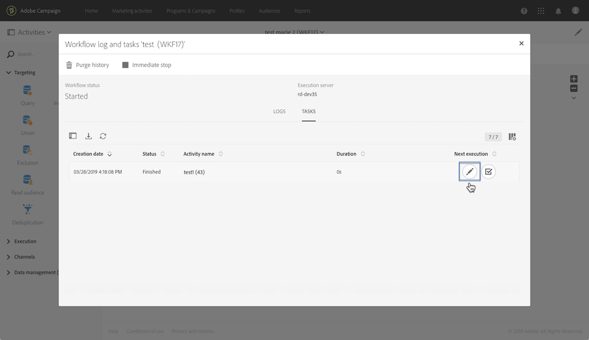

# Monitorización de las variables de eventos {#monitoring-the-events-variables}

Es posible monitorizar las variables de eventos disponibles en el flujo de trabajo, incluidos los parámetros externos declarados. Para realizar esto, siga los pasos a continuación:

1. Seleccione la actividad que sigue a la actividad **[!UICONTROL External signal]** y luego haga clic en el botón **[!UICONTROL Log and tasks]**.
1. En la ficha **[!UICONTROL Tasks]**, haga clic en el botón .

   

1. Se muestra el contexto de ejecución de la tarea (ID, estado, duración, etc.), incluidas todas las variables de eventos que ahora están disponibles para su uso en el flujo de trabajo.

   
