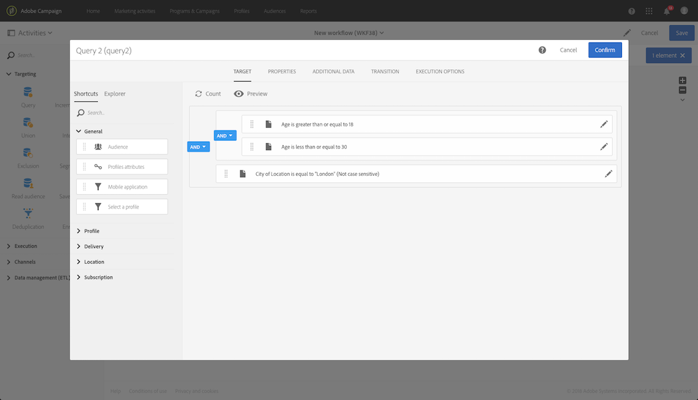
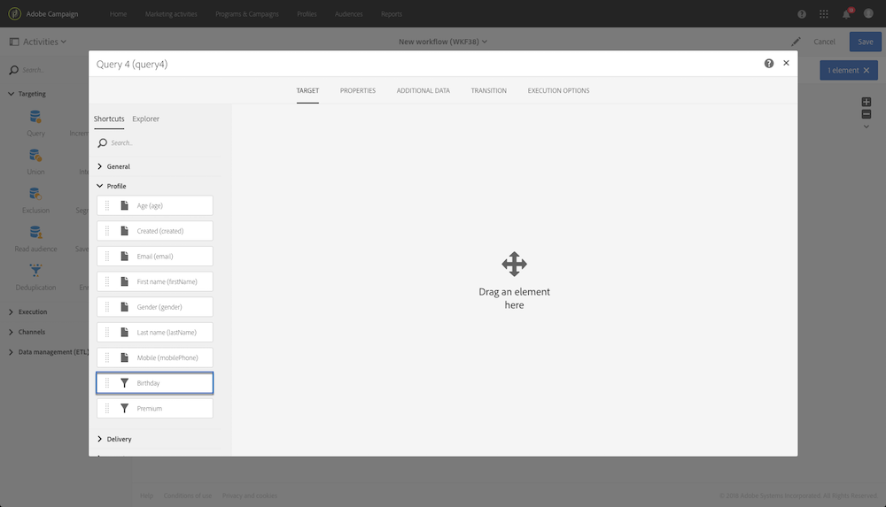
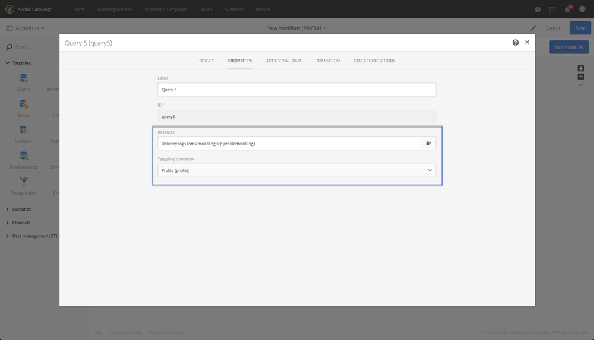
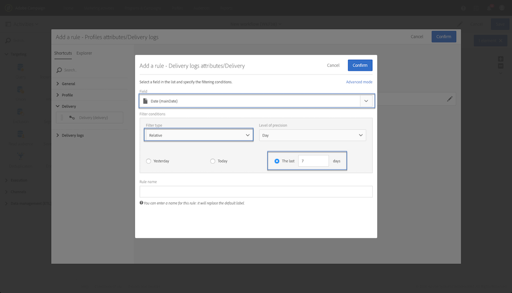

# Ejemplos de consultas {#query-samples}

Esta sección presenta un caso de uso al usar una actividad **[!UICONTROL Query]**. Para obtener más información sobre cómo usar una actividad **[!UICONTROL Query]**, consulte [esta sección](../../automating/using/query.md).

## Segmentación en atributos de perfil simples {#targeting-on-simple-profile-attributes}

El siguiente ejemplo muestra una actividad de consulta configurada para segmentar hombres de entre 18 y 30 años que viven en Londres.

## Segmentación en atributos de correo electrónico {#targeting-on-email-attributes}

El siguiente ejemplo muestra una actividad de consulta configurada para perfiles de segmentación con el dominio de dirección de correo electrónico &quot;orange.co.uk&quot;.

El siguiente ejemplo muestra una actividad de consulta configurada para perfiles de destinatario cuya dirección de correo electrónico se ha proporcionado.

## Segmentación de perfiles cuyo cumpleaños es hoy {#targeting-profiles-whose-birthday-is-today}

El siguiente ejemplo muestra una actividad de consulta configurada para perfiles de destinatario cuyo cumpleaños es hoy.

1. Arrastre el filtro **[!UICONTROL Birthday]** a la consulta.

   

1. Configure el **[!UICONTROL Filter type]** en **[!UICONTROL Relative]** y seleccione **[!UICONTROL Today]**.

   

## Segmentación de perfiles que abrieron un envío específico {#targeting-profiles-who-opened-a-specific-delivery}

El siguiente ejemplo muestra una actividad de consulta configurada para filtrar perfiles que abrieron el envío con la etiqueta &quot;Hora de verano&quot;.

1. Arrastre el filtro **[!UICONTROL Opened]** a la consulta.

   

1. Seleccione el envío y haga clic en **[!UICONTROL Confirm]**.

   

## Segmentación de perfiles para los que los envíos fallaron por un motivo específico {#targeting-profiles-for-whom-deliveries-failed-for-a-specific-reason}

El siguiente ejemplo muestra una actividad de consulta configurada para filtrar perfiles para los que los envíos fallaron porque el buzón estaba lleno. Esta consulta solo está disponible para usuarios con derechos de administración y pertenecientes a las unidades organizativas **[!UICONTROL All (all)]** (consulte [esta sección](../../administration/using/organizational-units.md)).

1. Seleccione el recurso **[!UICONTROL Delivery logs]** para filtrar directamente en la tabla de registro de envíos (consulte [Uso de recursos diferentes de dimensiones de segmentación](../../automating/using/using-resources-different-from-targeting-dimensions.md)).

   

1. Arrastre el filtro **[!UICONTROL Nature of failure]** a la consulta.

   

1. Seleccione el tipo de fallo que desea segmentar. En nuestro caso, es **[!UICONTROL Mailbox full]**.

   

## Segmentación de perfiles no contactados durante los últimos 7 días {#targeting-profiles-not-contacted-during-the-last-7-days}

El siguiente ejemplo muestra una actividad de consulta configurada para filtrar perfiles a los que no se ha contactado durante los últimos 7 días.

1. Arrastre el filtro **[!UICONTROL Delivery logs (logs)]** a la consulta.

   

   Seleccione **[!UICONTROL Does not exist]** en la lista desplegable y arrastre el filtro **[!UICONTROL Delivery]**.

   

1. Configure el filtro como se muestra a continuación.

   

## Segmentación de perfiles que hicieron clic en un vínculo específico {#targeting-profiles-who-clicked-a-specific-link-}

1. Arrastre el filtro **[!UICONTROL Tracking logs (tracking)]** a la consulta.

   

1. Arrastre el filtro **[!UICONTROL Label (urlLabel)]**.

   

1. En el campo **[!UICONTROL Value]**, escriba la etiqueta que se definió al insertar el vínculo en el envío y confirme.

   
