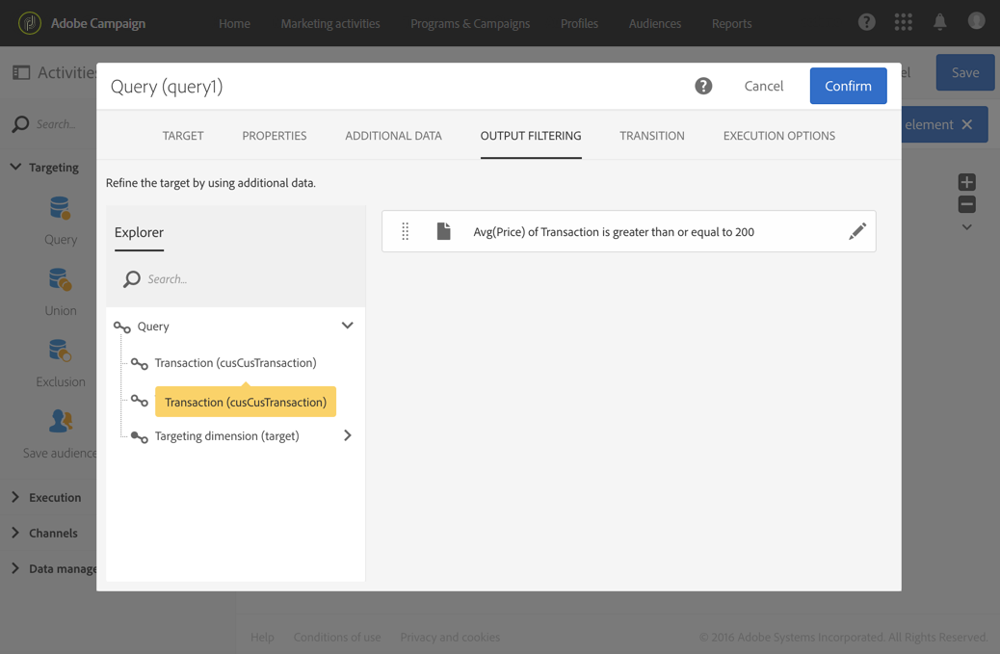

# Consulta{#query}

## Descripción {#description}

La actividad **[!UICONTROL Query]** permite filtrar y extraer una población de elementos de la base de datos de Adobe Campaign. Puede definir los **[!UICONTROL Additional data]** para la población objetivo mediante una pestaña dedicada. Estos datos se almacenan en columnas adicionales y solo se pueden utilizar para el flujo de trabajo en curso.

La actividad utiliza la herramienta de edición de consultas. Esta herramienta se detalla en una [sección dedicada](../../automating/using/editing-queries.md#about-query-editor).

**Temas relacionados:**

* [Ejemplos de consultas](../../automating/using/query-samples.md)
* [Caso de uso: Flujo de trabajo de redireccionamiento que envía una nueva entrega a receptores que no abran el mensaje](../../automating/using/workflow-cross-channel-retargeting.md)

## Contexto de uso {#context-of-use}

La actividad **[!UICONTROL Query]** se puede utilizar para varios tipos de usos:

* Segmentación de individuos para definir el destinatario de un mensaje, la audiencia, etc.
* Enriquecimiento de datos de toda la tabla de la base de datos de Adobe Campaign.
* Exportación de datos.

## Configuración {#configuration}

1. Arrastre y suelte una actividad **[!UICONTROL Query]** en su flujo de trabajo.
1. Seleccione la actividad y, a continuación, ábrala con el botón , en las acciones rápidas que aparecerán. De forma predeterminada, la actividad está preconfigurada para buscar perfiles.
1. Si desea ejecutar una consulta en un recurso que no sea el de perfil, vaya a la pestaña **[!UICONTROL Properties]** de la actividad y seleccione un **[!UICONTROL Resource]** y una **[!UICONTROL Targeting dimension]**.

   El **[!UICONTROL Resource]** permite refinar los filtros mostrados en la paleta, mientras que la **[!UICONTROL Targeting dimension]**, contextual con respecto al recurso seleccionado, corresponde al tipo de población que desea obtener (perfiles identificados, envíos, datos vinculados al recurso seleccionado, etc.).

   Para obtener más información sobre esto, consulte [Dimensiones de segmentación y recursos](#targeting-dimensions-and-resources).

1. En la pestaña **[!UICONTROL Target]**, ejecute la consulta definiendo y combinando reglas.

   >[!NOTE]
   >
   >Al segmentar una audiencia, tenga en cuenta que no se hace referencia a la definición de la audiencia, sino que **se ha copiado** en la consulta. Si realiza cualquier cambio en la audiencia después de haberla segmentado en una consulta, asegúrese de volver a configurar la consulta para tener en cuenta la nueva definición.

1. Puede definir los **[!UICONTROL Additional data]** para la población objetivo mediante una pestaña dedicada. Estos datos se almacenan en columnas adicionales y solo se pueden utilizar para el flujo de trabajo en curso. En particular, puede añadir datos de las tablas de la base de datos de Adobe Campaign vinculadas a la dimensión de segmentación de la consulta. Consulte la sección [Enriquecimiento de datos](#enriching-data).

   >[!NOTE]
   >
   >De forma predeterminada, la opción **[!UICONTROL Remove duplicate rows (DISTINCT)]** está marcada en **[!UICONTROL Advanced options]** de la pestaña **[!UICONTROL Additional data]** de la consulta. Si la actividad **[!UICONTROL Query]** contiene muchos datos adicionales definidos (de 100), se recomienda desactivar esta opción por motivos de rendimiento. Tenga en cuenta que desmarcar esta opción puede resultar en duplicados, según los datos consultados.

1. En la pestaña **[!UICONTROL Transition]**, la opción **[!UICONTROL Enable an outbound transition]** le permite agregar una transición saliente después de la actividad de consulta, aunque no recupere datos.

   El código de segmento de la transición saliente se puede personalizar mediante una expresión estándar y variables de eventos (consulte [esta página](../../automating/using/customizing-workflow-external-parameters.md)).

1. Confirme la configuración de la actividad y guarde el flujo de trabajo.

## Recursos y dimensiones de segmentación {#targeting-dimensions-and-resources}

Los recursos y dimensiones de segmentación le permiten definir en qué elementos se basará una consulta para determinar el destinatario de un envío.

Se configuran en [asignaciones de destino](../../administration/using/target-mappings-in-campaign.md) y se definen al crear un flujo de trabajo, en la pestaña **[!UICONTROL Properties]** de una actividad de consulta.

>[!NOTE]
>
>La dimensión de segmentación también se puede definir al crear una audiencia (consulte [esta sección](../../audiences/using/creating-audiences.md)).

Los recursos y dimensiones de segmentación están vinculados. Por lo tanto, las dimensiones de segmentación disponibles dependen del recurso seleccionado.

Por ejemplo, para el recurso **[!UICONTROL Profiles (profile)]**, estarán disponibles las siguientes dimensiones de segmentación:

Mientras que para **[!UICONTROL Deliveries (delivery)]**, la lista contendrá las siguientes dimensiones de segmentación:

Una vez que se han especificado el recurso y la dimensión de segmentación, verá diferentes filtros disponibles en la consulta.

Ejemplo de filtros disponibles para el recurso **[!UICONTROL Profiles (profile)]**:

Ejemplo de filtros disponibles para el recurso **[!UICONTROL Deliveries (delivery)]**:

De forma predeterminada, el recurso y la dimensión de segmentación se configuran en perfiles de destino. Sin embargo, puede resultar útil utilizar un recurso diferente de la dimensión de segmentación si desea buscar un registro específico en una tabla distante.

Para obtener más información, consulte este caso de uso: [Uso de recursos diferentes de dimensiones de segmentación](../../automating/using/using-resources-different-from-targeting-dimensions.md)

## Enriquecimiento de datos {#enriching-data}

La pestaña **[!UICONTROL Additional data]** de las actividades **[!UICONTROL Query]**, **[!UICONTROL Incremental query]** y **[!UICONTROL Enrichment]** permite enriquecer los datos segmentados y transferir estos datos a las siguientes actividades de flujo de trabajo, donde se pueden utilizar. En particular, puede agregar lo siguiente:

* Datos simples
* Agregados
* Colecciones

En el caso de los agregados y las colecciones, se define un **[!UICONTROL Alias]** automáticamente una variable para proporcionar un ID técnico a una expresión compleja. Este alias, que debe ser único, permite que los agregados y las colecciones se encuentren fácilmente posteriormente. Puede modificarla para darle un nombre fácilmente reconocible.

>[!NOTE]
>
>Los alias deben respetar las siguientes reglas de sintaxis: solo se pueden usar caracteres alfanuméricos y los caracteres &quot;_&quot;. Los alias distinguen entre mayúsculas y minúsculas. El alias debe comenzar con el carácter &quot;@&quot;. El carácter que sigue inmediatamente a &quot;@&quot; no debe ser numérico. Por ejemplo: @myAlias_1 y @_1Alias son correctos; mientras que @myAlias#1 y @1Alias son incorrectos.

Después de agregar datos adicionales, puede aplicar un nivel de filtro adicional a los datos objetivo inicial creando condiciones basadas en los datos adicionales definidos.

>[!NOTE]
>
>De forma predeterminada, la opción **[!UICONTROL Remove duplicate rows (DISTINCT)]** está marcada en **[!UICONTROL Advanced options]** de la pestaña **[!UICONTROL Additional data]** de la consulta. Si la actividad **[!UICONTROL Query]** contiene muchos datos adicionales definidos (de 100), se recomienda desactivar esta opción por motivos de rendimiento. Tenga en cuenta que desmarcar esta opción puede resultar en duplicados, según los datos consultados.

En [esta sección](../../automating/using/personalizing-email-with-additional-data.md) se presenta un caso de uso sobre cómo personalizar un correo electrónico con datos adicionales.

### Adición de un campo simple {#adding-a-simple-field}

Al agregar un campo simple como datos adicionales, ese campo se vuelve directamente visible en la transición de salida de la actividad. Esto permite al usuario comprobar, por ejemplo, que los datos de la consulta son los datos deseados.

1. En la pestaña **[!UICONTROL Additional data]**, agregue un nuevo elemento.
1. En la ventana que se abre, en el campo **[!UICONTROL Expression]**, seleccione uno de los campos disponibles directamente en la dimensión de segmentación o en una de las dimensiones vinculadas. Puede editar expresiones y utilizar funciones o cálculos simples (excepto agregados) desde los campos de dimensión.

   Se crea automáticamente un **[!UICONTROL Alias]** si edita una expresión que no es una ruta XPATH simple (por ejemplo: &quot;Year(&lt;@birthDate>)&quot;). Si lo desea, puede modificarlo. Si solo selecciona un campo (por ejemplo, &quot;@age&quot;), no necesita definir un **[!UICONTROL Alias]**.

1. Seleccione **[!UICONTROL Add]** para confirmar la adición del campo a los datos adicionales. Cuando se ejecute la consulta, aparecerá una columna adicional correspondiente al campo agregado en la transición saliente de la actividad.

### Adición de un agregado {#adding-an-aggregate}

Los agregados permiten calcular valores a partir de los campos de la dimensión de segmentación o de los campos de dimensiones vinculados a la dimensión de segmentación. Por ejemplo: la cantidad promedio comprada por un perfil.
Cuando se utiliza un agregado con consulta, su función puede volver a cero, lo que se considera como NULL. Utilice la pestaña **[!UICONTROL Output filtering]** de la consulta para filtrar el valor agregado:

* si quiere valores cero, debe filtrar con **[!UICONTROL is null]**.
* si no quiere valores cero, filtre con **[!UICONTROL is not null]**.

Tenga en cuenta que, si necesita ordenar el agregado, debe filtrar los valores cero o bien el valor NULL aparecerá como número correcto.

1. En la pestaña **[!UICONTROL Additional data]**, agregue un nuevo elemento.
1. En la ventana que se abre, seleccione la colección que desee utilizar para crear el agregado en el campo **[!UICONTROL Expression]**.

   Se crea automáticamente un **[!UICONTROL Alias]**. Si lo desea, puede modificarlo volviendo a la pestaña **[!UICONTROL Additional data]** de la consulta.

   Se abre la ventana de definición de agregados.

1. Defina un agregado desde la pestaña **[!UICONTROL Data]**. Según el tipo de agregado seleccionado, solo los elementos cuyos datos son compatibles están disponibles en el campo **[!UICONTROL Expression]**. Por ejemplo, una suma solo se puede calcular con datos numéricos.

   

   Puede agregar varios agregados para los campos de la colección seleccionada. Asegúrese de definir etiquetas explícitas para distinguir las distintas columnas en los detalles de los datos salientes de la actividad.

   También puede cambiar los alias que se definen automáticamente para cada agregado.

   

1. Si es necesario, puede agregar un filtro para limitar los datos que se tienen en cuenta.

   Consulte la sección [Filtrado de datos adicionales](#filtering-added-data).

1. Seleccione **[!UICONTROL Confirm]** para agregar agregados.

>[!NOTE]
>
>No se puede crear una expresión que contenga un agregado directamente desde el campo **[!UICONTROL Expression]** de la ventana **[!UICONTROL New additional data]**.

### Adición de una colección {#adding-a-collection}

1. En la pestaña **[!UICONTROL Additional data]**, agregue un nuevo elemento.
1. En la ventana que se abre, seleccione la colección que desee agregar en el campo **[!UICONTROL Expression]**. Se crea automáticamente un **[!UICONTROL Alias]**. Si lo desea, puede modificarlo volviendo a la pestaña **[!UICONTROL Additional data]** de la consulta.
1. Seleccione **[!UICONTROL Add]**. Se abre una nueva ventana, que le permite refinar los datos de recopilación que desea mostrar.
1. En la pestaña **[!UICONTROL Parameters]**, seleccione **[!UICONTROL Collection]** y defina el número de líneas de la colección que desea agregar. Por ejemplo, si desea obtener las tres compras más recientes realizadas por cada perfil, introduzca &quot;3&quot; en el campo **[!UICONTROL Number of lines to return]**.

   >[!NOTE]
   >
   >Debe especificar un número mayor o igual que 1.

1. En la pestaña **[!UICONTROL Data]**, defina los campos de la colección que desea mostrar para cada línea.

   

1. Si lo desea, puede agregar un filtro para limitar las líneas de recopilación que se tienen en cuenta.

   Consulte la sección [Filtrado de datos adicionales](#filtering-added-data).

1. Si lo desea, puede definir una clasificación de datos.

   Por ejemplo, si ha seleccionado 3 líneas para que se devuelvan en la pestaña **[!UICONTROL Parameters]** y desea determinar las tres compras más recientes, puede definir un orden descendente en el campo &quot;fecha&quot; de la colección que corresponde a las transacciones.

1. Consulte la sección [Clasificación de datos adicionales](#sorting-additional-data).
1. Seleccione **[!UICONTROL Confirm]** para añadir la colección.

### Filtrado de datos añadidos {#filtering-added-data}

Cuando se añade una colección o un agregado, puede definir un filtro adicional para limitar los datos que desea mostrar.

Por ejemplo, si solo desea procesar las líneas de recopilación de transacciones con importes de 50 dólares o más, puede agregar una condición en el campo correspondiente al importe de la transacción desde la pestaña **[!UICONTROL Filter]**.

### Clasificación de datos adicionales {#sorting-additional-data}

Al agregar un agregado o una colección a los datos de una consulta, puede especificar si desea aplicar una clasificación (ya sea ascendente o descendente) en función del valor del campo o de la expresión definida.

Por ejemplo, si desea guardar únicamente la transacción que un perfil realizó más recientemente, introduzca &quot;1&quot; en el campo **[!UICONTROL Number of lines to return]** de la pestaña **[!UICONTROL Parameters]** y aplique un orden descendente en el campo correspondiente a la fecha de transacción en la pestaña **[!UICONTROL Sort]**.

### Filtrado de datos segmentados con datos adicionales {#filtering-the-targeted-data-according-to-additional-data}

Una vez que haya agregado datos adicionales, aparecerá una nueva pestaña **[!UICONTROL Output filtering]** en **[!UICONTROL Query]**. Esta pestaña le permite aplicar un filtro adicional a los datos que inicialmente están en la pestaña **[!UICONTROL Target]**, teniendo en cuenta los datos agregados.

Por ejemplo, si ha segmentado todos los perfiles que han realizado, al menos, una transacción y se ha agregado a **[!UICONTROL Additional data]** una cantidad agregada que calcula el importe de transacción medio por perfil, puede refinar la población calculada inicialmente con esta media.

Para ello, en la pestaña **[!UICONTROL Output filtering]**, simplemente agregue una condición a estos datos adicionales.

