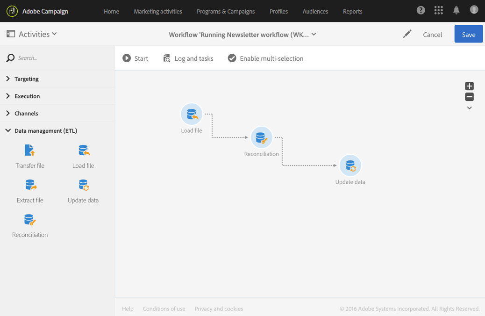
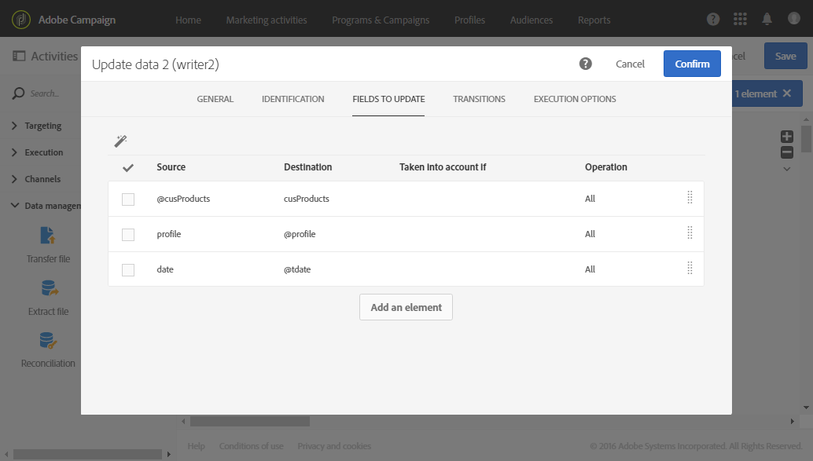

# Reconciliación de datos mediante relaciones {#reconciliation-relations}

En el siguiente ejemplo se muestra un flujo de trabajo que actualiza la base de datos con los datos de compra de un archivo. Los datos de compra contienen datos que hacen referencia a elementos de otras dimensiones, como los correos electrónicos del cliente y los códigos de producto.

>[!NOTE]
>
>Los recursos de **Transactions** y **Products** utilizados en este ejemplo no existen de forma predeterminada en la base de datos de Adobe Campaign. Por lo tanto, se crearon de antemano utilizando la función [Recursos personalizados](../../developing/using/data-model-concepts.md). Los perfiles que corresponden a las direcciones de correo electrónico del archivo importado, así como a los productos, se cargaron en la base de datos de antemano.

El flujo de trabajo se compone de las siguientes actividades:



* A [Cargar archivo](../../automating/using/load-file.md) actividad, que carga y detecta los datos del archivo que se va a importar. El archivo importado contiene los siguientes datos:

   * Fecha de transacción
   * Dirección de correo electrónico del cliente
   * Código del producto comprado

  ```
  date;client;product
  2015-05-19 09:00:00;mail1@email.com;ZZ1
  2015-05-19 09:01:00;mail2@email.com;ZZ2
  2015-05-19 09:01:01;mail3@email.com;ZZ2
  2015-05-19 09:01:02;mail4@email.com;ZZ2
  2015-05-19 09:02:00;mail5@email.com;ZZ3
  2015-05-19 09:03:00;mail6@email.com;ZZ4
  2015-05-19 09:04:00;mail7@email.com;ZZ5
  2015-05-19 09:05:00;mail8@email.com;ZZ7
  2015-05-19 09:06:00;mail9@email.com;ZZ6
  ```

* A [Reconciliación](../../automating/using/reconciliation.md) actividad para enlazar datos de compra a perfiles de base de datos, así como a productos. Por lo tanto, es necesario definir una relación entre los datos del archivo y la tabla de perfiles, así como la tabla de productos. Esta configuración se realiza en la pestaña **[!UICONTROL Relations]** de la actividad:

   * Relación con **Profiles**: la columna **cliente** del archivo está vinculada al campo de **correo electrónico** de la dimensión **Profiles** .
   * Relación con **Products**: la columna de **producto** del archivo está vinculada al campo **productCode** de la dimensión **Profiles** .

  Las columnas se agregan a los datos de entrada para hacer referencia a las claves externas de las dimensiones vinculadas.

  

* Un [Actualización de datos](../../automating/using/update-data.md) La actividad permite definir los campos de base de datos que se actualizarán con los datos importados. Como los datos ya se identificaron como pertenecientes a la dimensión **Transactions** en la actividad anterior, aquí puede utilizar la opción de identificación **[!UICONTROL Directly using the targeting dimension]**.

  Mediante la opción que detecta automáticamente los campos que se van a actualizar, los vínculos configurados en la actividad anterior (a perfiles y productos) se agregan a la lista de **[!UICONTROL Fields to update]**. También debe asegurarse de que el campo que corresponde a la fecha de transacción se agrega correctamente a esta lista.

  

  
