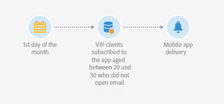

# Envío de una notificación push recurrente con un flujo de trabajo {#sending-a-recurring-push-notification-with-a-workflow}

En este ejemplo, se envía una notificación push personalizada todos los primeros días del mes a las 20:00 a los suscriptores de la aplicación móvil, según sus husos horarios.

Para crear el flujo de trabajo, siga estos pasos:

1. El [Planificador](../../automating/using/scheduler.md) Esta actividad le permite iniciar el flujo de trabajo días antes del inicio de la entrega para poder enviar la notificación a cada suscriptor a las 20:00 en cualquier huso horario determinado:

   * En el **[!UICONTROL Execution frequency]** , seleccione Monthly.
   * Seleccione las 20:00 en **[!UICONTROL Time]** field.
   * Elija el día en el que se enviará la entrega todos los meses.
   * Seleccione una fecha de inicio para el flujo de trabajo, al menos un día antes del inicio de la entrega. De lo contrario, es posible que algunos destinatarios reciban el mensaje un día después si la hora seleccionada ya ha pasado en sus zonas horarias.
   * En el **[!UICONTROL Execution options]** pestaña, seleccione el huso horario en el que comenzará el flujo de trabajo en la **[!UICONTROL Time zone]** field. En este caso, por ejemplo, el flujo de trabajo se inicia a las 20:00, hora del Pacífico, una semana antes del primer día del mes para permitir que se cree un tiempo para las entregas para todos los husos horarios aplicables.

   >[!NOTE]
   >
   >De forma predeterminada, el huso horario seleccionado es el definido en las propiedades del flujo de trabajo (consulte [Creación de un flujo de trabajo](../../automating/using/building-a-workflow.md)).

   

1. El [Consulta](../../automating/using/query.md) VIP La actividad de le permite dirigirse a sus clientes de entre 20 y 30 años de edad que se hayan suscrito a su aplicación móvil y que no hayan abierto el correo electrónico que ha enviado:

   * VIP Seleccione una audiencia (sus clientes de) y filtre por edad.
   * Arrastre y suelte el **Suscripciones a una aplicación** en el espacio de trabajo. Seleccionar **Existe** y seleccione la aplicación móvil que desee utilizar.
   * Seleccione el correo electrónico que envió a sus clientes.
   * Arrastre y suelte el **Registros de envío (registros)** en el espacio de trabajo y seleccione **Existe** para dirigirse a todos los clientes que recibieron el correo electrónico.
   * Arrastre y suelte el **Registros de seguimiento (seguimiento)** en el espacio de trabajo y seleccione **No existe** para dirigirse a todos los clientes que no hayan abierto el correo electrónico.

     

1. El [Entrega de notificaciones push](../../automating/using/push-notification-delivery.md) esta actividad le permite introducir el contenido del mensaje y seleccionar los campos de personalización que desea utilizar:

   * Seleccione la opción **[!UICONTROL Recurring notification]**.
   * Defina el contenido de las notificaciones push. Para obtener más información sobre el contenido de las notificaciones push, consulte [sección](../../channels/using/preparing-and-sending-a-push-notification.md).
   * En el **[!UICONTROL Schedule]** bloque, seleccione **[!UICONTROL Messages to be sent automatically on the time zone specified below]**. Aquí, elegimos el **[!UICONTROL Time zone of the contact date]** Pacífico como en el flujo de trabajo **[!UICONTROL Scheduler]**.
   * En el campo **[!UICONTROL Optimize the sending time per recipient]**, seleccione **[!UICONTROL Send at the recipient's time zone]**.

     

1. Haga clic en **[!UICONTROL Start]** para iniciar el flujo de trabajo recurrente.

   

El flujo de trabajo se está ejecutando. Comenzará en la fecha de inicio elegida del **[!UICONTROL Scheduler]** a las 20:00, hora del Pacífico, la notificación push recurrente se enviará todos los primeros días del mes a las 20:00, según la zona horaria del cliente.
