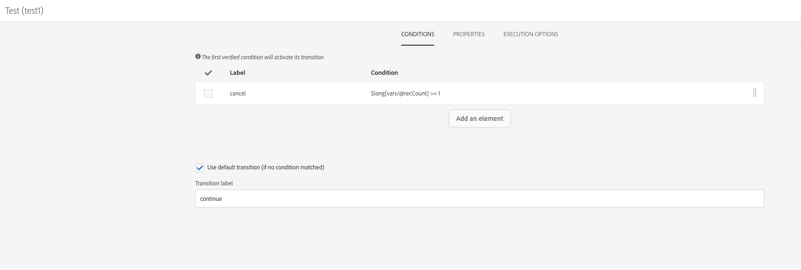

# Ejecución superpuesta de flujos de trabajo programados{#preventing-overlapping-execution-of-scheduled-workflows}

## Acerca de la ejecución de flujos de trabajo programados

En Campaign Standard, el motor de flujos de trabajo garantiza que una instancia de flujo de trabajo se ejecute únicamente mediante un proceso. Bloquear actividades como importaciones, consultas de larga ejecución o escrituras en la base de datos impide la ejecución de cualquier otra tarea al ejecutarse.

Por otra parte, las actividades sin bloqueo no bloquean la ejecución de otras tareas (normalmente actividades que esperan un evento como la actividad **[!UICONTROL Scheduler]**).

Esto puede dar lugar a un escenario en el que un flujo de trabajo basado en programación puede resultar inicio de ejecución incluso cuando la ejecución anterior del mismo flujo de trabajo aún no ha finalizado, lo que podría dar lugar a problemas de datos inesperados.

Por lo tanto, al diseñar un flujo de trabajo programado que incluya varias actividades, debe asegurarse de que el flujo de trabajo no se vuelva a programar hasta que finalice. Para ello, debe configurar el flujo de trabajo para evitar que se ejecute si una o varias tareas de una ejecución anterior siguen pendientes.

## Configuración del flujo de trabajo

Para comprobar si una o varias tareas de una ejecución de flujo de trabajo anterior siguen pendientes, debe utilizar una actividad **[!UICONTROL Query]** y una **[!UICONTROL Test]**.

1. Añada una actividad **[!UICONTROL Query]** después de la actividad **[!UICONTROL Scheduler]** y configúrela de la siguiente manera.

1. Cambie el recurso de la actividad a **[!UICONTROL WorkflowTaskDetail]**, lo que significa que destinatario las tareas actuales del flujo de trabajo.

   

1. Configure la consulta con las reglas siguientes:

   

   * La primera regla filtros la tarea actual (consulta 2), así como la siguiente tarea de programación (programación 2) que pertenece al flujo de trabajo actual.

      >[!NOTE]
      >
      >Cuando una **[!UICONTROL Scheduler]** actividad inicio, agrega inmediatamente otra tarea de programación para que se ejecute a la siguiente hora programada y inicio el flujo de trabajo. Por lo tanto, es importante filtrar tanto la consulta como las tareas de programación cuando se buscan tareas pendientes de una ejecución anterior.

   * La segunda regla determina si las tareas de una ejecución anterior del flujo de trabajo siguen activas (pendientes), lo que corresponde al estado de ejecución 0.

1. Añada una actividad **[!UICONTROL Test]** para comprobar el número de tareas pendientes devueltas por la actividad **[!UICONTROL Query]**. Para ello, configure dos transiciones salientes.

   

   * La primera transición continúa la ejecución del flujo de trabajo si no hay tareas pendientes,
   * La segunda transición cancela la ejecución del flujo de trabajo si hay tareas pendientes.

   

Ahora puede configurar el resto del flujo de trabajo según sea necesario. Si la ejecución del flujo de trabajo se cancela debido a tareas pendientes, cuando el flujo de trabajo se ejecuta de nuevo según la programación, puede seguir estos pasos. Esto garantizará que la ejecución del flujo de trabajo sólo se realizará si no hay ninguna tarea activa (pendiente) de una ejecución anterior.
