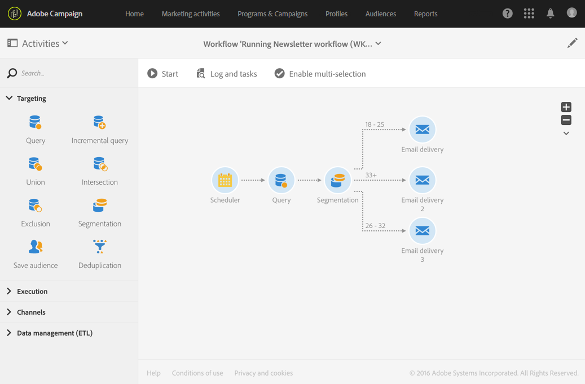
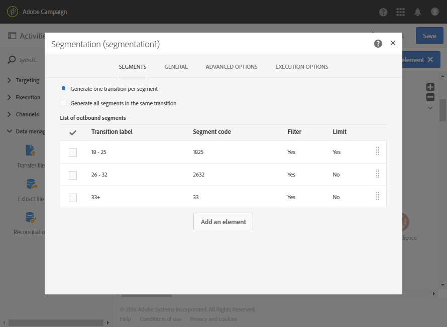
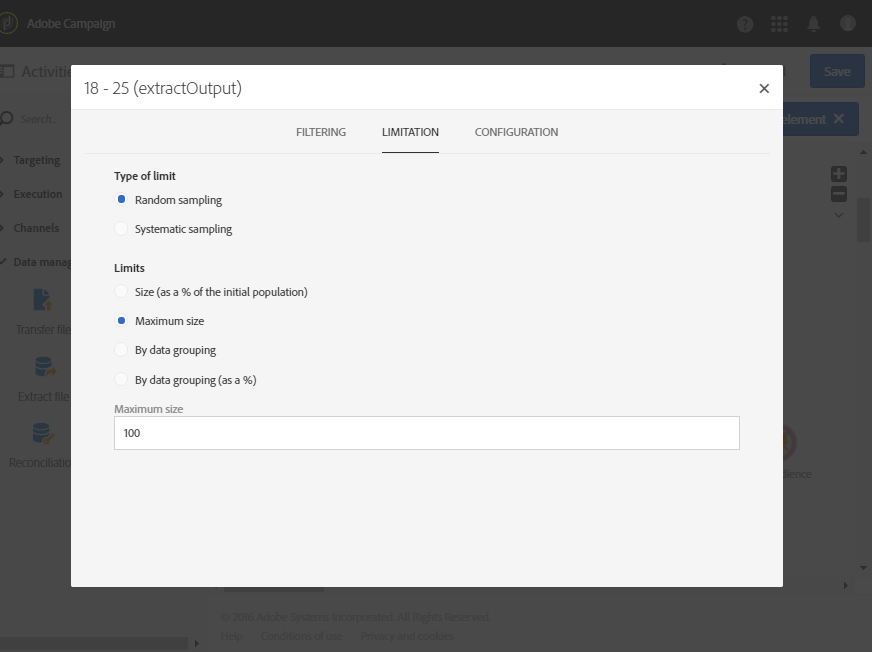

# Segmentación según grupos de edad {#segmentation-age-groups}

El siguiente ejemplo muestra una segmentación de los perfiles de base de datos según su grupo de edad.

El objetivo del flujo de trabajo es enviar un correo electrónico específico a cada grupo de edad. Teniendo en cuenta que este flujo de trabajo forma parte de una campaña de prueba, cada segmento solo puede contener un máximo de 100 perfiles seleccionados al azar para utilizar públicos limitados y representativos a la vez.

El flujo de trabajo se compone de los siguientes elementos:

* Una [actividad de planificador](../../automating/using/segmentation.md) para especificar la fecha de ejecución del flujo de trabajo.
* Una actividad [Query](../../automating/using/query.md) para segmentar perfiles de personas cuyo cumpleaños y dirección de correo electrónico han sido especificados.
* Una actividad [Segmentation](../../automating/using/segmentation.md) para crear 3 segmentos divididos en diferentes transiciones salientes: 18 a 25 años, 26 a 32 años y perfiles mayores de 32 años. Los segmentos se definen según los siguientes parámetros:

  

   * Un filtro de edad para definir el grupo de edad del segmento.

     

   * Un límite de tipo **[!UICONTROL Random sampling]** vinculado a un límite **[!UICONTROL Maximum size]** de 100.

     

* Una actividad de [envío de correo electrónico](../../automating/using/email-delivery.md) por segmento.
