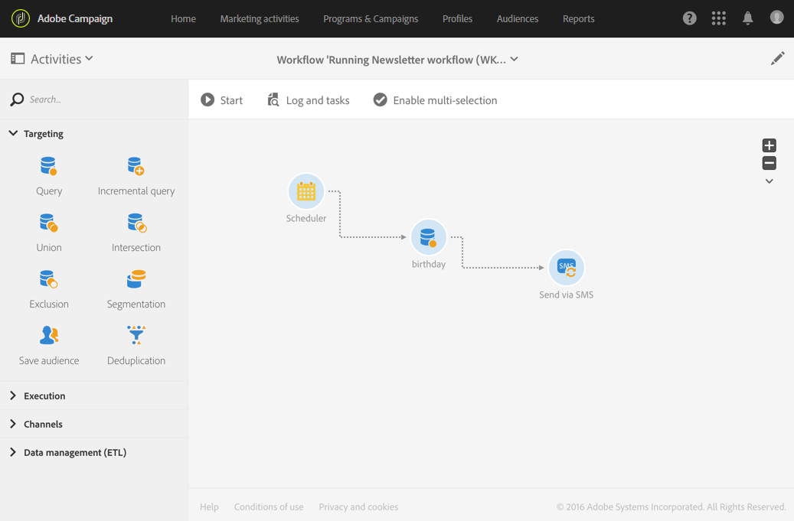

# SMS delivery{#sms-delivery}

## Description {#description}

The **[!UICONTROL SMS delivery]** activity allows you to configure sending an SMS in a workflow. This can be a **single send** SMS and sent just once, or it can be a **recurring** SMS.

Los mensajes SMS de envío único son SMS estándar, enviados una vez.

Los mensajes SMS recurrentes le permiten enviar el mismo SMS varias veces a diferentes objetivos durante un período definido. Puede agregar las entregas por período para obtener informes que correspondan a sus necesidades.

## Context of use {#context-of-use}

The **[!UICONTROL SMS delivery]** activity is generally used to automate sending an SMS to a target calculated in the same workflow.

Cuando se vincula a un programador, puede definir mensajes SMS recurrentes.

Los destinatarios SMS se definen como flujo ascendente de la actividad en el mismo flujo de trabajo mediante actividades de segmentación como consultas, intersecciones, etc.

La preparación de los mensajes se activa según los parámetros de ejecución del flujo de trabajo. Desde el panel de mensajes, puede seleccionar si desea solicitar o no una confirmación manual para enviar el mensaje (obligatorio de forma predeterminada). Puede iniciar el flujo de trabajo manualmente o colocar una actividad de programador en el flujo de trabajo para automatizar la ejecución.

## Configuration {#configuration}

1. Drag and drop an **[!UICONTROL SMS delivery]** activity into your workflow.
1. Select the activity, then open it using the  button from the quick actions that appear.

   >[!NOTE]
   >
   >You can access the general properties and advanced options of the activity (and not of the delivery itself) via the  button in the workflow's action bar. This button is specific to the **[!UICONTROL SMS delivery]** activity. Se puede acceder a las propiedades SMS mediante la barra de acciones en el panel SMS.

1. Seleccione el modo de envío SMS:

   * **[!UICONTROL SMS]**: El SMS se envía una sola vez. Puede especificar si desea o no agregar una transición saliente a la actividad. Los distintos tipos de transición se detallan en el paso 7 de este procedimiento.
   * **[!UICONTROL Recurring SMS]**: El SMS se envía varias veces, según la frecuencia definida en una **[!UICONTROL Scheduler]** actividad. Seleccione el período de agregación de los envíos. This allows you to regroup all the sends that occur during the defined period into one single view that is also called **Recurring execution** and can be accessed from the application's marketing activity list.

      Por ejemplo, para un SMS de cumpleaños recurrente, que se envía diariamente, puede elegir agregar los envíos al mes. Esto le permite recibir informes sobre su entrega mensualmente, aunque el SMS se envíe todos los días.

1. Seleccione un tipo SMS. The SMS types come from SMS templates defined in the **[!UICONTROL Resources]** &gt; **[!UICONTROL Templates]** &gt; **[!UICONTROL Delivery templates]** menu.
1. Introduzca las propiedades generales del SMS. También puede adjuntarla a una campaña existente. La etiqueta de la actividad de entrega del flujo de trabajo se actualiza con la etiqueta SMS.
1. Defina el contenido SMS. Refer to the section concerning [Creating an SMS message](../../channels/using/creating-an-sms-message.md).
1. By default, the **[!UICONTROL SMS delivery]** activity does not include any outbound transitions. If you would like to add an outbound transition to your **[!UICONTROL SMS delivery]** activity, go to the **[!UICONTROL General]** tab of the advanced activity options (  button in the activity's quick actions) then check one of the following options:

   * **[!UICONTROL Add outbound transition without the population]**: esto permite generar una transición saliente que contiene exactamente la misma población que la transición entrante.
   * **[!UICONTROL Add outbound transition with the population]**: esto permite generar una transición saliente que contenga la población a la que se envió el SMS. Los miembros del objetivo excluidos durante la preparación de la entrega (cuarentena, número no válido, etc.) se excluyen de esta transición.

1. Confirme la configuración de su actividad y guarde el flujo de trabajo.

Cuando vuelva a abrir la actividad, se le dirigirá directamente al tablero SMS. Solo se puede editar su contenido.

De forma predeterminada, al iniciar un flujo de trabajo de entrega, se activa la preparación de los mensajes. El envío de mensajes creados a partir de un flujo de trabajo todavía debe confirmarse después de haber iniciado el flujo de trabajo. But from the message dashboard, and only if the message was created from a workflow, you can disable the **[!UICONTROL Request confirmation before sending messages]** option. Al desmarcar esta opción, los mensajes se envían sin previo aviso cuando se realiza la preparación.

## Remarks {#remarks}

Se puede acceder a los envíos creados dentro de un flujo de trabajo en la lista de actividades de marketing de la aplicación. Puede ver el estado de ejecución del flujo de trabajo mediante el tablero. Los vínculos del panel de resumen SMS permiten acceder directamente a los elementos vinculados (flujo de trabajo, campaña, entrega principal en caso de SMS recurrente).

Sin embargo, las ejecuciones de entregas recurrentes se enmascaran de forma predeterminada. To view them, check the **[!UICONTROL Show recurring executions]** option in the marketing activities' search panel.

In the parent deliveries, which can be accessed from the marketing activity list or directly via the associated recurring executions, you can view the total number of sends that have been processed (according to the aggregation period specified when the **[!UICONTROL SMS delivery]** activity was configured). To do this, open the detail view of the parent delivery's **[!UICONTROL Deployment]** block by selecting .

## Example {#example}

Este ejemplo es un flujo de trabajo de cumpleaños. Cada día se envía un SMS a los perfiles cuyo cumpleaños es ese día. Para ello:

* The **[!UICONTROL Scheduler]** allows you to start the workflow every day at 8am.

   

* The **[!UICONTROL Query]** activity allows you to calculate the profiles who have provided a mobile phone number and whose birthday is on the current day, every time the workflow is executed. El cálculo de cumpleaños se lleva a cabo con un filtro predefinido disponible en la paleta de la herramienta de edición de consultas.

   

* The **[!UICONTROL SMS]** is recurring. Los envíos se agregan por mes. Por lo tanto, todos los mensajes SMS enviados en un mes se agregan en una sola vista. In one year, 365 deliveries are therefore executed but they are regrouped into 12 views (also called **recurring executions**) in the Adobe Campaign interface. Los detalles del historial y del informe se muestran todos los meses, no por cada envío.

   

