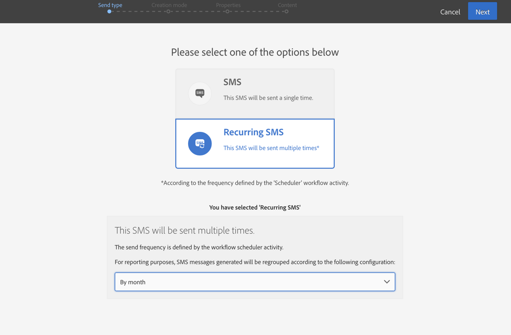

# Envío SMS{#sms-delivery}

## Descripción {#description}

La **[!UICONTROL SMS delivery]** actividad permite configurar el envío de SMS en un flujo de trabajo. Puede ser un **único envío** SMS y enviarlo una sola vez, o puede ser un SMS **recurrente** .

Los mensajes SMS de envío único son SMS estándar, enviados una vez.

Los mensajes SMS recurrentes le permiten enviar el mismo SMS varias veces a diferentes objetivos durante un período definido. Puede agregar las entregas por período para obtener informes que correspondan a sus necesidades.

## Contexto de uso {#context-of-use}

La **[!UICONTROL SMS delivery]** actividad se utiliza generalmente para automatizar el envío de un SMS a un objetivo calculado en el mismo flujo de trabajo.

Cuando se vincula a un programador, puede definir mensajes SMS recurrentes.

Los destinatarios SMS se definen como flujo ascendente de la actividad en el mismo flujo de trabajo mediante actividades de segmentación como consultas, intersecciones, etc.

La preparación de los mensajes se activa según los parámetros de ejecución del flujo de trabajo. Desde el panel de mensajes, puede seleccionar si desea solicitar o no una confirmación manual para enviar el mensaje (obligatorio de forma predeterminada). Puede iniciar el flujo de trabajo manualmente o colocar una actividad de programador en el flujo de trabajo para automatizar la ejecución.

## Configuración {#configuration}

1. Arrastre y suelte una **[!UICONTROL SMS delivery]** actividad en el flujo de trabajo.
1. Seleccione la actividad y ábrala utilizando  el botón de las acciones rápidas que aparecen.

   >[!NOTE]
   >
   >Puede acceder a las propiedades generales y a las opciones avanzadas de la actividad (y no de la propia entrega) a través del  botón de la barra de acciones del flujo de trabajo. Este botón es específico de **[!UICONTROL SMS delivery]** la actividad. Se puede acceder a las propiedades SMS mediante la barra de acciones en el panel SMS.

1. Seleccione el modo de envío SMS:

   * **[!UICONTROL SMS]**: El SMS se envía una sola vez. Puede especificar si desea o no agregar una transición saliente a la actividad. Los distintos tipos de transición se detallan en el paso 7 de este procedimiento.
   * **[!UICONTROL Recurring SMS]**: El SMS se envía varias veces, según la frecuencia definida en una **[!UICONTROL Scheduler]** actividad. Seleccione el período de agregación de los envíos. Esto permite reagrupar todos los envíos que se producen durante el período definido en una sola vista que también se denomina ejecución **recurrente** y se puede acceder a ellos desde la lista de actividades de marketing de la aplicación.

      Por ejemplo, para un SMS de cumpleaños recurrente, que se envía diariamente, puede elegir agregar los envíos al mes. Esto le permite recibir informes sobre su entrega mensualmente, aunque el SMS se envíe todos los días.

1. Seleccione un tipo SMS. Los tipos SMS provienen de plantillas SMS definidas en **[!UICONTROL Resources]** el menú &gt; **[!UICONTROL Templates]** &gt; **[!UICONTROL Delivery templates]** .
1. Introduzca las propiedades generales del SMS. También puede adjuntarla a una campaña existente. La etiqueta de la actividad de entrega del flujo de trabajo se actualiza con la etiqueta SMS.
1. Defina el contenido SMS. Consulte la sección correspondiente [a Creación de un mensaje SMS](../../channels/using/creating-an-sms-message.md).
1. De forma predeterminada, **[!UICONTROL SMS delivery]** la actividad no incluye transiciones salientes. Si desea agregar una transición saliente a la **[!UICONTROL SMS delivery]** actividad, vaya a **[!UICONTROL General]** la ficha de las opciones de actividad avanzadas (  botón de las acciones rápidas de la actividad) y, a continuación, marque una de las siguientes opciones:

   * **[!UICONTROL Add outbound transition without the population]**: esto permite generar una transición saliente que contiene exactamente la misma población que la transición entrante.
   * **[!UICONTROL Add outbound transition with the population]**: esto permite generar una transición saliente que contenga la población a la que se envió el SMS. Los miembros del objetivo excluidos durante la preparación de la entrega (cuarentena, número no válido, etc.) se excluyen de esta transición.

1. Confirme la configuración de su actividad y guarde el flujo de trabajo.

Cuando vuelva a abrir la actividad, se le dirigirá directamente al tablero SMS. Solo se puede editar su contenido.

De forma predeterminada, al iniciar un flujo de trabajo de entrega, se activa la preparación de los mensajes. El envío de mensajes creados a partir de un flujo de trabajo todavía debe confirmarse después de haber iniciado el flujo de trabajo. Sin embargo, en el panel de mensajes, y solo si el mensaje se creó desde un flujo de trabajo, puede deshabilitar la **[!UICONTROL Request confirmation before sending messages]** opción. Al desmarcar esta opción, los mensajes se envían sin previo aviso cuando se realiza la preparación.

## Observaciones {#remarks}

Se puede acceder a los envíos creados dentro de un flujo de trabajo en la lista de actividades de marketing de la aplicación. Puede ver el estado de ejecución del flujo de trabajo mediante el tablero. Los vínculos del panel de resumen SMS permiten acceder directamente a los elementos vinculados (flujo de trabajo, campaña, entrega principal en caso de SMS recurrente).

Sin embargo, las ejecuciones de entregas recurrentes se enmascaran de forma predeterminada. Para verlos, marque **[!UICONTROL Show recurring executions]** la opción en el panel de búsqueda de actividades de marketing.

En las entregas principales, a las que se puede acceder desde la lista de actividades de marketing o directamente a través de las ejecuciones recurrentes asociadas, puede ver el número total de envíos procesados (según el período de agregación especificado cuando se configuró la **[!UICONTROL SMS delivery]** actividad). Para ello, abra la vista de detalles del **[!UICONTROL Deployment]** bloque de la entrega principal seleccionando .

## Ejemplo {#example}

Este ejemplo es un flujo de trabajo de cumpleaños. Cada día se envía un SMS a los perfiles cuyo cumpleaños es ese día. Para ello:

* Esto **[!UICONTROL Scheduler]** le permite iniciar el flujo de trabajo todos los días a las 8 am.

   

* La **[!UICONTROL Query]** actividad permite calcular los perfiles que han proporcionado un número de teléfono móvil y cuyo cumpleaños es el día actual, cada vez que se ejecuta el flujo de trabajo. El cálculo de cumpleaños se lleva a cabo con un filtro predefinido disponible en la paleta de la herramienta de edición de consultas.

   

* El es **[!UICONTROL SMS]** recurrente. Los envíos se agregan por mes. Por lo tanto, todos los mensajes SMS enviados en un mes se agregan en una sola vista. En un año, se ejecutan 365 entregas pero se regeneran en 12 vistas (también denominadas ejecuciones **recurrentes**) en la interfaz de Adobe Campaign. Los detalles del historial y del informe se muestran todos los meses, no por cada envío.

   

Para ver otro ejemplo de envío de SMS en un flujo de trabajo, consulte [Caso de uso: Se ha reproducido el flujo de trabajo de envío de una nueva entrega a usuarios que no son abiertos](../../automating/using/workflow-cross-channel-retargeting.md).
