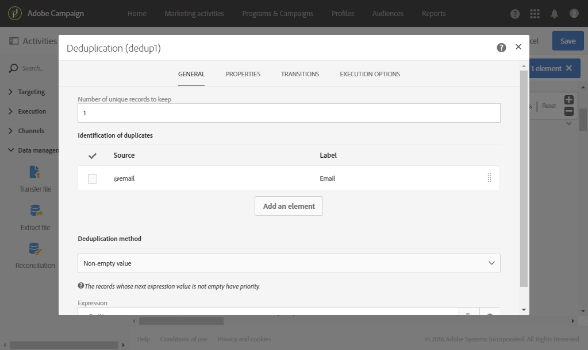
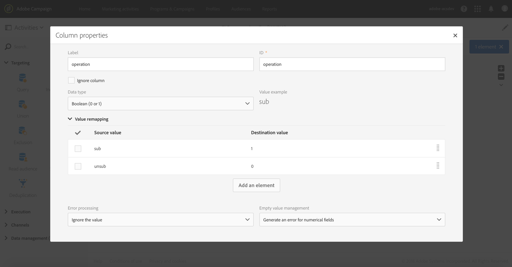

# Servicios de suscripción {#subscription-services}

## Descripción {#description}


La actividad **[!UICONTROL Subscription Services]** le permite recopilar perfiles en masa y suscribirlos a un servicio o cancelar dicha suscripción.

>[!CAUTION]
>
>Cuando la suscripción se administra en el contexto de un flujo de trabajo, los perfiles suscritos o no suscritos no reciben los distintos correos electrónicos de confirmación definidos en las propiedades del servicio.

## Contexto de uso {#context-of-use}

La actividad **[!UICONTROL Subscription Services]** es la única función de Adobe Campaign que permite suscribir a un servicio o cancelar dicha suscripción de varios perfiles en una sola acción.

Puede utilizar esta actividad después de haber realizado la segmentación o de haber importado un archivo con datos identificados.

Si se especifica en un archivo a través de columnas dedicadas, esta actividad también le permite elegir la acción (suscripción o cancelación de suscripción) y el servicio en el que realizar la acción.

**Temas relacionados:**

* [Caso de uso: Actualización de varios estados de suscripción de un archivo](../../automating/using/updating-subscriptions-from-file.md)
* [Caso de uso: Suscripción de perfiles de un archivo a un servicio específico](../../automating/using/subscribing-profiles-from-file.md)

## Configuración {#configuration}

1. Arrastre y suelte una actividad de **[!UICONTROL Subscription Services]** en el flujo de trabajo.
1. Conéctelo después de otras actividades de objetivos, como una consulta o una reconciliación, tras una importación.
1. Seleccione la actividad y, a continuación, ábrala con el botón , en las acciones rápidas que aparecerán.
1. Seleccione el **[!UICONTROL Service]** para el que desea administrar las suscripciones mediante una de las siguientes opciones:

   * **[!UICONTROL Select a specific service]**: seleccione manualmente un servicio.
   * **[!UICONTROL Select services from the inbound transition]**: el servicio se especifica en la transición de entrada. Por ejemplo, puede importar un archivo que especifique el servicio que se va a administrar para cada línea. Si elige esta opción, asegúrese de que se ha creado previamente un vínculo entre los datos y el recurso del **servicio**, como se muestra en [este ejemplo](#example--updating-multiple-subscription-statuses-from-a-file).

      El servicio en el que se realiza la operación se selecciona dinámicamente para cada registro.

1. Seleccione el **[!UICONTROL Operation type]** de ejecución mediante una de las siguientes opciones:

   * **[!UICONTROL Select a specific operation type]**: seleccione manualmente si desea **[!UICONTROL Subscribe]** o **[!UICONTROL Unsubscribe]** perfiles.
   * **[!UICONTROL Select an operation type from a path of inbound transition]**: seleccione la columna de los datos de entrada que especifica la operación que se realizará para cada registro.

      En esta columna, la operación debe especificarse como tipo booleano o como entero. Utilice **0** para cancelar la suscripción de un registro y **1** para suscribirse.

      Si los valores contenidos en un archivo importado no coinciden con los requisitos anteriores, puede seguir utilizando la opción [Reasignación de valores](../../automating/using/load-file.md#column-format) disponible en la actividad **[!UICONTROL Load file]**.

1. Si los datos de entrada contienen una columna correspondiente a la fecha de suscripción del perfil al servicio, selecciónelo. Puede dejarlo vacío, pero no se establece ninguna fecha de suscripción al ejecutar el flujo de trabajo.
1. Defina el origen de la suscripción. Puede definirlo en uno de los campos de los datos de entrada o en un valor constante de su elección marcando la opción **[!UICONTROL Set a constant as origin]**. Puede dejarlo vacío, pero no hay ningún origen definido al ejecutar el flujo de trabajo.
1. Si es necesario, puede generar una transición de salida. Esta transición contiene exactamente los mismos datos que en la actividad de entrada.
1. Confirme la configuración de la actividad y guarde el flujo de trabajo.

   Está listo para ejecutarse. Una vez ejecutado, puede realizar la vista de los perfiles que se han suscrito o cancelado la suscripción al servicio en los detalles del mismo.

## Ejemplo: suscripción de perfiles a un servicio específico después de importar un archivo {#example--subscribing-profiles-to-a-specific-service-after-importing-a-file}

Este ejemplo ilustra cómo importar un archivo que contiene perfiles y suscribirlos a un servicio existente. Después de importar el archivo, es necesario llevar a cabo una reconciliación para que los datos importados puedan identificarse como perfiles. Para asegurarse de que el archivo no contenga duplicados, se ejecutará un proceso de anulación de duplicación en los datos.

El flujo de trabajo se presenta de la siguiente manera:


* Una actividad de **[!UICONTROL Load file]** carga el archivo de perfiles y define la estructura de las columnas importadas.

   Para este ejemplo, el archivo cargado tiene el formato .csv y contiene los datos siguientes:

   ```
   lastname;firstname;email;birthdate;subdate
   jackman;megan;megan.jackman@testmail.com;07/08/1975;10/08/2017
   phillips;edward;phillips@testmail.com;09/03/1986;10/08/2017
   weaver;justin;justin_w@testmail.com;11/15/1990;10/08/2017
   martin;babeth;babeth_martin@testmail.net;11/25/1964;10/08/2017
   reese;richard;rreese@testmail.com;02/08/1987;11/08/2017
   cage;nathalie;cage.nathalie227@testmail.com;07/03/1989;11/08/2017
   xiuxiu;andrea;andrea.xiuxiu@testmail.com;09/12/1992;11/08/2017
   grimes;daryl;daryl_890@testmail.com;12/06/1979;12/08/2017
   tycoon;tyreese;tyreese_t@testmail.net;10/08/1971;12/08/2017
   ```

   

* Una actividad de **[!UICONTROL Reconciliation]** identifica los datos del archivo como pertenecientes a la dimensión de perfil de la base de datos de Adobe Campaign. Solo se configura la pestaña **[!UICONTROL Identification]**. Identifica los datos del archivo según las direcciones de correo electrónico de los perfiles.

   

* Una actividad de **[!UICONTROL Deduplication]** basada en el campo de **correo electrónico** del recurso temporal (resultante de la reconciliación) identifica cualquier duplicado. Si los datos importados del archivo contienen duplicados, la suscripción a un servicio genera un error en todos los datos.

   

* Una actividad de **[!UICONTROL Subscription Services]** permite seleccionar el servicio al que se deben suscribir los perfiles, el campo correspondiente a la fecha de suscripción y el origen de la suscripción.

   

## Ejemplo: actualización de varios estados de suscripción de un archivo {#example--updating-multiple-subscription-statuses-from-a-file}

Este ejemplo ilustra cómo importar un archivo que contiene perfiles y actualizar su suscripción a varios servicios especificados en el archivo. Después de importar el archivo, es necesario llevar a cabo una reconciliación para que los datos importados puedan identificarse como perfiles con un vínculo a los servicios. Para asegurarse de que el archivo no contenga duplicados, se ejecutará un proceso de anulación de duplicación en los datos.

El flujo de trabajo se presenta de la siguiente manera:


* Una actividad de **[!UICONTROL Load file]** carga el archivo de perfiles y define la estructura de las columnas importadas.

   Para este ejemplo, el archivo cargado tiene el formato .csv y contiene los datos siguientes:

   ```
   lastname;firstname;email;birthdate;service;operation
   jackman;megan;megan.jackman@testmail.com;07/08/1975;SVC2;sub
   phillips;edward;phillips@testmail.com;09/03/1986;SVC3;unsub
   weaver;justin;justin_w@testmail.com;11/15/1990;SVC3;sub
   martin;babeth;babeth_martin@testmail.net;11/25/1964;SVC3;unsub
   reese;richard;rreese@testmail.com;02/08/1987;SVC3;sub
   cage;nathalie;cage.nathalie227@testmail.com;07/03/1989;SVC3;sub
   xiuxiu;andrea;andrea.xiuxiu@testmail.com;09/12/1992;SVC4;sub
   grimes;daryl;daryl_890@testmail.com;12/06/1979;SVC3;unsub
   tycoon;tyreese;tyreese_t@testmail.net;10/08/1971;SVC2;sub
   ```

   

   Como ha visto, la operación se especifica en el archivo como “sub” o “unsub”. El sistema espera que un valor **booleano** o **entero** reconozca la operación que se va a realizar: “0” para cancelar la suscripción y “1” para suscribirse. Para que coincida con este requisito, se realiza una reasignación de valores en los detalles de la columna “operación”.

   

   Si el archivo ya utiliza “0” y “1” para identificar la operación, no es necesario volver a asignar esos valores. Solo asegúrese de que la columna se procesa como **booleano** o **entero** en la pestaña **[!UICONTROL Column definition]**.

* Una actividad de **[!UICONTROL Reconciliation]** identifica los datos del archivo como pertenecientes a la dimensión de perfil de la base de datos de Adobe Campaign. A través de la pestaña **[!UICONTROL Identification]**, el campo de **correo electrónico** del archivo coincide con el campo de **correo electrónico** del recurso de perfil.

   

   En la pestaña **[!UICONTROL Relations]**, se crea un vínculo con el recurso de servicio para permitir que se reconozca el campo de **servicio** del archivo. En este ejemplo, los valores coinciden con el campo de **nombre** del recurso de servicio.

   

* Una actividad de **[!UICONTROL Deduplication]** basada en el campo de **correo electrónico** del recurso temporal (resultante de la reconciliación) identifica duplicados. Es importante eliminar duplicados, ya que son los causantes de que falle la suscripción a un servicio para todos los datos.

   

* Una actividad de **[!UICONTROL Subscription Services]** identifica los servicios que se van a actualizar como procedentes de la transición, a través del vínculo creado en la actividad de **[!UICONTROL Reconciliation]**.

   El **[!UICONTROL Operation type]** se identifica como proveniente del campo de **operación** del archivo. Aquí solo se pueden seleccionar los campos booleano o entero. Si la columna del archivo que contiene la operación que se va a realizar no aparece en la lista, asegúrese de que ha configurado correctamente el formato de columna en la actividad de **[!UICONTROL Load file]**, como se ha explicado anteriormente en este ejemplo.

   
