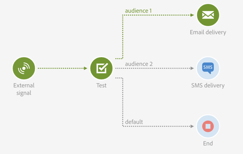

# Prueba{#test}

## Descripción {#description}

La actividad **[!UICONTROL Test]** permite una transición basada en un resultado de prueba.

## Contexto de uso {#context-of-use}

Una actividad **Prueba** activa la primera transición que cumple la condición asociada a esta.

Si no se cumple ninguna condición y si la opción **Use default transition** está activada, se activa la transición predeterminada.

Las condiciones se pueden basar en **funciones** o en **variables** como, por ejemplo, variables de eventos que se han declarado en la actividad **[!UICONTROL External signal]** del flujo de trabajo.

**Temas relacionados:**

* [Lista de funciones](../../automating/using/list-of-functions.md)
* [Invocación de un flujo de trabajo con parámetros externos](../../automating/using/calling-a-workflow-with-external-parameters.md)

## Configuración {#configuration}

1. Arrastre y suelte una actividad **[!UICONTROL Test]** en el flujo de trabajo.
1. Seleccione la actividad y, a continuación, ábrala con el botón , en las acciones rápidas que aparecerán.
1. Defina los atributos de cada condición:

   Al editar el campo **[!UICONTROL Condition]**, dos botones proporcionan ayuda para llamar a variables de eventos y editar expresiones que combinan variables y funciones:

   * :: seleccione la variable de eventos entre todas las variables disponibles en el flujo de trabajo (consulte )

      

   * : edite expresiones que combinan variables y funciones. Para obtener más información sobre el editor de expresiones, consulte [esta sección](../../automating/using/advanced-expression-editing.md).

      
