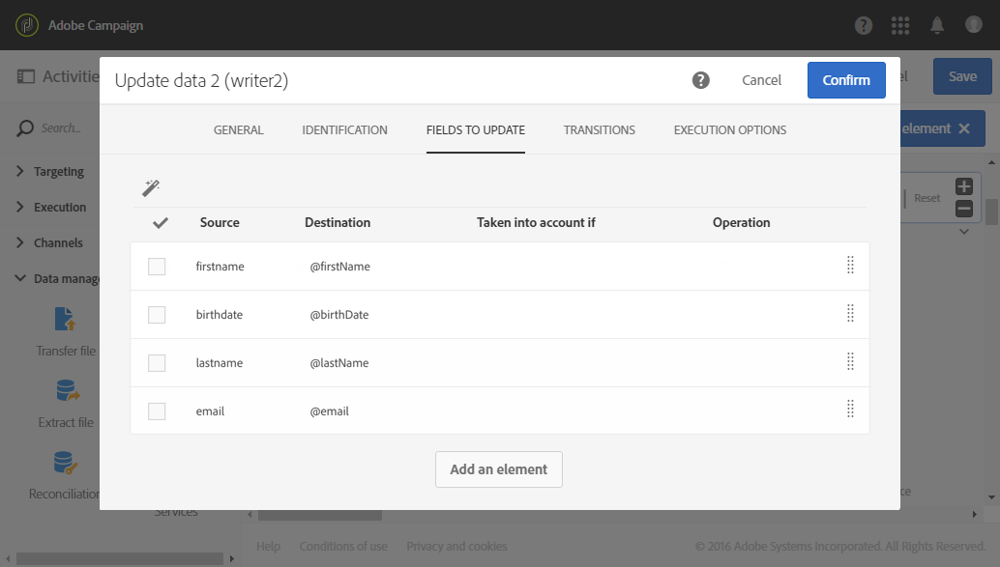

# Actualización de la base de datos con datos externos {#update-database-file}

El siguiente ejemplo muestra la configuración de un **[!UICONTROL Update data]** actividad después de un **[!UICONTROL Load file]** actividad. El objetivo de este flujo de trabajo es añadir o actualizar perfiles a la base de datos de Adobe Campaign con los datos recuperados del archivo.

En este ejemplo, la clave de reconciliación utilizada es **dirección de email**. El archivo cargado en [Cargar archivo](../../automating/using/load-file.md) la actividad es una **.txt** archivo de formato que contiene los siguientes datos de ejemplo:

```
lastname;firstname;email;birthdate
jackman;megan;megan.jackman@testmail.com;07/08/1975
phillips;edward;phillips@testmail.com;09/03/1986
weaver;justin;justin_w@testmail.com;11/15/1990
martin;babeth;babeth_martin@testmail.net;11/25/1964
reese;richard;rreese@testmail.com;02/08/1987
cage;nathalie;cage.nathalie227@testmail.com;07/03/1989
xiuxiu;andrea;andrea.xiuxiu@testmail.com;09/12/1992
grimes;daryl;daryl_890@testmail.com;12/06/1979
tycoon;tyreese;tyreese_t@testmail.net;10/08/1971
```

El [Actualización de datos](../../automating/using/update-data.md) la actividad se configura de la siguiente manera:



