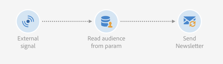

# Caso de uso {#use-case}

El caso de uso siguiente muestra cómo invocar al flujo de trabajo con parámetros dentro de los flujos de trabajo.

El objetivo es el déclencheur de un flujo de trabajo desde una llamada a la API con parámetros externos. Este flujo de trabajo carga datos en la base de datos desde un archivo y crea una audiencia asociada. Una vez creada la audiencia, se activa un segundo flujo de trabajo para enviar un mensaje personalizado con los parámetros externos definidos en la llamada de API.

Para realizar este caso de uso, debe realizar las siguientes acciones:

1. **Realizar una llamada de API** para almacenar en déclencheur el flujo de trabajo 1 con parámetros externos. Consulte [Paso 1: Configuración de la llamada de API](../../automating/using/use-case-calling-workflow.md#step-1--configuring-the-api-call).
1. **Generar flujo de trabajo 1**: el flujo de trabajo transfiere un archivo y lo carga en la base de datos. Luego comprobará si los datos están vacíos o no y, finalmente, guardará los perfiles en una audiencia. Finalmente, déclencheur el flujo de trabajo 2. Consulte [Paso 2: Configuración del flujo de trabajo 1](../../automating/using/use-case-calling-workflow.md#step-2--configuring-workflow-1).
1. **Generar flujo de trabajo 2**: el flujo de trabajo lee la audiencia que se ha creado en Workflow 1 y, a continuación, envía un mensaje personalizado a los perfiles, con un código de segmento personalizado con los parámetros . Consulte [Paso 3: Configuración del flujo de trabajo 2](../../automating/using/use-case-calling-workflow.md#step-3--configuring-workflow-2).


## Requisitos previos {#prerequisites}

Antes de configurar los flujos de trabajo, debe crear los flujos de trabajo 1 y 2 con una **[!UICONTROL External signal]** actividad en cada una de ellas. De este modo, puede dirigirse a estas actividades de señal al llamar a los flujos de trabajo.

## Paso 1: Configuración de la llamada de API {#step-1--configuring-the-api-call}

Realice una llamada de API al flujo de trabajo de déclencheur 1 con parámetros. Para obtener más información sobre la sintaxis de llamadas a la API, consulte la [Documentación de las API de REST del Campaign Standard](../../api/using/triggering-a-signal-activity.md).

En nuestro caso, queremos llamar al flujo de trabajo con los parámetros siguientes:

* **fileToTarget**: el nombre del archivo que desea importar en la base de datos.
* **billetes de descuentoDesc**: la descripción que queremos mostrar en la entrega para el descuento.

```
-X POST https://mc.adobe.io/<ORGANIZATION>/campaign/<TRIGGER_URL>
-H 'Authorization: Bearer <ACCESS_TOKEN>' 
-H 'Cache-Control: no-cache' 
-H 'X-Api-Key: <API_KEY>' 
-H 'Content-Type: application/json;charset=utf-8' 
-H 'Content-Length:79' 
-i
-d {
-d "source:":"API",
-d "parameters":{
-d "fileToTarget":"profile.txt",
-d "discountDesc":"Running shoes"
-d } 
```

## Paso 2: Configuración del flujo de trabajo 1 {#step-2--configuring-workflow-1}

El flujo de trabajo 1 se generará de la siguiente manera:

* **[!UICONTROL External signal]** actividad: donde los parámetros externos deben declararse para poder utilizarse dentro del flujo de trabajo.
* **[!UICONTROL Transfer file]** actividad: importa el archivo con el nombre definido en los parámetros.
* **[!UICONTROL Load file]** actividad: carga datos del archivo importado en la base de datos.
* **[!UICONTROL Update data]** actividad: inserte o actualice la base de datos con datos del archivo importado.
* **[!UICONTROL Test]** actividad: comprueba si hay datos importados.
* **[!UICONTROL Save audience]** actividad: si el archivo contiene datos, guarda los perfiles en una audiencia.
* **[!UICONTROL End activity]** actividad: llama al flujo de trabajo 2 con los parámetros que desea utilizar en él.


Siga los pasos a continuación para configurar el flujo de trabajo:

1. Declare los parámetros que se han definido en la llamada de API. Para ello, abra el **[!UICONTROL External signal]** y, a continuación, añada los nombres y tipos de los parámetros.

   

1. Agregue un **[!UICONTROL Transfer file]** actividad para importar datos en la base de datos. Para ello, arrastre y suelte la actividad, ábrala y seleccione la **[!UICONTROL Protocol]** pestaña .
1. Seleccione el **[!UICONTROL Use a dynamic file path]** y, a continuación, utilice la opción **fileToTarget** como el archivo que se va a transferir:

   ```
   $(vars/@fileToTarget)
   ```

   

1. Cargue los datos del archivo en la base de datos.

   Para ello, arrastre y suelte una **[!UICONTROL Load file]** actividad en el flujo de trabajo y, a continuación, configúrela según sus necesidades.

1. Inserte y actualice la base de datos con datos del archivo importado.

   Para ello, arrastre y suelte una **[!UICONTROL Update data]** actividad y, a continuación, seleccione la **[!UICONTROL Identification]** para añadir un criterio de reconciliación (en nuestro caso, la pestaña **email** ).

   

1. Seleccione el **[!UICONTROL Fields to update]** y, a continuación, especifique los campos que desea actualizar en la base de datos (en nuestro caso, la **firstname** y **email** campos).

   

1. Compruebe si se recuperan datos del archivo. Para ello, arrastre y suelte una **[!UICONTROL Test]** en el flujo de trabajo y, a continuación, haga clic en la **[!UICONTROL Add an element]** para añadir una condición.
1. Asigne un nombre a la condición y defina su definición. En nuestro caso, queremos comprobar si la transición saliente contiene datos con la siguiente sintaxis:

   ```
   $long(vars/@recCount)>0
   ```

   

1. Si se recuperan datos, guárdelos en una audiencia. Para ello, agregue una **[!UICONTROL Save audience]** a la **El objetivo no está vacío** y, a continuación, ábrala.
1. Seleccione el **[!UICONTROL Use a dynamic label]** y, a continuación, utilice la opción **fileToTarget** como etiqueta de la audiencia:

   ```
   $(vars/@fileToTarget)
   ```

   

1. Arrastre y suelte una **[!UICONTROL End]** actividad que llamará al flujo de trabajo 2 con parámetros y, a continuación, ábrala.
1. Seleccione el **[!UICONTROL External signal]** y, a continuación, especifique el flujo de trabajo a déclencheur y su actividad de señal asociada.
1. Defina los parámetros que desea utilizar en Workflow 2 y sus valores asociados.

   En nuestro caso, queremos pasar los parámetros definidos originalmente en la llamada de API (**fileToTarget** y **billetes de descuentoDesc**) y un **segmentCode** con un valor constante (&quot;20% de descuento&quot;).

   

El flujo de trabajo 1 está configurado, ahora puede crear el flujo de trabajo 2. Para obtener más información, consulte [esta sección](../../automating/using/use-case-calling-workflow.md#step-3--configuring-workflow-2).

## Paso 3: Configuración del flujo de trabajo 2 {#step-3--configuring-workflow-2}

El flujo de trabajo 2 se generará de la siguiente manera:

* **[!UICONTROL External signal]** actividad: donde los parámetros deben declararse para poder utilizarse dentro del flujo de trabajo.
* **[!UICONTROL Read audience]** actividad: lee la audiencia guardada en Workflow 1.
* **[!UICONTROL Email delivery]** actividad: envía un mensaje recurrente a la audiencia de destino, personalizado con parámetros.



Siga los pasos a continuación para configurar el flujo de trabajo:

1. Declare los parámetros que se han definido en Workflow 1.

   Para ello, abra el **[!UICONTROL External signal]** actividad y, a continuación, añada el nombre y el tipo de cada parámetro definido en la variable **[!UICONTROL End]** actividad del flujo de trabajo 1.

   

1. Utilice la audiencia que se ha guardado en el flujo de trabajo 1. Para ello, arrastre y suelte una **[!UICONTROL Read audience]** actividad en el flujo de trabajo y, a continuación, ábrala.
1. Seleccione el **[!UICONTROL Use a dynamic audience]** y, a continuación, utilice la opción **fileToTarget** como nombre de la audiencia que desea leer:

   ```
   $(vars/@fileToTarget)
   ```

   

1. Asigne un nombre a la transición saliente según la variable **segmentCode** parámetro.

   Para ello, seleccione la **[!UICONTROL Transition]** y, a continuación, la pestaña **[!UICONTROL Use a dynamic segment code]** .

1. Utilice la variable **segmentCode** como nombre de la transición saliente:

   ```
   $(vars/@segmentCode)
   ```

   

1. Arrastre y suelte una **[!UICONTROL Email delivery]** actividad para enviar un mensaje a la audiencia.
1. Identifique los parámetros que desea utilizar en el mensaje para personalizarlo con la variable **billetes de descuentoDesc** parámetro. Para ello, abra las opciones avanzadas de la actividad y añada el nombre y el valor del parámetro .

   

1. Ahora puede configurar el mensaje. Abra la actividad y seleccione **[!UICONTROL Recurring email]**.

   

1. Seleccione la plantilla que desea utilizar y, a continuación, defina las propiedades de correo electrónico según sus necesidades.
1. Utilice la variable **billetes de descuentoDesc** como campo personalizado. Para ello, selecciónelo en la lista de campos personalizados.

   

1. Ahora puede terminar de configurar el mensaje y enviarlo como de costumbre.

   

## Ejecución de los flujos de trabajo {#executing-the-workflows}

Una vez creados los flujos de trabajo, puede ejecutarlos. Asegúrese de que los dos flujos de trabajo se inician antes de realizar la llamada de API.
