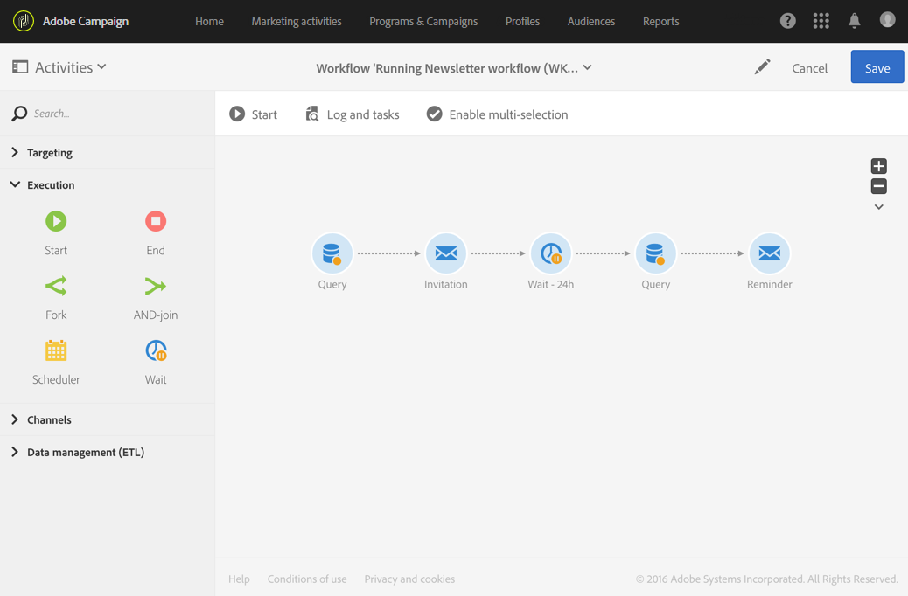

# Espera{#wait}

## Descripción {#description}

La actividad **[!UICONTROL Wait]** suspende momentáneamente la ejecución de una parte de un flujo de trabajo. Activa su transición saliente después de un retraso que puede oscilar entre unos segundos y varios meses, lo que ejecuta las actividades posteriores.

## Contexto de uso {#context-of-use}

La actividad **[!UICONTROL Wait]** se utiliza para permitir que transcurra un cierto tiempo entre dos actividades que se están ejecutando. Por ejemplo, para esperar varios días después de una actividad de envío de correo electrónico y, después, analizar las aperturas y los clics generados durante este período antes de realizar cualquier operación de seguimiento (correo electrónico recordatorio, creación de un público, etc.).

## Configuración {#configuration}

1. Arrastre y suelte una actividad de **[!UICONTROL Wait]** en el flujo de trabajo.
1. Seleccione la actividad y, a continuación, ábrala con el botón , en las acciones rápidas que aparecerán.
1. Especifique la **[!UICONTROL Duration]** de la espera entre la activación de las transiciones de entrada y salida de la actividad.

   Puede introducir manualmente la duración o utilizar el selector disponible en el campo.

   

1. Confirme la configuración de la actividad y guarde el flujo de trabajo.

## Ejemplo {#example}

El siguiente ejemplo ilustra la actividad **[!UICONTROL Wait]** en un caso de uso típico. Se envía una invitación por correo electrónico a un evento. 24 horas después de su envío, se analizan los registros de envío de correo electrónico y se envía un recordatorio por correo electrónico a las personas que recibieron el primer correo electrónico pero no se registraron.

El flujo de trabajo se presenta de la siguiente manera:

* Un primer **[!UICONTROL Query]** segmenta los perfiles que se enviarán a la invitación por correo electrónico.
* Un **[!UICONTROL Email delivery]** envía la invitación por primera vez a los perfiles seleccionados.
* Una actividad **[!UICONTROL Wait]** de 24 horas coloca una pausa entre el momento en que se envió la invitación y el resto del flujo de trabajo.
* Un segundo **[!UICONTROL Query]** segmenta los perfiles que recibieron el primer correo electrónico, pero no hicieron clic en el vínculo de suscripción incluido en el mensaje.
* Un segundo **[!UICONTROL Email delivery]** envía un recordatorio de la invitación a las personas seleccionadas.
