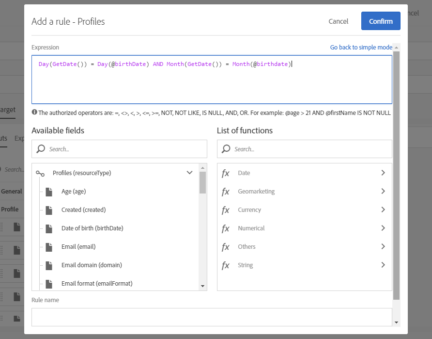

# Caso de uso del flujo de trabajo: Crear entregas en la fecha de creación de los perfiles {#creation-date-query}

Puede enviar una oferta por correo electrónico en el aniversario de la creación del perfil del cliente.

1. En **[!UICONTROL Marketing Activities]**, haga clic **[!UICONTROL Create]** y seleccione **[!UICONTROL Workflow]**.
1. Seleccione **[!UICONTROL New Workflow]** como tipo de flujo de trabajo y haga clic en **[!UICONTROL Next]**.
1. Introduzca las propiedades del flujo de trabajo y haga clic en **[!UICONTROL Create]**.

## Creación de una actividad de Programador {#creating-a-scheduler-activity}

1. En **[!UICONTROL Activities]** &gt; **[!UICONTROL Execution]**, arrastre y suelte una **[!UICONTROL Scheduler activity]**.
1. Haga doble clic en la actividad.
1. Configure la ejecución de la entrega.
1. En **[!UICONTROL Execution frequency]**, seleccione **[!UICONTROL Daily]**.
1. Seleccione un **[!UICONTROL Time]** y el orden **[!UICONTROL Repetition frequency]** de ejecución para el flujo de trabajo.
1. Seleccione una **[!UICONTROL Start]** fecha y **[!UICONTROL Expiration]** para el flujo de trabajo.
1. Confirme la actividad y guarde el flujo de trabajo.

>[!NOTE]
>
>Para iniciar el flujo de trabajo en un huso horario específico, en la **[!UICONTROL Execution options]** ficha , configure el huso horario del programador en el **[!UICONTROL Time zone]** campo.


## Creación de una actividad de consulta {#creating-a-query-activity}

1. Para seleccionar destinatarios, arrastre y suelte un **[!UICONTROL Query activity]** y haga doble clic en él.
1. Agregue **[!UICONTROL Profiles]** y seleccione **[!UICONTROL no longer contact by email]** con el valor **[!UICONTROL no]**.

### Recuperación de perfiles creados el mismo día de la ejecución {#retriving-profiles-created-on-the-same-day}

1. En **[!UICONTROL Profile]**, arrastre y suelte el **[!UICONTROL Created]** campo. y haga clic en **[!UICONTROL Advanced Mode]**.
   
1. En el **[!UICONTROL list of functions]**, haga doble clic **[!UICONTROL Day]** desde el **[!UICONTROL Date]** nodo.
1. A continuación, inserte el campo **[!UICONTROL Created]** como argumento.
1. Seleccione **[!UICONTROL equals to (=)]** como operador.
1. En Valor, seleccione **[!UICONTROL Day]** en el **[!UICONTROL Date]** nodo de la **[!UICONTROL List of functions]**.
1. Inserte la **[!UICONTROL GetDate()]** función como argumento.

Se recuperaron los perfiles cuyo día de creación es igual al día actual.

Debería terminar con:

```Day(@created) = Day(GetDate())```


Click **[!UICONTROL Confirm]**.

### Recuperando perfiles creados el mismo mes del mes de ejecución{#retriving-profiles-created-on-the-same-month}

1. En el **[!UICONTROL Query]** editor, seleccione la primera consulta y duplíquela.
1. Abra el duplicado.
1. Reemplazar **[!UICONTROL Day]** por **[!UICONTROL Month]** en la consulta.
1. Click **[!UICONTROL Confirm]**.


Debería terminar con esto:

``` Month(@created) = Month(GetDate()) ```

Se muestra la consulta final:

```Day(@created) = Day(GetDate()) AND Month(@created) = Month(GetDate())```



## Creating an Email delivery{#creating-an-email-delivery}

1. Arrastre y suelte un envío de correo electrónico.
1. Haga clic en la actividad y seleccione  editar.
1. Seleccione **[!UICONTROL Recurring email]** y haga clic en **[!UICONTROL Next]**.
1. Seleccione una plantilla de correo electrónico y haga clic en **[!UICONTROL Next]**.
1. Introduzca las propiedades de correo electrónico y haga clic en **[!UICONTROL Next]**.
1. Para crear el diseño del correo electrónico, haga clic en **[!UICONTROL Email Designer]**.
1. Inserte elementos o seleccione una plantilla existente.
1. Personalice el correo electrónico mediante campos y vínculos.
Para obtener más información, consulte [Diseño de un correo electrónico](../../designing/using/designing-from-scratch.md#designing-an-email-content-from-scratch).
1. Haga clic **[!UICONTROL Preview]** para comprobar el diseño.
1. Click **[!UICONTROL Save]**.

**Temas relacionados:**

* [Consulta](../../automating/using/query.md)
* [Planificador](../../automating/using/scheduler.md)
* [Envío de correo electrónico](../../automating/using/email-delivery.md)
* [Canal de correo electrónico](../../channels/using/creating-an-email.md)
