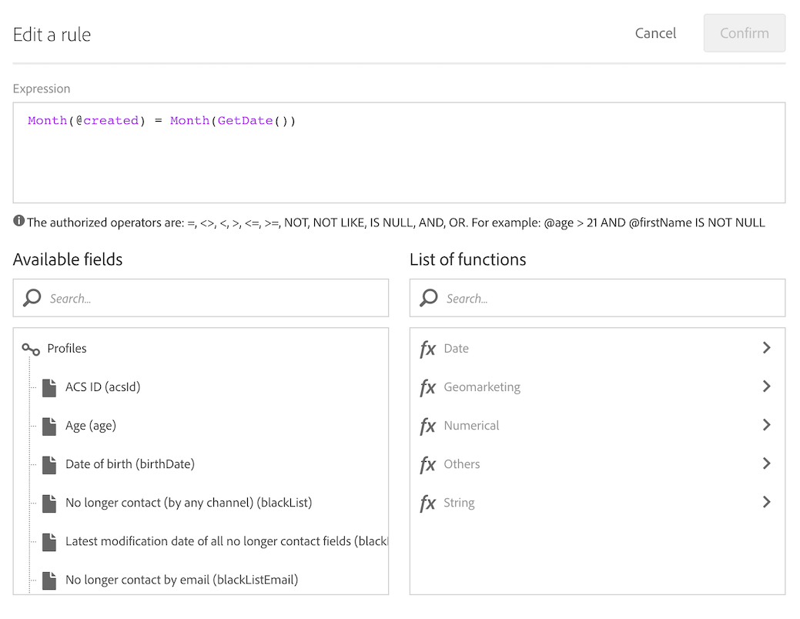

# Creación de envíos en la fecha de creación de los perfiles {#creation-date-query}

Puede enviar una oferta por correo electrónico en el aniversario de la creación del perfil del cliente.

1. En **[!UICONTROL Marketing Activities]**, haga clic en **[!UICONTROL Create]** y seleccione **[!UICONTROL Workflow]**.
1. Seleccione **[!UICONTROL New Workflow]** como tipo de flujo de trabajo y haga clic en **[!UICONTROL Next]**.
1. Introduzca las propiedades del flujo de trabajo y haga clic en **[!UICONTROL Create]**.

## Creación de una actividad de planificador {#creating-a-scheduler-activity}

1. En **[!UICONTROL Activities]** > **[!UICONTROL Execution]**, arrastre y suelte una actividad de [Planificador](../../automating/using/scheduler.md).
1. Haga doble clic en la actividad.
1. Configure la ejecución del envío.
1. En **[!UICONTROL Execution frequency]**, seleccione **[!UICONTROL Daily]**.
1. Seleccione un **[!UICONTROL Time]** y el **[!UICONTROL Repetition frequency]** de ejecución para el flujo de trabajo.
1. Seleccione una fecha **[!UICONTROL Start]** y **[!UICONTROL Expiration]** para el flujo de trabajo.
1. Confirme la actividad y guarde el flujo de trabajo.

>[!NOTE]
>
>Para iniciar el flujo de trabajo en un huso horario específico, en la pestaña **[!UICONTROL Execution options]**, configure el huso horario del planificador en el campo **[!UICONTROL Time zone]**. De forma predeterminada, el huso horario seleccionado es el definido en las propiedades del flujo de trabajo (consulte [Creación de un flujo de trabajo](../../automating/using/building-a-workflow.md)).


## Creación de una actividad de consulta {#creating-a-query-activity}

1. Para seleccionar destinatarios, arrastre y suelte una actividad [Query](../../automating/using/query.md) y haga doble clic en ella.
1. Agregue **[!UICONTROL Profiles]** y seleccione **[!UICONTROL no longer contact by email]** con el valor **[!UICONTROL no]**.

### Recuperación de perfiles creados el mismo día que el día de ejecución {#retrieving-profiles-created-on-the-same-day}

1. En **[!UICONTROL Profile]**, arrastre y suelte el campo **[!UICONTROL Created]**. y haga clic en **[!UICONTROL Advanced Mode]**.
   
1. En **[!UICONTROL list of functions]**, haga doble clic en **[!UICONTROL Day]** desde el nodo **[!UICONTROL Date]**.
1. A continuación, inserte el campo **[!UICONTROL Created]** como argumento.
1. Seleccione **[!UICONTROL equals to (=)]** como operador.
1. Para Valor, seleccione **[!UICONTROL Day]** del nodo **[!UICONTROL Date]** en **[!UICONTROL List of functions]**.
1. Inserte la función **[!UICONTROL GetDate()]** como argumento.

Ha recuperado los perfiles cuyo día de creación es igual al día actual.

Debería terminar con lo siguiente:

```Day(@created) = Day(GetDate())```


Haga clic en **[!UICONTROL Confirm]**.

### Recuperación de perfiles creados en el mismo mes que el mes de ejecución{#retrieving-profiles-created-on-the-same-month}

1. En el editor **[!UICONTROL Query]**, seleccione la primera consulta y duplíquela.
1. Abra el duplicado.
1. Reemplazar **[!UICONTROL Day]** por **[!UICONTROL Month]** en la consulta.
1. Haga clic en **[!UICONTROL Confirm]**.



Debería terminar con esto:

``` Month(@created) = Month(GetDate()) ```

Se muestra la consulta final:

```Day(@created) = Day(GetDate()) AND Month(@created) = Month(GetDate())```


## Creación de una entrega por correo electrónico{#creating-an-email-delivery}

1. Arrastre y suelte una actividad [Email delivery](../../automating/using/email-delivery.md).
1. Haga clic en la actividad y seleccione  para editarla.
1. Seleccione **[!UICONTROL Recurring email]** y haga clic en **[!UICONTROL Next]**.
1. Seleccione una plantilla de correo electrónico y haga clic en **[!UICONTROL Next]**.
1. Introduzca las propiedades de correo electrónico y haga clic en **[!UICONTROL Next]**.
1. Para crear el diseño del correo electrónico, haga clic en **[!UICONTROL Email Designer]**.
1. Inserte elementos o seleccione una plantilla existente.
1. Personalice el correo electrónico mediante campos y vínculos.
Para obtener más información, consulte [diseño de un correo electrónico](../../designing/using/designing-from-scratch.md#designing-an-email-content-from-scratch).
1. Haga clic en **[!UICONTROL Preview]** para comprobar el diseño.
1. Haga clic en **[!UICONTROL Save]**.

**Temas relacionados:**

* [Canal de correo electrónico](../../channels/using/creating-an-email.md)
