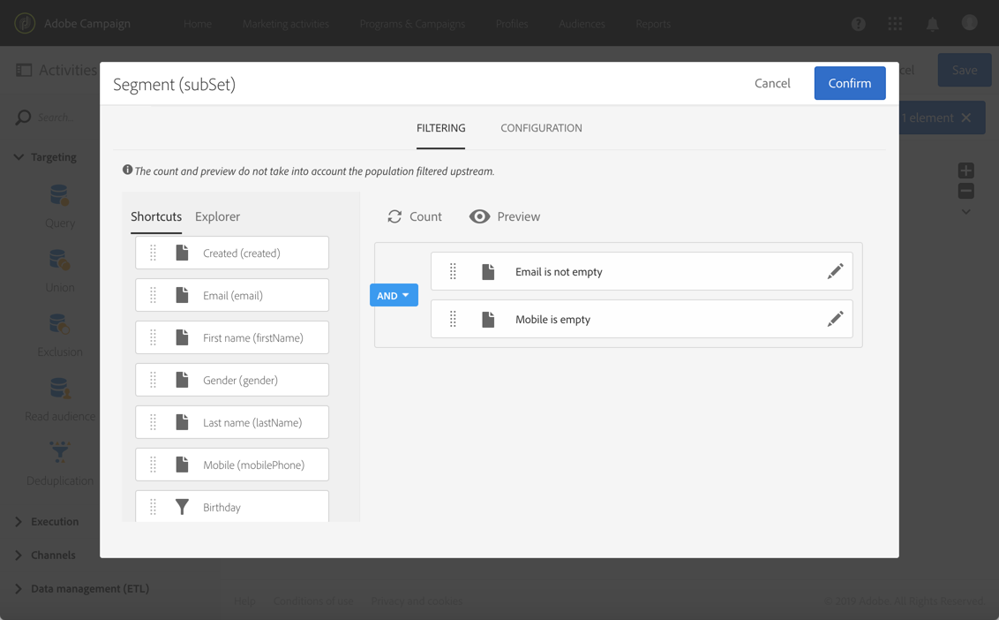
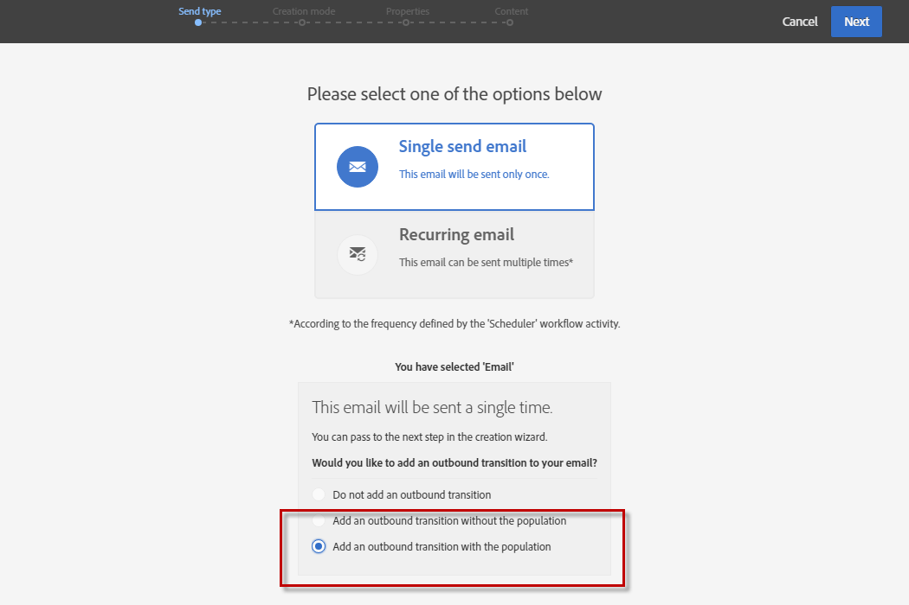

# Creación de una entrega multicanal{#cross-channel-delivery}

Este documento le permite descubrir la siguiente funcionalidad de Adobe Campaign mediante un caso de uso estándar: creación de un flujo de trabajo de envío entre canales.

El objetivo aquí es seleccionar una audiencia de los destinatarios de la base de datos y segmentarla en dos grupos diferentes con el fin de enviar un correo electrónico al primer grupo y un mensaje SMS al segundo grupo.

Para obtener más información sobre los flujos de trabajo y los diferentes canales disponibles en Adobe Campaign, consulte los siguientes documentos:

* [Descubrimiento de flujos de trabajo](../../automating/using/get-started-workflows.md)
* [Descubrimiento de canales de comunicación](../../channels/using/get-started-communication-channels.md)

## Creación de un flujo de trabajo {#creating-workflow}

Para enviar dos envíos diferentes a un grupo determinado, primero debe definir el destinatario.

Para ello, debe crear una consulta para identificar los destinatarios y, por lo tanto, crear un flujo de trabajo.

Cree un nuevo flujo de trabajo en el programa o en la campaña que elija:

1. En **[!UICONTROL Marketing Activities]**, haga clic en **[!UICONTROL Create]** y seleccione **[!UICONTROL Workflow]**.
1. Seleccione **[!UICONTROL New Workflow]** como tipo de flujo de trabajo y haga clic en **[!UICONTROL Next]**.
1. Introduzca las propiedades del flujo de trabajo y haga clic en **[!UICONTROL Create]**.

Los pasos detallados para crear un flujo de trabajo se describen en la sección [Creación de un flujo de trabajo](../../automating/using/building-a-workflow.md).

## Creación de una actividad de consulta {#creating-query-activity}

Una vez creado el flujo de trabajo, puede acceder a su interfaz.

Inserte una actividad de consulta en el flujo de trabajo para identificar los perfiles que van a recibir los envíos.

1. En **[!UICONTROL Activities]** > **[!UICONTROL Targeting]**, arrastre y suelte una actividad de [Consulta](../../automating/using/query.md).
1. Haga doble clic en la actividad.
1. En la pestaña **[!UICONTROL Target]**, examine los accesos directos y seleccione una de las [audiencias](../../audiences/using/about-audiences.md).
1. Arrastre y suelte el acceso directo en la zona de edición. Según el tipo de acceso directo seleccionado, aparece una ventana.
1. Configure los elementos de objetivo y confirme la consulta.

Puede crear una consulta en uno o varios elementos.

Utilice el botón **[!UICONTROL Count]** para ver una estimación del número de perfiles objetivo por la consulta.

## Creación de una actividad de segmentación {#creating-segmentation-activity}

Una vez identificado el destinatario por la actividad de consulta, debe seleccionar un criterio para segmentar el destinatario en dos poblaciones diferentes: una recibirá un correo electrónico y la otro, un SMS.

Debe utilizar una actividad [Segmentation](../../automating/using/segmentation.md) para crear uno o varios segmentos a partir de una población calculada en sentido ascendente en una consulta.

El grupo **Correo electrónico** identifica los destinatarios que tienen una dirección de correo electrónico definida pero no un número de teléfono móvil. El grupo **SMS** contiene los destinatarios cuyo número de teléfono móvil se ha guardado en el perfil.

Para configurar la primera transición (correo electrónico):

1. En la pestaña **[!UICONTROL Segments]**, hay un primer segmento presente de forma predeterminada. Edite sus propiedades para configurar ese segmento.

   

1. Seleccione el perfil **[!UICONTROL Email]** como criterio de filtrado.

   

1. En la nueva ventana que aparece en la pantalla, seleccione el operador **[!UICONTROL Is not empty]**.

   

1. Añada un segundo criterio de filtrado, **[!UICONTROL Mobile]**, y seleccione el operador **[!UICONTROL Is empty]**.

   

   Todos los perfiles procedentes de la consulta que tengan un correo electrónico, pero no un número de teléfono móvil definido, están en esta transición.

1. Para que el flujo de trabajo sea más claro, puede editar la etiqueta de transición. Confirme los cambios.

   

Se ha configurado la primera transición. Para configurar la segunda transición (SMS):

1. Haga clic en el botón **[!UICONTROL Add an element]** para añadir una nueva transición.
1. Defina una condición que le permita recuperar todos los perfiles que incluyan un número de teléfono móvil. Para ello, cree una regla en el campo **[!UICONTROL Mobile]** con el operador lógico **[!UICONTROL Is not empty]**.

   

   Todos los perfiles procedentes de la consulta que tengan un número de teléfono móvil definido estarán en esta transición.

1. Puede editar la etiqueta de la transición. Confirme los cambios.

La segunda transición ahora también está configurada.

## Creación de envíos {#creating-deliveries}

Como ya se han creado dos transiciones, ahora debe añadir dos tipos de envíos a las transiciones salientes de la actividad de segmentación: una actividad [Email delivery](../../automating/using/email-delivery.md) y una actividad [SMS delivery](../../automating/using/sms-delivery.md).

Adobe Campaign le permite añadir envíos a un flujo de trabajo. Para ello, seleccione un envío de la categoría **[!UICONTROL Channels]** en la paleta de la actividad del flujo de trabajo.

Para crear un envío de correo electrónico:

1. Arrastre y suelte una actividad [Email delivery](../../automating/using/email-delivery.md) después del primer segmento.
1. Haga doble clic en la actividad para editarla.
1. Seleccione **[!UICONTROL Simple email]**.
1. Seleccione **[!UICONTROL Add an outbound transition with the population]** y haga clic en **[!UICONTROL Next]**.

   

   La transición de salida le permite recuperar la población y los registros de seguimiento. Puede usar esto, por ejemplo, para enviar un segundo correo a las personas que no hicieron clic en el primer correo.

1. Seleccione una plantilla de correo electrónico y haga clic en **[!UICONTROL Next]**.
1. Introduzca las propiedades de correo electrónico y haga clic en **[!UICONTROL Next]**.
1. Para crear el diseño del correo electrónico, seleccione **[!UICONTROL Use the Email Designer]**.
1. Edite y guarde el contenido.
1. En la sección **[!UICONTROL Schedule]** del panel de mensajes, anule la selección de la opción **[!UICONTROL Request confirmation before sending messages]**.

Para crear un envío de SMS:

1. Arrastre y suelte una actividad [SMS delivery](../../automating/using/sms-delivery.md) después del otro segmento.
1. Haga doble clic en la actividad para editarla.
1. Seleccione **[!UICONTROL SMS]** y haga clic en **[!UICONTROL Next]**.
1. Seleccione una plantilla de SMS y haga clic en **[!UICONTROL Next]**.
1. Introduzca las propiedades del SMS y haga clic en **[!UICONTROL Next]**.
1. Edite y guarde el contenido.

Una vez creados y editados los envíos, el flujo de trabajo está listo para iniciarse.

## Ejecución del flujo de trabajo {#running-the-workflow}

Una vez iniciado el flujo de trabajo, la población objetivo de la actividad **[!UICONTROL Query]** se segmenta para recibir un envío de correo electrónico o SMS.

Para ejecutar el flujo de trabajo, haga clic en el botón **[!UICONTROL Start]** de la barra de acciones.

Puede acceder a sus envíos desde el logotipo de Adobe Campaign, en el menú avanzado **[!UICONTROL Marketing plans]** > **[!UICONTROL Marketing activities]**. Haga clic en el envío y, a continuación, en el botón **[!UICONTROL Reports]** para acceder a los [informes de envío](../../reporting/using/about-dynamic-reports.md#accessing-dynamic-reports), como el resumen del envío, la velocidad de apertura o el procesamiento por correo electrónico según la bandeja de entrada del destinatario.
