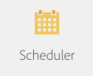
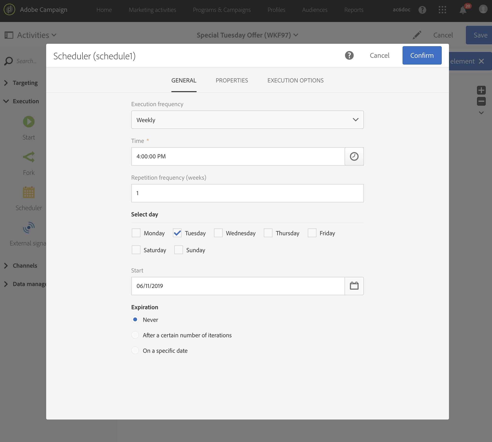

# Caso de uso de flujos: Creación de una entrega por correo electrónico cada martes{#creating-email-every-tuesday}

Puede enviar un mensaje de correo electrónico cada martes a todos los clientes para ofertas especiales.

1. En **[!UICONTROL Marketing Activities]**, haga clic **[!UICONTROL Create]** y seleccione **[!UICONTROL Workflow]**.
1. Seleccione **[!UICONTROL New Workflow]** como tipo de flujo de trabajo y haga clic **[!UICONTROL Next]** en.
1. Introduzca las propiedades del flujo de trabajo y haga clic **[!UICONTROL Create]** en.

## Creación de una actividad de programador{#creating-a-scheduler-activity}

1. En **[!UICONTROL Activities]** &gt; **[!UICONTROL Execution]**, arrastre y suelte un **[!UICONTROL Scheduler activity]**.
1. Haga doble clic en la actividad.
1. Configurar la ejecución de la entrega.
1. En **[!UICONTROL Execution frequency]**, seleccione **[!UICONTROL Weekly]**.
1. Seleccione un **[!UICONTROL Time]** y un **[!UICONTROL Repetition frequency]** para sus envíos.
1. En **[!UICONTROL Days of the week]**, seleccione **[!UICONTROL Tuesday]**.
1. Especifique un **[!UICONTROL Start]** parámetro y un **[!UICONTROL Expiration]** parámetro para el flujo de trabajo.
1. Confirme su actividad y guarde el flujo de trabajo.

>[!NOTE]
>
>Para iniciar el flujo de trabajo en una **[!UICONTROL Time Zone]****[!UICONTROL Execution options]** ficha específica, configure la zona horaria del programador en el campo Zona horaria.

## Creación de una actividad de consulta{#creating-a-query-activity}

1. En **[!UICONTROL Activities]** &gt; **[!UICONTROL Targeting]**, para seleccionar destinatarios, arrastre y suelte una **[!UICONTROL query]** actividad y haga doble clic en ella.
1. En **[!UICONTROL Shortcuts]** &gt; **[!UICONTROL Profile]**, arrastre y suelte.**[!UICONTROL Email]**
1. Seleccione **[!UICONTROL is not empty]** como operador.
1. **[!UICONTROL Shortcuts]** En &gt; **[!UICONTROL General]**, agregue perfiles y seleccione **[!UICONTROL no longer contact by email]** con el valor **[!UICONTROL No]**.
1. Click **[!UICONTROL Confirm]**.

## Creación de una entrega por correo electrónico{#creating-an-email-delivery}

1. En **[!UICONTROL Activities]** &gt; **[!UICONTROL Channels]**, arrastre y suelte un **[!UICONTROL Email delivery]**.
1. Haga clic en la actividad y seleccione  editar.
1. Seleccione **[!UICONTROL Recurring email]** y haga clic **[!UICONTROL Next]** en.
1. Seleccione una plantilla de correo electrónico y haga clic **[!UICONTROL Next]** en.
1. Introduzca las propiedades de correo electrónico y haga clic **[!UICONTROL Next]** en.
1. Para crear la presentación del correo electrónico, haga clic **[!UICONTROL Use Email Designer]** en.
1. Inserte elementos o seleccione una plantilla existente.
1. Personalice su correo electrónico mediante campos y vínculos.
1. Click **[!UICONTROL Save]**.

Para obtener más información, consulte [Diseño de un correo electrónico](../../designing/using/about-email-content-design.md#designing-an-email-content-from-scratch).

**Temas relacionados:**

* [Actividad de consulta](../..//automating/using/query.md)
* [Actividad del programador](../..//automating/using/scheduler.md)
* [Envío por correo electrónico](../..//automating/using/email-delivery.md)
* [Canal de correo electrónico](../..//channels/using/creating-an-email.md)
