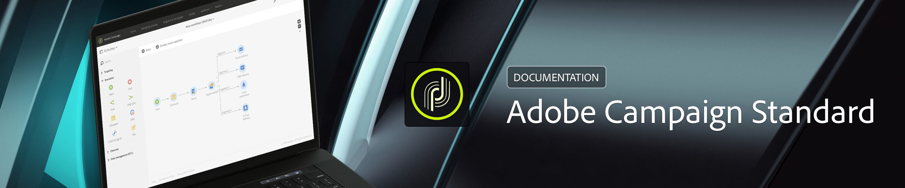

# Centro de ayuda {#campaign-standard-documentation}

## Novedades

* **[Administración de privacidad](https://helpx.adobe.com/campaign/kb/campaign-privacy.html)** Obtenga información sobre las herramientas proporcionadas por Adobe Campaign para ayudarle a cumplir con la privacidad.

* **[Recomendaciones de entrega](https://helpx.adobe.com/campaign/kb/delivery-best-practices.html)** Obtenga más información sobre las recomendaciones relacionadas con la creación y el envío de entregas.

* **[Diseñador](designing/using/designing-content-in-adobe-campaign.md)** de correo electrónico Consulte la documentación reorganizada del Diseñador de correo electrónico.

* **[Guía](https://helpx.adobe.com/campaign/kb/acs-mobile.html)** móvil de Campaign Standard Obtenga más información sobre las directrices generales para envíos móviles.

[Haga clic aquí para obtener más actualizaciones](rn/using/documentation-updates.md)

## Páginas principales

<table>
<tr>
  <td valign="top">
    
    

    <a href="administration/using/about-access-management.md"><strong>Funciones y grupos de seguridad</strong></a>
    

    <em>Obtenga información sobre cómo definir permisos y asignar funciones a usuarios de Campaign.</em>
     
  </td>
  <td valign="top">
    
    

    <a href="designing/using/designing-content-in-adobe-campaign.md"><strong>Cree un correo electrónico</strong></a>
    

    <em>Aprenda a utilizar el Diseñador de correo electrónico para crear correos</em>interactivos y personalizados  
  </td>
  <td valign="top">
       
    

    <strong>Recursos para desarrolladores</strong>
    

    
<em><a href="api/using/about-campaign-standard-apis.md">API de Adobe Campaign</a></em>

    
<em><a href="integrating/using/about-adobe-experience-cloud-triggers.md">Activadores de Adobe Experience Cloud</a></em>

     
  </td>
</tr>
</table>

## Recursos adicionales

* [Notas de la versión](rn/using/release-notes.md)

* [Panel de control](https://docs.adobe.com/content/help/en/control-panel/using/control-panel-home.html)

* [Vídeos tutoriales](https://docs.adobe.com/content/help/en/campaign-learn/campaign-standard-tutorials/overview.html)

* [Guía de planificación de versiones](https://helpx.adobe.com/campaign/kb/acs-release-planning.html)

* [Funciones obsoletas y eliminadas](https://helpx.adobe.com/campaign/kb/acs-deprecated-and-removed-features.html)

* [Notas técnicas](https://helpx.adobe.com/campaign/kb/acs-article-list.html)

* [Guía de implementación de Adobe Campaign Standard](https://helpx.adobe.com/campaign/kb/campaign-standard-implementation-guide.html)
