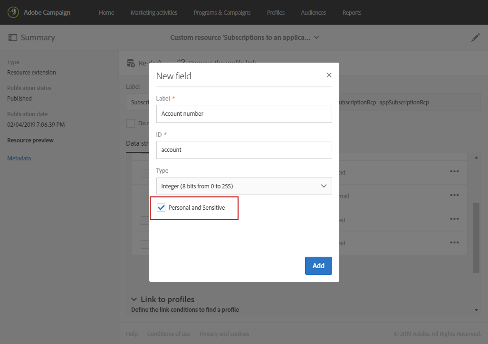

# Acerca de la mensajería en la aplicación{#about-in-app-messaging}

La mensajería en la aplicación es un canal de mensajería que le permite mostrar un mensaje cuando el usuario está activo en la aplicación móvil. Este tipo de mensaje es gratuito para las notificaciones push que se envían al centro de notificaciones del teléfono de los usuarios. Para obtener más información sobre el canal de notificaciones push, consulte esta [sección](../../channels/using/about-push-notifications.md).

Este canal requiere que las aplicaciones móviles se integren con el SDK de Adobe Experience Platform. Estas aplicaciones deben activarse en la interfaz de usuario de la recopilación de datos antes de estar disponibles en Adobe Campaign para entregas en la aplicación.

Para empezar a enviar mensajes en la aplicación en aplicaciones móviles que utilicen el SDK de Experience Platform, debe cumplir los siguientes requisitos previos:

1. En Adobe Campaign, asegúrese de que puede acceder al canal **[!UICONTROL In-App]**. Si no puede acceder a estos canales, póngase en contacto con el equipo de su cuenta.

1. Para aprovechar los casos de uso móvil en Adobe Campaign Standard con una aplicación de SDK de Experience Cloud, se debe crear una aplicación móvil en la interfaz de usuario de recopilación de datos y configurarla en Adobe Campaign Standard. Para obtener la guía paso a paso, consulte esta [página](../../administration/using/configuring-a-mobile-application.md).

1. Una vez configurada, ahora puede preparar su mensaje en la aplicación. Para obtener más información, consulte [esta página](../../channels/using/preparing-and-sending-an-in-app-message.md#preparing-your-in-app-message).

1. Entonces, puede decidir enviar un [mensaje en la aplicación](../../channels/using/customizing-an-in-app-message.md) o [personalizar un tipo de mensaje de notificación local](../../channels/using/customizing-an-in-app-message.md#customizing-a-local-notification-message-type).

1. Su envío está ahora listo para ejecutarse. Para obtener más información, consulte esta [página](../../channels/using/preparing-and-sending-an-in-app-message.md#sending-your-in-app-message).

**Contenido relacionado:**

* [Informe en la aplicación](../../reporting/using/in-app-report.md)
* [Casos de uso móvil admitidos en Adobe Campaign Standard](../../administration/using/configuring-rules-launch.md)
* [Guía de Campaign Standard Mobile](../../channels/using/get-started-communication-channels.md)

## Gestión de campos de perfil móvil con datos personales y confidenciales {#handling-mobile-profile-fields-with-personal-and-sensitive-data}

En Adobe Campaign, los datos de atributos de perfil móviles enviados desde dispositivos móviles se almacenan en el recurso **[!UICONTROL Subscriptions to an application (appSubscriptionRcp)]**, que le permite definir los datos que desea recopilar de los suscriptores de las aplicaciones.

Este recurso debe ampliarse para recopilar los datos que se van a enviar desde el dispositivo móvil a Adobe Campaign. Para ello, consulte esta [página](../../developing/using/extending-the-subscriptions-to-an-application-resource.md) para conocer los pasos detallados.

Para habilitar la personalización de los mensajes en la aplicación de forma más segura, es necesario configurar los campos de perfil móvil de este recurso. En **[!UICONTROL Subscriptions to an application (appSubscriptionRcp)]**, al crear los nuevos campos de perfiles móviles, marque **[!UICONTROL Personal and Sensitive]** para que no estén disponibles durante la personalización de mensajes en la aplicación.

>[!NOTE]
>
>Si tiene una implementación existente con la extensión de recursos personalizada en esta tabla, le recomendamos que etiquete los campos correctamente antes de utilizarlos para personalizar los mensajes en la aplicación.

Una vez que su recurso personalizado de **[!UICONTROL Subscriptions to an application]** ha sido configurado y publicado, puede empezar a preparar la entrega en la aplicación con la plantilla **[!UICONTROL Target users based on their Mobile profile (inApp)]**. Solo los campos no personales y no confidenciales estarán disponibles en el recurso **[!UICONTROL Subscriptions to an application (appSubscriptionRcp)]** para su personalización.

Si necesita personalizar con los campos **Personal y confidencial**, recomendamos utilizar la plantilla **[!UICONTROL Target users based on their Campaign profile (inAppProfile)]** que tiene un mecanismo de seguridad adicional para garantizar que los datos PII de los usuarios sigan siendo seguros.
