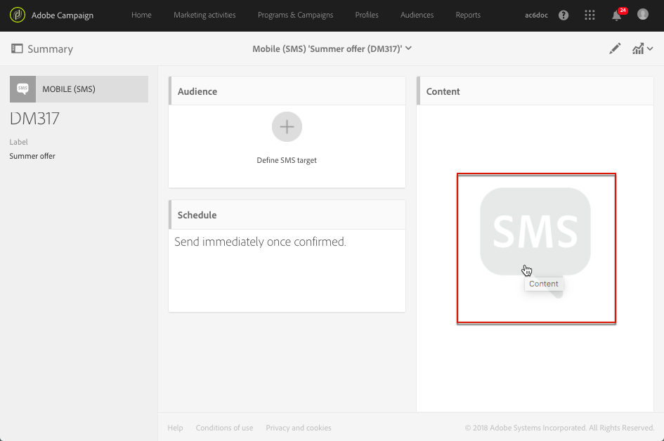

# Acerca de los SMS y el diseño de contenido push{#about-sms-and-push-content-design}

Utilice el editor de contenido para definir, modificar y personalizar el contenido de sus mensajes SMS y las notificaciones push en Adobe Campaign.

Esta sección describe las características específicas del editor de contenido push y SMS, incluyendo la [interfaz del editor de contenido push y SMS](../../channels/using/sms-and-push-content-editor-interface.md).

Las acciones que son comunes en una o más actividades de marketing se presentan en las siguientes secciones:

* Para obtener más información sobre la personalización del contenido de notificaciones push o SMS, consulte [Inserción de un campo de personalización](../../designing/using/personalization.md#inserting-a-personalization-field) y [Añadir un bloque de contenido](../../designing/using/personalization.md#adding-a-content-block).
* Para obtener más información sobre la definición de texto condicional en un mensaje SMS o una notificación push, consulte [Definición de texto dinámico](../../channels/using/defining-dynamic-text.md).

Para acceder al editor de contenido push y SMS:

* Haga clic en el bloque **[!UICONTROL Content]** de un panel de control SMS.

  

* Haga clic en el lápiz situado junto al campo **[!UICONTROL Message body]** en un panel de control de notificaciones push.

  

**Temas relacionados:**

* [Creación de un mensaje SMS](../../channels/using/creating-an-sms-message.md)
* [Creación y envío de una notificación push](../../channels/using/preparing-and-sending-a-push-notification.md)
