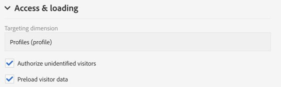
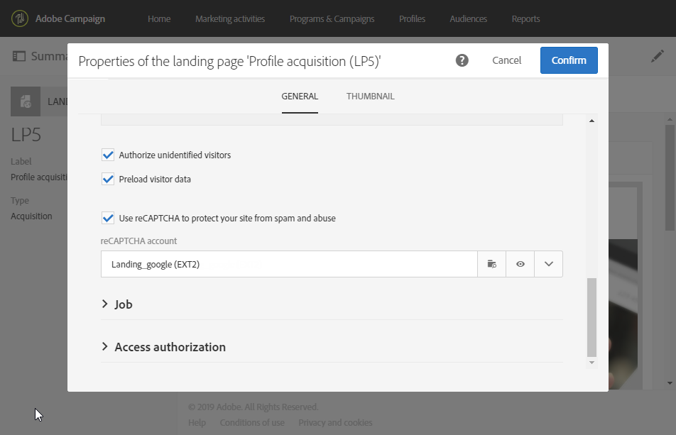

# Configuración de una página de destino {#configuring-landing-page}

## Confirmar un envío de página de aterrizaje {#confirm-a-landing-page-submission}

Cuando un visitante envía una página de aterrizaje, puede configurar las acciones activadas. Para ello:

1. Edite las propiedades de página de aterrizaje a las que se accede mediante el icono  del panel de página de aterrizaje y muestre los parámetros de **[!UICONTROL Job]**.

   

1. En la sección **[!UICONTROL Specific actions]**, seleccione **[!UICONTROL Start sending message]** para determinar el envío de un mensaje automático, por ejemplo, para confirmar la suscripción a un servicio. Debe seleccionar una plantilla de envíos de correo electrónico.

   Tenga en cuenta que si un mensaje de confirmación ya está configurado en el nivel de servicio, no debe seleccionar uno en esta pantalla para evitar enviar varios mensajes de confirmación. Consulte [Configuración de un servicio](../../audiences/using/creating-a-service.md).

1. Cree **[!UICONTROL Additional data]** para permitir almacenar datos adicionales cuando se envía la página de aterrizaje. Estos datos no son visibles para las personas que visitan la página. Solo se tienen en cuenta los valores constantes.

   

## Vinculación de una página de aterrizaje a un servicio {#linking-a-landing-page-to-a-service}

Puede vincular un formulario a un servicio para que los perfiles puedan suscribirse a un servicio específico al validar las páginas de aterrizaje.

Los parámetros para vincular una página de aterrizaje permiten especificar el tipo de acción realizada y si la página de aterrizaje está vinculada específicamente a un único servicio o si es genérica.

Para seleccionar el servicio que desea vincular, siga estos pasos:

1. Edite las propiedades de página de aterrizaje a las que se accede mediante el icono  del panel de página de aterrizaje y muestre los parámetros de **[!UICONTROL Job]**.

   

1. Elija **[!UICONTROL Subscription]** en la lista desplegable **[!UICONTROL Specific actions]**.

   

1. Seleccione **[!UICONTROL Specific service]** para vincular la página de aterrizaje a un solo servicio. No seleccione esta opción si desea utilizar varios servicios con la página de aterrizaje.

   Utilice la opción **[!UICONTROL Specified service in the URL]** para permitir que la página de aterrizaje se utilice en varios servicios. Por lo tanto, debe hacer referencia a la página de aterrizaje al configurar el servicio.

## Configuración de permisos y datos de precarga {#setting-permissions-and-pre-loading-data}

El acceso a una página de aterrizaje se puede restringir a visitantes identificados, que proceden de un vínculo de un mensaje enviado por Campaign, por ejemplo, o a una unidad organizativa específica.
En el caso de visitantes identificados, puede cargar previamente sus datos en la página de aterrizaje. Para ello:

1. Edite las propiedades de página de aterrizaje a las que se accede mediante el icono  del panel de página de aterrizaje y muestre los parámetros de **[!UICONTROL Access & loading]**.

   

1. Seleccione **[!UICONTROL Preload visitor data]**.

   Si un visitante a la página corresponde a un perfil de la base de datos, sus datos se muestran en los campos del formulario asignados a los datos de la base de datos y se tienen en cuenta los elementos de personalización de la página de aterrizaje.

   

También puede autorizar a cualquier visitante a acceder a la página de aterrizaje mediante la opción **[!UICONTROL Authorize unidentified visitors]** .

<!--Use the URL parameters to identify the visitors, using the **[!UICONTROL Authorize visitor identification via URL parameters]** option: then you must choose the loading key and map the filter parameters with the parameters of the corresponding URL.-->

Las páginas de aterrizaje también pueden vincularse a una unidad organizativa. Esto define el acceso de los usuarios a las diferentes páginas de aterrizaje. Para asignar una unidad organizativa:

1. Acceda a las propiedades de la página de aterrizaje mediante el icono **[!UICONTROL Edit properties]**.

   

1. Despliegue **[!UICONTROL Access authorization]**.

1. Haga clic en el menú desplegable y seleccione la unidad organizativa. Para obtener más información sobre cómo crear una unidad organizativa, consulte esta [página](../../administration/using/organizational-units.md).

   

1. Los campos **[!UICONTROL Created by]**, **[!UICONTROL Created]**, **[!UICONTROL Access authorization]** y **[!UICONTROL Last modified]** se completan automáticamente.

1. Haga clic en **[!UICONTROL Confirm]** y luego en **[!UICONTROL Save]**.

Ahora, solo se puede administrar y acceder a la página de aterrizaje si se es un usuario dentro de la unidad organizativa elegida.

## Configuración de Google reCAPTCHA {#setting-google-recaptcha}

Puede configurar Google reCAPTCHA V3 con la página de aterrizaje para protegerlo del spam y los abusos causados por los bots. Para poder usarlo con la página de aterrizaje, primero debe crear una cuenta externa. Para obtener más información sobre cómo configurarla, consulte esta [sección](../../administration/using/external-accounts.md#google-recaptcha-external-account).

Una vez configurada la cuenta externa de Google reCAPTCHA V3, puede añadirla a la página de aterrizaje:

1. Antes de publicar la página de aterrizaje, acceda a las propiedades de la página mediante el icono  en el panel de página de aterrizaje.

   

1. Despliegue el menú **[!UICONTROL Access & loading]**.
1. Marque la opción **[!UICONTROL Use reCAPTCHA to protect your site from spam and abuse]**.
1. Seleccione la cuenta externa reCAPTCHA de Google creada anteriormente.

   

1. Haga clic en **[!UICONTROL Confirm]**.

La página de aterrizaje ahora está configurada con Google reCAPTCHA, que se puede ver en la parte inferior de la página.

Google reCAPTCHA devuelve una puntuación basada en las interacciones de los usuarios con la página. Para comprobar su puntuación, conéctese a la [consola de administración de Google](https://g.co/recaptcha/admin).
