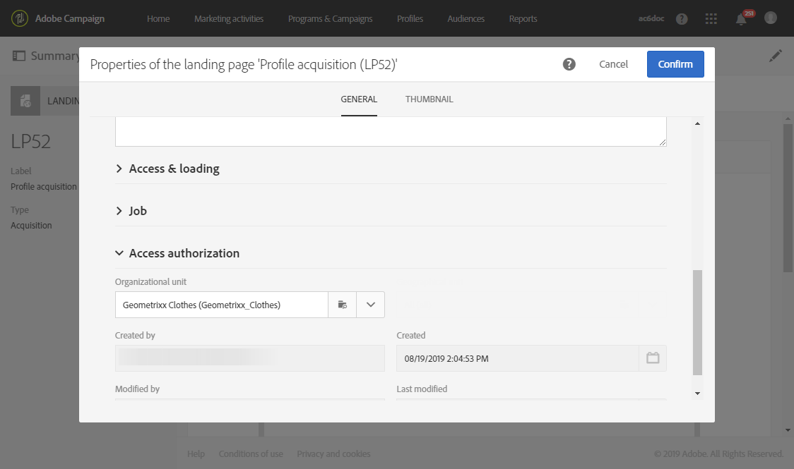

# Configuración de una página de aterrizaje {#configuring-landing-page}

## Confirmar un envío de página de aterrizaje {#confirm-a-landing-page-submission}

Cuando un visitante envía una página de aterrizaje, puede configurar las acciones activadas. Para ello:

1. Edite las propiedades de la página de aterrizaje a las que se accede mediante el icono  del tablero de la página de aterrizaje y muestre los **[!UICONTROL Job]** parámetros.

   

1. En la **[!UICONTROL Specific actions]** sección , seleccione **[!UICONTROL Start sending message]** para determinar el envío de un mensaje automático, por ejemplo para confirmar la suscripción a un servicio. A continuación, debe seleccionar una plantilla de envío de correo electrónico.

   Tenga en cuenta que si un mensaje de confirmación ya está configurado en el nivel de servicio, no debe seleccionar uno en esta pantalla para evitar enviar varios mensajes de confirmación. Consulte [Configuración de un servicio](../../audiences/using/creating-a-service.md).

1. Crear **[!UICONTROL Additional data]** para habilitar el almacenamiento de datos adicionales cuando se envía la página de aterrizaje. Estos datos no son visibles para las personas que visitan la página. Solo se tienen en cuenta los valores constantes.

   

## Vinculación de una página de aterrizaje a un servicio {#linking-a-landing-page-to-a-service}

Puede vincular un formulario a un servicio para que los perfiles se puedan suscribir a un servicio específico al validar las páginas de aterrizaje.

Los parámetros para vincular una página de aterrizaje permiten especificar el tipo de acción realizado y si la página de aterrizaje está vinculada específicamente a un único servicio o si es genérica.

Para seleccionar el servicio que desea vincular, debe:

1. Edite las propiedades de la página de aterrizaje a las que se accede mediante el icono  del tablero de la página de aterrizaje y muestre los **[!UICONTROL Job]** parámetros.

   

1. Elija **[!UICONTROL Subscription]** en la lista **[!UICONTROL Specific actions]** desplegable.

   

1. Seleccione **[!UICONTROL Specific service]** para vincular la página de aterrizaje a un solo servicio. No seleccione esta opción si desea utilizar varios servicios con la página de aterrizaje.

   Utilice la **[!UICONTROL Specified service in the URL]** opción para permitir que la página de aterrizaje se utilice en varios servicios. Por lo tanto, debe hacer referencia a la página de aterrizaje al configurar el servicio.

## Configuración de permisos y precarga de datos {#setting-permissions-and-pre-loading-data}

El acceso a una página de aterrizaje puede restringirse a los visitantes identificados, que provienen de un vínculo en un mensaje enviado por Campaña, por ejemplo, o a una unidad organizativa específica.
En el caso de los visitantes identificados, puede cargar previamente sus datos en la página de aterrizaje. Para ello:

1. Edite las propiedades de la página de aterrizaje a las que se accede mediante el icono  del tablero de la página de aterrizaje y muestre los **[!UICONTROL Access & loading]** parámetros.

   

1. Select **[!UICONTROL Preload visitor data]**.

   Si un visitante de la página corresponde a un perfil de la base de datos, sus datos se muestran en los campos del formulario asignados a los datos de la base de datos y se tienen en cuenta los elementos de personalización de la página de aterrizaje.

   

También puede:

* Utilice los parámetros de URL para identificar a los visitantes mediante la **[!UICONTROL Authorize visitor identification via URL parameters]** opción: a continuación, debe elegir la clave de carga y asignar los parámetros del filtro con los parámetros de la URL correspondiente.
* Autorice a cualquier visitante a acceder a la página de aterrizaje mediante la **[!UICONTROL Authorize unidentified visitors]** opción .

Las páginas de aterrizaje también se pueden vincular a una unidad organizativa. Esto definirá el acceso de los usuarios a las diferentes páginas de aterrizaje. Para asignar una unidad organizativa:

1. Acceda a las propiedades de la página de aterrizaje mediante el **[!UICONTROL Edit properties]** icono .

   

1. Despliegue el **[!UICONTROL Access authorization]**.

1. Haga clic en el menú desplegable y seleccione la unidad organizativa. For more information on how to create organization unit, refer to this [page](../../administration/using/organizational-units.md).

   

1. Los campos **[!UICONTROL Created by]**, **[!UICONTROL Created]****[!UICONTROL Access authorization]** y **[!UICONTROL Last modified]** se completan automáticamente.

1. Haga clic en **[!UICONTROL Confirm]** luego **[!UICONTROL Save]**.

Ahora solo los usuarios de la unidad organizativa seleccionada pueden acceder a la página de aterrizaje y administrarla.

## Configuración de Google reCAPTCHA {#setting-google-recaptcha}

Puede configurar Google reCAPTCHA V3 con su página de aterrizaje para protegerla del spam y los abusos causados por los bots. Para poder utilizarlo con la página de aterrizaje, primero debe crear una cuenta externa. Para obtener más información sobre cómo configurarla, consulte esta [sección](../../administration/using/external-accounts.md#google-recaptcha-external-account).

Una vez configurada la cuenta externa de Google reCAPTCHA V3, puede agregarla a la página de aterrizaje:

1. Antes de publicar la página de aterrizaje, acceda a las propiedades de página a las que se accede mediante el icono del tablero de la página de aterrizaje. 

   

1. Despliegue el **[!UICONTROL Access & loading]** menú.
1. Marque la **[!UICONTROL Use reCAPTCHA to protect your site from spam and abuse]** opción.
1. Seleccione la cuenta externa de Google reCAPTCHA creada anteriormente.

   

1. Click **[!UICONTROL Confirm]**.

La página de aterrizaje ahora está configurada con Google reCAPTCHA, que se puede ver en la parte inferior de la página.

Google reCAPTCHA devolverá una puntuación basada en las interacciones de los usuarios con su página. Para comprobar su puntuación, conéctese a su consola [de administración de](https://g.co/recaptcha/admin)Google.
