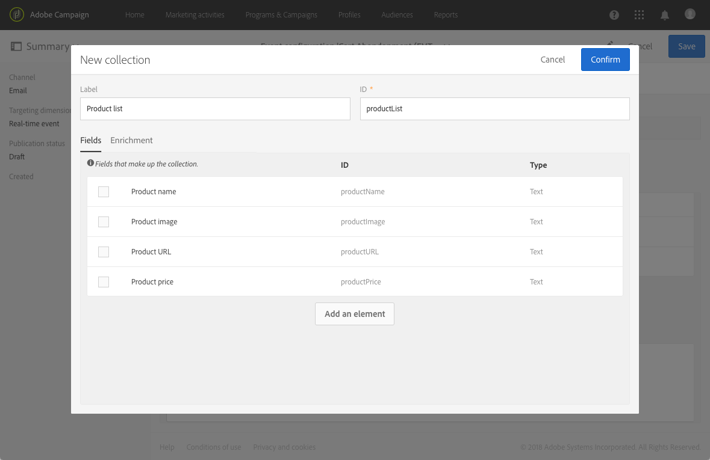

# Configuración de un evento transaccional {#configuring-transactional-event}

Para enviar un mensaje transaccional con Adobe Campaign, primero debe describir la estructura de los datos de evento creando y configurando un evento.

>[!IMPORTANT]
>
>Solo [Administradores funcionales](../../administration/using/users-management.md#functional-administrators) <!--being part of the **[!UICONTROL All]** [organizational unit](../../administration/using/organizational-units.md) -->tiene los derechos adecuados para crear y editar configuraciones de evento.

La configuración varía en función del [tipo de mensaje transaccional](../../channels/using/getting-started-with-transactional-msg.md#transactional-message-types) desea enviar y en el canal que se utilizará. Para obtener más información, consulte [Configuraciones específicas](#transactional-event-specific-configurations).

Una vez completada la configuración, el evento debe publicarse. Consulte [Publicación de un evento transaccional](../../channels/using/publishing-transactional-event.md).

## Creación de un evento {#creating-an-event}

Para empezar, cree el evento que se ajuste a sus necesidades.

1. Haga clic en **Adobe** , en la esquina superior izquierda, y seleccione **[!UICONTROL Marketing plans]** > **[!UICONTROL Transactional messages]** > **[!UICONTROL Event configuration]**.
1. Haga clic en el botón **[!UICONTROL Create]**.
1. Introduzca una **[!UICONTROL Label]** y un **[!UICONTROL ID]** para el evento. El **[!UICONTROL ID]** El campo es obligatorio y debe comenzar con el prefijo &quot;EVT&quot;. Si no utiliza este prefijo, se añade automáticamente cuando hace clic en **[!UICONTROL Create]**.

   

   >[!IMPORTANT]
   >
   >El ID no debe superar los 64 caracteres, incluido el prefijo EVT.

1. Seleccione el canal que se utilizará para enviar los mensajes transaccionales **[!UICONTROL Email]**, **[!UICONTROL Mobile (SMS)]** o **[!UICONTROL Push notification]**. Solo se puede utilizar un canal para cada evento y no se puede cambiar posteriormente.

1. Seleccione la dimensión de segmentación correspondiente a la configuración de evento deseada y haga clic en **[!UICONTROL Create]**.

   Los mensajes transaccionales basados en eventos se dirigen a datos contenidos en el propio evento, mientras que los mensajes transaccionales basados en perfiles se dirigen a datos contenidos en la base de datos de Adobe Campaign. Para obtener más información, consulte [Configuraciones específicas](#transactional-event-specific-configurations).

>[!NOTE]
>
>La cantidad de eventos transaccionales puede tener un impacto en la plataforma. Para garantizar un rendimiento óptimo, asegúrese de eliminar los eventos que no se utilicen. Consulte [Eliminación de un evento](../../channels/using/publishing-transactional-event.md#deleting-an-event).

## Definición de los atributos del evento {#defining-the-event-attributes}

En el **[!UICONTROL Fields]** , defina los atributos que se integrarán en el contenido del evento y se podrán utilizar para personalizar el mensaje transaccional.

Los pasos para agregar y modificar campos son los mismos que para [recursos personalizados](../../developing/using/configuring-the-resource-s-data-structure.md#adding-fields-to-a-resource).

>[!NOTE]
>
>Si desea crear un mensaje transaccional multilingüe, defina un atributo de evento adicional con la variable **[!UICONTROL AC_language]** ID. Esto solo se aplica a los mensajes transaccionales de eventos. Una vez publicado el evento, los pasos para editar el contenido de un mensaje transaccional multilingüe son los mismos que para un correo electrónico estándar multilingüe. Consulte [Creación de un correo electrónico multilingüe](../../channels/using/creating-a-multilingual-email.md).

## Definición de colecciones de datos {#defining-data-collections}

Puede añadir al contenido del evento una colección de elementos, cada uno de los cuales incluye varios atributos.

Esta colección se puede utilizar en un correo electrónico transaccional para agregar [listados de productos](../../designing/using/using-product-listings.md) al contenido del mensaje, por ejemplo, una lista de productos, con el precio, el número de referencia, la cantidad, etc. para cada producto de la lista.

1. En el **[!UICONTROL Collections]** , haga clic en **[!UICONTROL Create element]** botón.

   

1. Añada una etiqueta y un ID para su colección.
1. Añada todos los campos que desee mostrar en el mensaje transaccional para cada producto de la lista.

   En este ejemplo, agregamos los campos siguientes:

   

1. El **[!UICONTROL Enrichment]** permite enriquecer cada elemento de la colección. Esto permite personalizar los elementos de la lista de productos correspondiente con información de la base de datos de Adobe Campaign o de otros recursos que haya creado.

>[!NOTE]
>
>Los pasos para enriquecer los elementos de una colección son los mismos que se describen en el [Enriquecimiento del evento](#enriching-the-transactional-message-content) sección. Tenga en cuenta que enriquecer el evento no le permitirá enriquecer una colección: debe agregar un enriquecimiento a la propia colección en el **[!UICONTROL Collections]** sección.

Una vez que se publiquen el evento y el mensaje, podrá utilizar esta colección en su mensaje transaccional.

Esta es la vista previa de la API para este ejemplo:

**Temas relacionados:**

* [Previsualización y publicación del evento](../../channels/using/publishing-transactional-event.md#previewing-and-publishing-the-event)
* [Uso de listas de productos en un mensaje transaccional](../../designing/using/using-product-listings.md)
* [Publicación de un mensaje transaccional](../../channels/using/publishing-transactional-message.md#publishing-a-transactional-message)

## Enriquecimiento del evento {#enriching-the-transactional-message-content}

Puede enriquecer el contenido del mensaje transaccional con información de la base de datos de Adobe Campaign para personalizar los mensajes. Desde el apellido o el ID de CRM de cada uno de sus destinatarios, por ejemplo, puede recuperar datos como su dirección o fecha de nacimiento o cualquier otro campo personalizado agregado en la tabla Perfil, para personalizar la información que se les envía.

Es posible enriquecer el contenido del mensaje transaccional con información de **[!UICONTROL Profile and services Ext API]**. Para obtener más información, consulte [Ampliación de la API: Publicación de la extensión](../../developing/using/step-2--publish-the-extension.md)

Esta información también se puede almacenar en nuevos recursos. En ese caso, el recurso debe estar vinculado al **[!UICONTROL Profile]** o **[!UICONTROL Service]** recursos directamente o a través de otra tabla. Por ejemplo, en la configuración siguiente, es posible enriquecer el contenido del mensaje transaccional con información del **[!UICONTROL Product]** como la categoría de producto o el ID, si el **[!UICONTROL Product]** el recurso está vinculado al **[!UICONTROL Profile]** recurso.

Para obtener más información sobre la creación y publicación de recursos, consulte [esta sección](../../developing/using/key-steps-to-add-a-resource.md).

1. En el **[!UICONTROL Enrichment]** , haga clic en **[!UICONTROL Create element]** botón.

   

1. Seleccione el recurso con el que desea vincular el mensaje. En este caso, elija la variable **[!UICONTROL Profile]** recurso.

   

1. Utilice el **[!UICONTROL Create element]** para vincular un campo del recurso seleccionado a uno de los campos agregados anteriormente al evento (consulte [Definición de los atributos del evento](#defining-the-event-attributes)).

   

   >[!NOTE]
   >
   >Si define una condición que pueda permitir la selección de varios destinatarios (como un campo que pueda tener el mismo valor para varios perfiles), no se segmentará más de un perfil.

1. En este ejemplo, reconciliamos el **[!UICONTROL Last name]** y el **[!UICONTROL First name]** campos con los campos correspondientes en la variable **[!UICONTROL Profile]** recurso.

   

   También puede enriquecer el contenido del mensaje transaccional utilizando **[!UICONTROL Service]** recurso. Para obtener más información sobre los servicios, consulte [esta sección](../../audiences/using/creating-a-service.md).

1. Si está creando o editando un [evento basado en perfiles](#profile-based-transactional-messages), en el **[!UICONTROL Targeting enrichment]** , seleccione el enriquecimiento que se utilizará como destinatario del mensaje durante la ejecución de la entrega.

   

   >[!NOTE]
   >
   >Creación de un enriquecimiento y selección de un enriquecimiento objetivo basado en la variable **[!UICONTROL Profile]** Los recursos de son obligatorios para los eventos basados en perfiles.

Una vez publicados el evento y el mensaje, este vínculo le permite enriquecer el contenido del mensaje transaccional.

**Temas relacionados:**

* [Previsualización y publicación del evento](../../channels/using/publishing-transactional-event.md#previewing-and-publishing-the-event)
* [Personalizar un mensaje transaccional](../../channels/using/editing-transactional-message.md#personalizing-a-transactional-message)
* [Publicación de un mensaje transaccional](../../channels/using/publishing-transactional-message.md#publishing-a-transactional-message)

## Búsqueda de eventos transaccionales {#searching-transactional-events}

Para acceder y buscar los eventos transaccionales ya creados, siga los pasos a continuación.

1. Haga clic en **Adobe** , en la esquina superior izquierda, y seleccione **[!UICONTROL Marketing plans]** > **[!UICONTROL Transactional messages]** > **[!UICONTROL Event configuration]**.
1. Haga clic en el botón **[!UICONTROL Show search]**.

   

1. Puede filtrar por el **[!UICONTROL Publication status]**. Esto le permite mostrar solo los eventos publicados, por ejemplo.
1. También puede filtrar los eventos mediante el **[!UICONTROL Last event received]**. Por ejemplo, si introduce 10, solo se muestran las configuraciones de evento con el último evento recibido hace 10 días o más. Esto permite mostrar qué eventos han estado inactivos durante un periodo determinado.

   

   >[!NOTE]
   >
   >El valor predeterminado es 0. A continuación, se muestran todos los eventos.

## Configuraciones específicas {#transactional-event-specific-configurations}

La configuración del evento transaccional puede variar según el [tipo de mensaje transaccional](../../channels/using/getting-started-with-transactional-msg.md#transactional-message-types) desea enviar (evento o perfil) y en el canal que se utilizará.

Las secciones siguientes detallan qué configuración específica debe establecerse según el mensaje transaccional deseado. Para obtener más información sobre los pasos generales para configurar un evento, consulte [Creación de un evento](#creating-an-event).

### Mensajes transaccionales basados en eventos {#event-based-transactional-messages}

Puede enviar mensajes transaccionales de eventos dirigidos a un evento. Este tipo de mensajes transaccionales no contiene información de perfil: el destinatario se define por los datos contenidos en el propio evento.

Para enviar un mensaje transaccional basado en eventos, primero debe crear y configurar un evento que tenga como objetivo el **datos contenidos en el propio evento**.

1. Al crear la configuración de evento, seleccione **[!UICONTROL Real-time event]** dimensión objetivo (consulte [Creación de un evento](#creating-an-event)).
1. Añada campos al evento para poder personalizar el mensaje transaccional (consulte [Definición de los atributos del evento](#defining-the-event-attributes)).
1. Se supone que la mensajería transaccional basada en eventos utiliza solo los datos que se encuentran en el evento enviado para definir el destinatario y la personalización del contenido del mensaje.

   Sin embargo, si desea utilizar información adicional de la base de datos de Adobe Campaign, puede enriquecer el contenido del mensaje transaccional (consulte [Enriquecimiento del contenido de mensajes transaccionales](#enriching-the-transactional-message-content)).

1. Previsualización y publicación del evento (consulte [Previsualización y publicación del evento](../../channels/using/publishing-transactional-event.md#previewing-and-publishing-the-event)).

   Al previsualizar el evento, la API de REST contiene un atributo que especifica la dirección de correo electrónico, el teléfono móvil o los atributos específicos de las notificaciones push, según el canal seleccionado.

   Una vez publicado el evento, se crea automáticamente un mensaje transaccional vinculado al nuevo evento. Para que el evento almacene en déclencheur el envío de un mensaje transaccional, debe [modificar](../../channels/using/editing-transactional-message.md) y [publicar](../../channels/using/publishing-transactional-message.md) el mensaje que acaba de crearse.

1. Integre el evento en su sitio web (consulte [Integración del activador del evento](../../channels/using/getting-started-with-transactional-msg.md#integrate-event-trigger)).

### Mensajes transaccionales basados en perfiles {#profile-based-transactional-messages}

Puede enviar mensajes transaccionales en función de los perfiles del cliente, lo que le permite aplicar reglas de tipología de marketing, incluir el vínculo de cancelación de suscripción, añadir el mensaje a los informes de envío globales y aprovecharlo en el recorrido del cliente.

Para enviar un mensaje transaccional basado en perfiles, primero debe crear y configurar un objetivo de evento **datos de la base de datos de Adobe Campaign**.

1. Al crear la configuración de evento, seleccione **[!UICONTROL Profile event]** dimensión objetivo (consulte [Creación de un evento](#creating-an-event)).
1. Añada campos al evento para poder personalizar el mensaje transaccional (consulte [Definición de los atributos del evento](#defining-the-event-attributes)). Debe añadir al menos un campo para crear un enriquecimiento. No es necesario crear otros campos, como **Nombre** y **Apellidos** al igual que podrá utilizar campos de personalización de la base de datos de Adobe Campaign.
1. Cree un enriquecimiento para vincular el evento a la **[!UICONTROL Profile]** recurso (consulte [Enriquecimiento del evento](#enriching-the-transactional-message-content)) y seleccione este enriquecimiento como **[!UICONTROL Targeting enrichment]**.

   >[!IMPORTANT]
   >
   >Este paso es obligatorio para eventos basados en perfiles.

1. Previsualización y publicación del evento (consulte [Previsualización y publicación del evento](../../channels/using/publishing-transactional-event.md#previewing-and-publishing-the-event)).

   Al obtener una vista previa del evento, la API de REST no contiene ningún atributo que especifique la dirección de correo electrónico, el teléfono móvil o los atributos específicos de las notificaciones push, ya que se recuperarán del **[!UICONTROL Profile]** recurso.

   Una vez publicado el evento, se crea automáticamente un mensaje transaccional vinculado al nuevo evento. Para que el evento almacene en déclencheur el envío de un mensaje transaccional, debe [modificar](../../channels/using/editing-transactional-message.md) y [publicar](../../channels/using/publishing-transactional-message.md) el mensaje que acaba de crearse.

1. Integre el evento en su sitio web (consulte [Integración del activador del evento](../../channels/using/getting-started-with-transactional-msg.md#integrate-event-trigger)).

<!--### Transactional SMS messages {#transactional-sms}

The steps to configure an  event to send an SMS transactional message are the same as for the email channel. The only differences are as follows:

* When creating the corresponding event, you need to select the **[!UICONTROL Mobile (SMS)]** channel.

* When previewing the event corresponding to an event-based transactional SMS, the REST API contains an attribute specifying the mobile phone instead of the email address.

* The specificities to edit the content of an SMS transactional message are the same as for a [standard SMS](../../channels/using/about-sms-and-push-content-design.md).-->

### Notificaciones push transaccionales {#transactional-push-notifications}

Puede enviar dos tipos de notificaciones push transaccionales:
* Una notificación push transaccional anónima a todos los usuarios que se han suscrito para recibir notificaciones de su aplicación móvil. Consulte [Configuración de notificaciones push transaccionales basadas en eventos](../../channels/using/transactional-push-notifications.md#event-based-transactional-push-notifications).
* Una notificación push transaccional a los perfiles de Adobe Campaign que se han suscrito a su aplicación móvil. Consulte [Configuración de notificaciones push transaccionales basadas en perfiles](../../channels/using/transactional-push-notifications.md#profile-based-transactional-push-notifications).

>[!IMPORTANT]
>
>Para poder enviar notificaciones push transaccionales, debe configurar Adobe Campaign en consecuencia. Consulte [Configuración de una aplicación móvil](../../administration/using/configuring-a-mobile-application.md).

### Mensajes de seguimiento {#follow-up-messages}

Puede enviar un mensaje de seguimiento a los clientes que recibieron un mensaje transaccional específico.

Los pasos para configurar un evento que permita enviar un mensaje de seguimiento se detallan en [esta sección](../../channels/using/follow-up-messages.md#configuring-an-event-to-send-a-follow-up-message).
