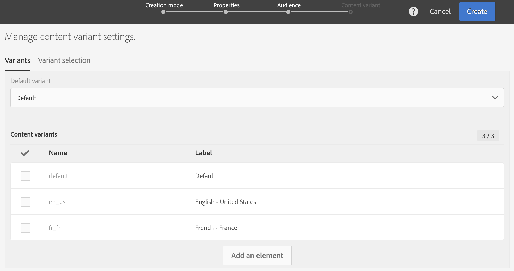

# Creación de un correo electrónico multilingüe{#creating-a-multilingual-email}

Puede enviar un correo electrónico multilingüe a perfiles con diferentes idiomas preferidos: cada perfil recibirá una variante del correo electrónico en su idioma preferido.

Para ello, compruebe que tiene disponible una plantilla de correo electrónico multilingüe. Si no es así, aprenda a crear uno en [esta sección](../../channels/using/multilingual-messages-template.md).

La audiencia se basa en perfiles con información de idioma preferido completada.

1. Cree un nuevo correo electrónico basado en una [plantilla multilingüe](../../channels/using/multilingual-messages-template.md).

   

1. Defina las propiedades generales y la audiencia de destino del mensaje de correo electrónico, igual que para un correo electrónico estándar. Consulte la sección [Creación de audiencias](../../audiences/using/creating-audiences.md).
1. En el cuarto paso del asistente de creación, defina las opciones de variante. Si la [plantilla multilingüe](../../channels/using/multilingual-messages-template.md) ya contiene todos los parámetros correctos, puede hacer clic directamente en el botón **[!UICONTROL Create]**.

   

   Si es necesario, agregue variantes con el botón **[!UICONTROL Add an element]**. **[!UICONTROL Default]** no debe eliminarse. Cuando se establece en **[!UICONTROL default]**, se utiliza [el idioma preferido del perfil](../../audiences/using/creating-profiles.md) para elegir la variante. También puede establecer la variante **[!UICONTROL Default]** en cualquier otro idioma.

1. Confirmar la creación de correo electrónico: a continuación, se muestra el panel de correo electrónico.
1. Defina el contenido del correo electrónico de cada variante. En función de la plantilla que haya elegido, puede definir varios asuntos, varios nombres de remitente o varios contenidos diferentes. Utilice el menú desplegable para desplazarse entre las distintas variantes del elemento. Para obtener más información, consulte la sección del [editor de contenido](../../designing/using/designing-content-in-adobe-campaign.md).

   

1. Pruebe y valide el mensaje. Consulte la sección [Envío de prueba](../../sending/using/sending-proofs.md) .
1. Programe el envío con **[!UICONTROL Send after confirmation option]**.
1. Una vez enviado el correo electrónico, puede acceder a sus registros e informes para medir el éxito de la campaña. Para obtener más información sobre la creación de informes, consulte [esta sección](../../reporting/using/about-dynamic-reports.md).

**Temas relacionados:**

* [Alcance de audiencias multilingües mediante un flujo de trabajo](https://helpx.adobe.com/es/campaign/kb/simplify-campaign-management.html#Engageyourcustomersateverystep)
