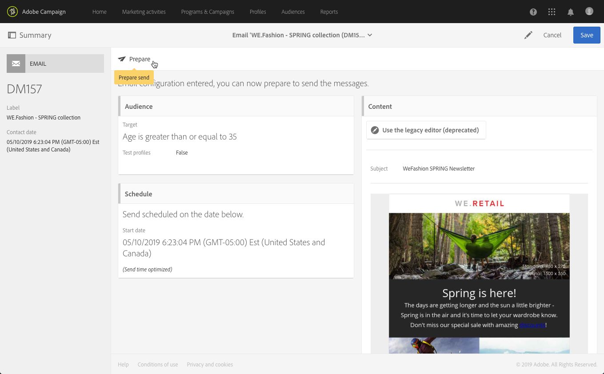

# Creación de un correo electrónico{#creating-an-email}

Puede crear un mensaje de correo electrónico a partir de una [campaña](../../start/using/marketing-activities.md#creating-a-marketing-activity), de la página de inicio [de Adobe Campaign](../../start/using/interface-description.md#home-page) o de la lista [actividad de mercadotecnia](../../start/using/marketing-activities.md#about-marketing-activities). También puede crear correos electrónicos recurrentes y de un solo envío a partir de un flujo de trabajo.

 [Descubra esta función en vídeo](#video)

1. Una vez que haya empezado a crear una actividad de marketing por correo electrónico, seleccione la plantilla que desee utilizar.

   De forma predeterminada, puede elegir entre varias plantillas para cada actividad de mercadotecnia. Esto le permite preconfigurar ciertos parámetros según sus necesidades y también asignar una marca al envío. Para obtener más información sobre esto, consulte [Administración de plantillas](../../start/using/marketing-activity-templates.md).

   

   >[!NOTE]
   >
   >Las plantillas de prueba A/B y de seguimiento están ocultas de forma predeterminada. Marque las casillas del lado izquierdo ( **[!UICONTROL Filter]** panel lateral) si desea mostrarlas.

1. Introduzca las propiedades generales del correo electrónico. Puede introducir un nombre en el campo **Etiqueta** y editar el ID. Tanto el nombre de la actividad como su ID aparecen en la interfaz, pero no son visibles para los destinatarios de mensajes.

   Puede añadir una descripción que el usuario pueda ver en el contenido de la campaña.

   

   >[!NOTE]
   >
   >Puede crear el correo electrónico dentro de una campaña principal desde la página de inicio o la lista de actividades de marketing. Selecciónelo entre las campañas que ya se han creado.

1. Defina el destinatario del mensaje en función de los criterios comerciales. Consulte [Acerca de perfiles](../../audiences/using/about-profiles.md).

   También puede definir los perfiles de prueba que validarán el mensaje. Consulte [Administración de perfiles de prueba](../../audiences/using/managing-test-profiles.md).

   

1. Defina y personalice el contenido del mensaje, el nombre del remitente y el asunto mediante el [Diseñador de correo electrónico](../../designing/using/designing-content-in-adobe-campaign.md). Para obtener más información sobre esto, consulte [Acerca del diseño de contenido de correo electrónico](../../designing/using/designing-content-in-adobe-campaign.md).

   

   Puede diseñar el mensaje directamente con una plantilla de contenido predefinida o con Dreamweaver o Adobe Experience Manager. Si no se siente como un diseñador, también puede cargar un contenido preparado para usted o importar un contenido existente desde una dirección URL. Consulte [Selección de contenido existente](../../designing/using/using-existing-content.md).

1. Previsualice el mensaje. Consulte [Vista previa de mensajes](../../sending/using/previewing-messages.md).
1. Confirme el correo electrónico que ha creado.

   >[!NOTE]
   >
   >Para poder guardar el correo electrónico, primero debe realizar algunas modificaciones en el contenido. Si hace clic **[!UICONTROL Cancel]** en este punto, no completará el asistente y no se creará el correo electrónico.

   A continuación, se muestra el panel de correo electrónico. Le permite comprobar su mensaje y [preparar el envío](../../sending/using/preparing-the-send.md).

   El botón **[!UICONTROL Edit properties]** en la esquina superior derecha permite editar las propiedades del correo electrónico. Por ejemplo, puede configurar el correo electrónico para que su etiqueta se calcule en el momento de la preparación del envío.  Los parámetros disponibles se enumeran en [esta sección](../../administration/using/configuring-email-channel.md#list-of-email-properties).

   

1. Programe el envío. Consulte [Programación de mensajes](../../sending/using/about-scheduling-messages.md).

   

1. Prepare el mensaje para analizar su destinatario. Consulte [Preparación del envío](../../sending/using/confirming-the-send.md).

   

   >[!NOTE]
   >
   >Puede establecer reglas globales de fatiga entre canales que excluyan automáticamente los perfiles superpuestos de las campañas. Para obtener más información sobre esto, consulte [Reglas de fatiga](../../sending/using/fatigue-rules.md).

1. Envíe pruebas para comprobar y validar el mensaje y supervisar el procesamiento de la bandeja de entrada. Consulte [Envío de prueba](../../sending/using/sending-proofs.md).

   

1. Envíe el mensaje y compruebe su envío a través del panel de mensajes y los registros. Consulte [Envío de mensajes](../../sending/using/confirming-the-send.md).

   

1. Mida el impacto del mensaje con informes de envío. Para obtener más información sobre sistema de informes, consulte [esta sección](../../reporting/using/about-dynamic-reports.md).

**Temas relacionados**:

* [Creación de una guía ](https://helpx.adobe.com/es/campaign/kb/acs-get-started-with-emails.html) paso a paso de correo electrónico personalizada
* [Integración con Adobe Campaign y Dreamweaver](../../designing/using/using-integrations.md#editing-content-in-dreamweaver)
* [Integración con Adobe Experience Manager](../../integrating/using/integrating-with-experience-manager.md)

## Tutorial video {#video}

Este vídeo muestra cómo crear un correo electrónico.

>[!VIDEO](https://video.tv.adobe.com/v/23721?quality=12)

Hay disponibles más vídeos de procedimientos para Campaign Standards [aquí](https://experienceleague.adobe.com/docs/campaign-standard-learn/tutorials/overview.html?lang=es).
