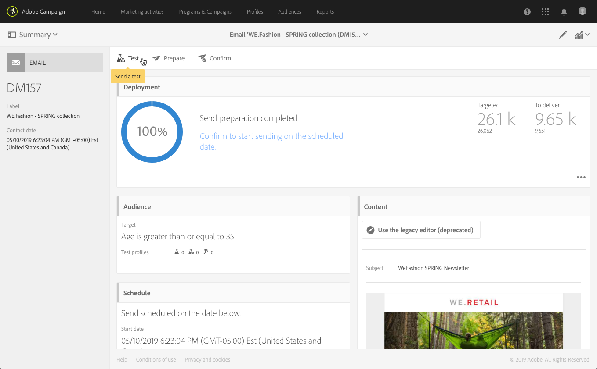

# Creación de un correo electrónico{#creating-an-email}

Puede crear un correo electrónico a partir de una [campaña](../../start/using/marketing-activities.md#creating-a-marketing-activity), desde la página [de](../../start/using/interface-description.md#home-page)inicio de Adobe Campaign o desde la lista [de actividades de](../../start/using/marketing-activities.md#about-marketing-activities)marketing. También puede crear correos electrónicos recurrentes y de un solo envío a partir de un flujo de trabajo.

1. Una vez que haya empezado a crear una actividad de marketing por correo electrónico, seleccione la plantilla que desee utilizar.

   De forma predeterminada, puede elegir entre varias plantillas para cada actividad de marketing. Esto le permite preconfigurar ciertos parámetros según sus necesidades y también asignar una marca a la entrega. Para obtener más información sobre esto, consulte [Administración de plantillas](../../start/using/marketing-activity-templates.md).

   

   >[!NOTE]
   >
   >Las plantillas de prueba A/B y de seguimiento están ocultas de forma predeterminada. Marque las casillas del lado izquierdo (panel **[!UICONTROL Filter]**lateral) si desea mostrarlas.

1. Introduzca las propiedades generales del correo electrónico. Puede introducir un nombre en el campo **Etiqueta** y editar el ID. Tanto el nombre de la actividad como su ID aparecen en la interfaz, pero no son visibles para los destinatarios del mensaje.

   Puede agregar una descripción que el usuario pueda ver en el contenido de la campaña.

   

   >[!NOTE]
   >
   >Puede crear el correo electrónico dentro de una campaña principal desde la página principal o desde la lista de actividades de marketing. Selecciónelo de las campañas que ya se hayan creado.

1. Defina el objetivo del mensaje en función de los criterios comerciales. Consulte [Administración de perfiles](../../audiences/using/about-profiles.md).

   También puede definir los perfiles de prueba que validarán el mensaje. Consulte [Administración de perfiles](../../sending/using/managing-test-profiles-and-sending-proofs.md#managing-test-profiles)de prueba.

   

1. Defina y personalice el contenido del mensaje, el nombre del remitente y el asunto mediante el Diseñador de [correo electrónico](../../designing/using/designing-content-in-adobe-campaign.md). Para obtener más información sobre esto, consulte [Acerca del diseño](../../designing/using/designing-content-in-adobe-campaign.md)del contenido del correo electrónico.

   

   Puede diseñar el mensaje directamente con una plantilla de contenido predefinida o con Dreamweaver o Adobe Experience Manager. Si no se siente como un diseñador, también puede cargar un contenido preparado para usted o importar un contenido existente desde una dirección URL. Consulte [Selección de un contenido](../../designing/using/using-existing-content.md)existente.

1. Previsualice el mensaje. Consulte [Vista previa de mensajes](../../sending/using/previewing-messages.md).
1. Confirme la creación del correo electrónico.

   >[!NOTE]
   >
   >Para poder guardar el correo electrónico, primero debe realizar algunas modificaciones en el contenido. Si hace clic **[!UICONTROL Cancel]**en este punto, no completará el asistente y su correo electrónico no se creará.

   A continuación, se muestra el tablero de correo electrónico. Le permite comprobar su mensaje y [preparar el envío](../../sending/using/preparing-the-send.md).

   El **[!UICONTROL Edit properties]**botón situado en la esquina superior derecha permite editar las propiedades del correo electrónico. Por ejemplo, puede configurar el correo electrónico para que su etiqueta se calcule en el momento de la preparación de la entrega.  Available parameters are listed in[this section](../../administration/using/configuring-email-channel.md#list-of-email-properties).

   

1. Programe el envío. Consulte [Programación de mensajes](../../sending/using/about-scheduling-messages.md).

   

1. Prepare el mensaje para analizar su objetivo. See [Preparing the send](../../sending/using/confirming-the-send.md).

   

   >[!NOTE]
   >
   >Puede establecer reglas de fatiga globales entre canales que excluyan automáticamente perfiles superpuestos de las campañas. Para obtener más información sobre esto, consulte [Reglas](../../administration/using/fatigue-rules.md)de fatiga.

1. Envíe pruebas para comprobar y validar el mensaje y supervisar el procesamiento de la bandeja de entrada. Consulte [Envío de la prueba](../../sending/using/managing-test-profiles-and-sending-proofs.md#sending-proofs).

   

1. Envíe el mensaje y compruebe su entrega a través del tablero de mensajes y los registros. Consulte [Envío de mensajes](../../sending/using/confirming-the-send.md).

   

1. Mida el impacto del mensaje en los informes de envío. Para obtener más información sobre los informes, consulte [esta sección](../../reporting/using/about-dynamic-reports.md).

**Temas relacionados**:

* [Creación de un vídeo de correo electrónico](https://helpx.adobe.com/campaign/kt/acs/using/acs-create-email-from-homepage-feature-video-use.html)
* [Creación de una guía paso a paso de correo electrónico](https://docs.campaign.adobe.com/doc/standard/getting_started/en/ACS_GettingStartedEmail.html) personalizada
* [Vídeo de integración](https://helpx.adobe.com/campaign/kt/acs/using/acs-dreamweaver-integration-feature-video-use.html) de Adobe Campaign y Dreamweaver
* [Integración con Adobe Experience Manager](../../integrating/using/integrating-with-experience-manager.md)

