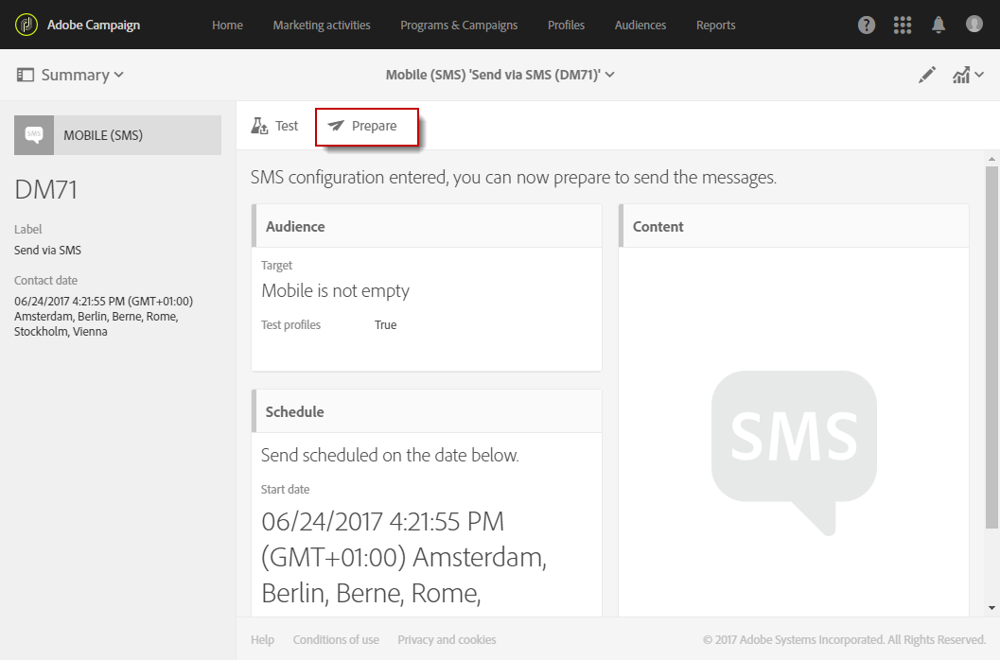

# Creación de un mensaje SMS{#creating-an-sms-message}

Crear un envío SMS es muy similar a crear un correo electrónico normal. Los pasos siguientes describen la configuración específica de este canal. Consulte [Creación de un correo electrónico](../../channels/using/creating-an-email.md) para obtener más información sobre otras opciones.

Los parámetros avanzados de SMS se detallan en la sección de [configuración de SMS](../../administration/using/configuring-sms-channel.md).

 [Descubra esta función en vídeo](#video)

Para crear y enviar mensajes SMS a un teléfono móvil, necesita:

* Una cuenta externa de **[!UICONTROL Routing]** configurada en el canal **[!UICONTROL Mobile (SMS)]** con el modo **[!UICONTROL Bulk delivery]**. Para obtener más información, consulte la sección [Enrutamiento](../../administration/using/configuring-sms-channel.md#defining-an-sms-routing).
* Una plantilla de envíos que esté correctamente vinculada a esta cuenta externa.

1. Creación de una entrega de SMS. Puede hacerlo desde la [página de inicio](../../start/using/interface-description.md#home-page)de Adobe Campaign, en una [campaña](../../start/using/marketing-activities.md#creating-a-marketing-activity) o en la [lista de actividades de marketing](../../start/using/programs-and-campaigns.md#creating-a-campaign).

   También puede añadir una actividad SMS en un flujo de trabajo. Para obtener más información, consulte la guía [Flujos de trabajo](../../automating/using/sms-delivery.md).

   Al crear un mensaje, aparece un asistente para guiarle por los pasos más importantes. Lo que se define a través del asistente se puede seguir editando después desde el panel de mensajes.

1. Seleccione la plantilla que desee utilizar. Puede elegir la plantilla de SMS predeterminada o una de sus propias plantillas.

   

   Para hacer el envío a un teléfono móvil, la plantilla de envíos debe estar correctamente vinculada a la cuenta externa de enrutamiento SMS.

1. Introduzca las propiedades generales del SMS.

   {{$include /help/_includes/channel-activities-name-id-fields.md}}

   

1. Especifique la audiencia a la que desea enviar el mensaje. Puede seleccionar una audiencia existente o dirigirlo un destinatario directo de una población definiendo y combinando reglas.

   

1. Añade contenido a tu SMS. También puede definir el contenido haciendo clic en la sección **[!UICONTROL Content]** del panel de envío, una vez que se haya finalizado la creación del SMS. Consulte [Acerca del diseño de contenido de SMS](../../channels/using/about-sms-and-push-content-design.md).

   Si ha insertado campos de personalización o texto condicional en el contenido del mensaje SMS, la longitud del mensaje puede variar de un destinatario a otro. De hecho, estos factores pueden introducir caracteres que no se tienen en cuenta en la codificación GSM. Por este motivo, la longitud del mensaje debe evaluarse una vez realizada la personalización. Consulte [Personalización de mensajes SMS](../../channels/using/personalizing-sms-messages.md).

   

1. Confirme el mensaje que ha creado. A continuación, aparece un panel.
1. Programe el envío. El SMS se puede enviar manualmente justo después de la preparación del mensaje o automáticamente en una fecha programada. Consulte [Programación de mensajes](../../sending/using/about-scheduling-messages.md).
1. Prepare el mensaje para analizar su validez, personalización y destinatario.

   

   >[!NOTE]
   >
   >Puede establecer reglas globales de fatiga entre canales que excluyan automáticamente los perfiles superpuestos de las campañas. Consulte [Reglas de fatiga](../../sending/using/fatigue-rules.md).

1. Envíe pruebas para comprobar y validar el mensaje y supervisar el procesamiento de la bandeja de entrada. Consulte la sección [Envío de prueba](../../sending/using/sending-proofs.md).
1. Confirme el envío del mensaje. El envío se inicia según la programación que haya definido.

   

Se envía el mensaje. Puede consultar el envío a través del panel de mensajes y los registros.

Una vez finalizado el envío, puede empezar a medir el impacto del mensaje con informes de envío integrados o personalizados.

**Temas relacionados:**

* [Acerca de la modificación del contenido push y SMS](../../channels/using/about-sms-and-push-content-design.md)
* [Administración de plantillas](../../start/using/marketing-activity-templates.md)

## Tutorial en vídeo {#video}

Este vídeo muestra cómo crear un envío SMS.

>[!VIDEO](https://video.tv.adobe.com/v/25265/?quality=12)

Hay disponibles vídeos prácticos adicionales del Campaign Standard [here](https://experienceleague.adobe.com/docs/campaign-standard-learn/tutorials/overview.html?lang=es).
