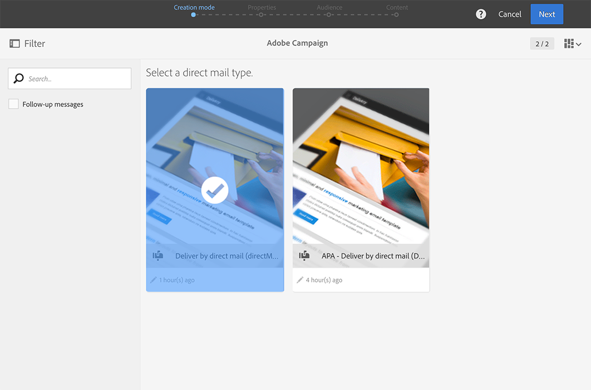
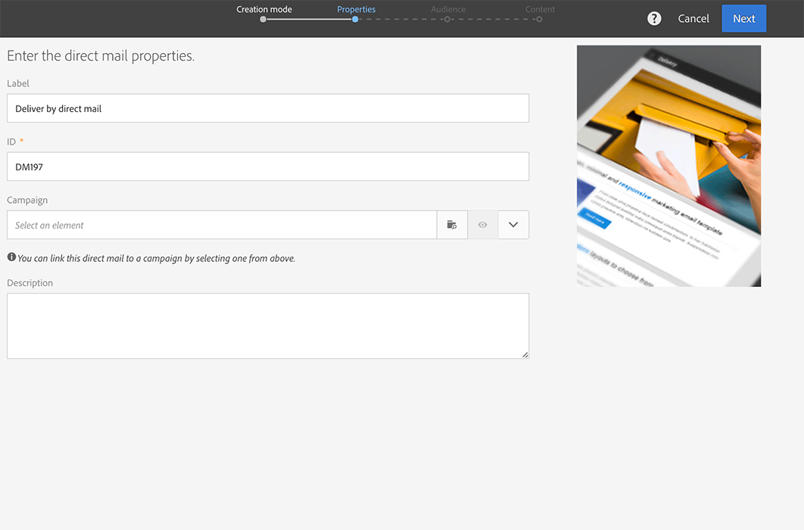
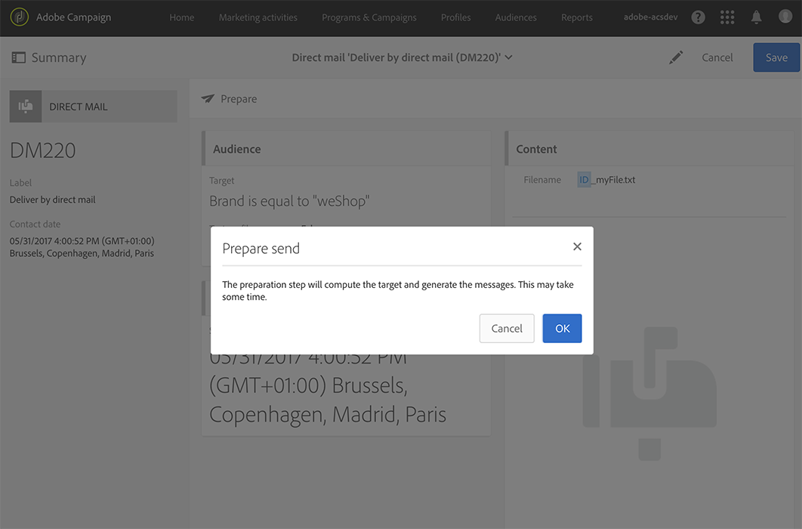
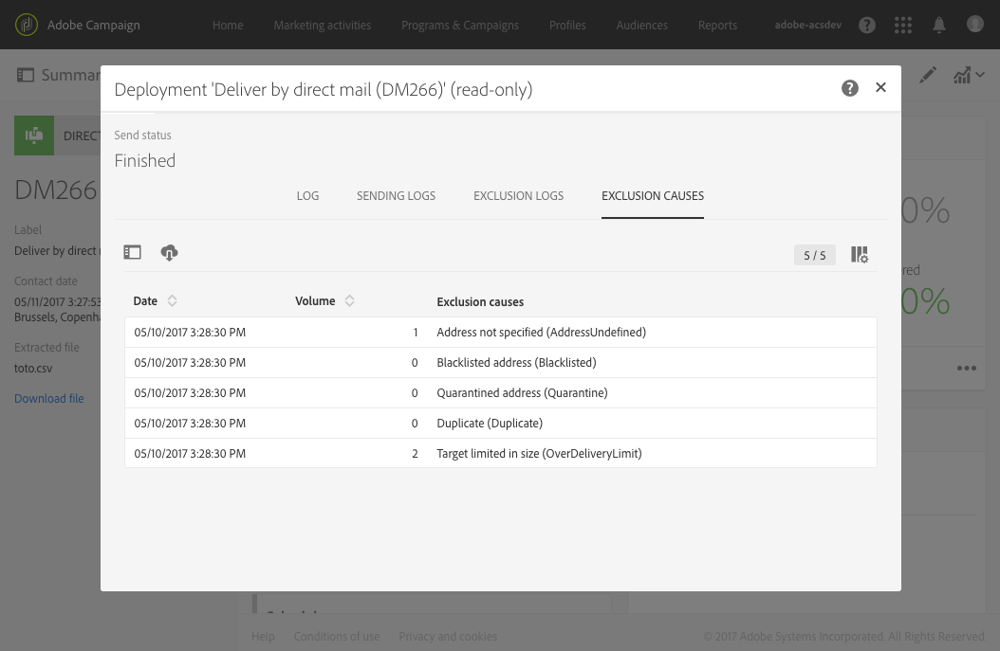

# Creación del correo directo{#creating-the-direct-mail}

Crear un envío de correo postal es muy similar a crear un correo electrónico normal. Los pasos siguientes describen la configuración específica de este canal. Consulte [Creación de un correo electrónico](../../channels/using/creating-an-email.md) para obtener más información sobre otras opciones.

>[!NOTE]
>
>También puede añadir una actividad de correo postal en un flujo de trabajo. Para obtener más información, consulte la guía [Flujos de trabajo](../../automating/using/direct-mail-delivery.md).

1. Cree un nuevo envío de correo postal. Puede crear un desde la [página de inicio](../../start/using/interface-description.md#home-page) de Adobe Campaign, en una [campaña](../../start/using/marketing-activities.md#creating-a-marketing-activity) o en una [lista de actividades de marketing](../../start/using/programs-and-campaigns.md#creating-a-campaign).

   

1. Elija la plantilla predeterminada **[!UICONTROL Direct mail]** o una que haya creado. Para obtener más información, consulte la sección [Administración de plantillas](../../start/using/marketing-activity-templates.md).

   

1. Introduzca las propiedades generales del envío.

   

   >[!NOTE]
   >
   >Tanto el nombre de la actividad como su ID aparecen en la interfaz, pero no son visibles para los destinatarios de mensajes.
   >
   >Asegúrese de que el campo ID no contenga ningún espacio en blanco para evitar discrepancias, por ejemplo, al integrarse con Adobe Analytics.

1. Defina la audiencia que desee incluir en el archivo de extracción, así como los perfiles de prueba y trampa. Consulte [Definición de audiencia de correo postal](../../channels/using/defining-the-direct-mail-audience.md).

   

   >[!NOTE]
   >
   >La definición de audiencia es muy similar a la definición de una audiencia de correo electrónico normal. Consulte [Creación de audiencias](../../audiences/using/creating-audiences.md).

1. Edite el contenido del archivo: columnas que se incluyen en cada perfil, estructura de los archivos, encabezado y pie de página. Consulte [Definición del contenido de correo postal](../../channels/using/defining-the-direct-mail-content.md).

   

1. Haga clic en la sección **[!UICONTROL Schedule]** del panel de envío para definir la fecha de contacto. Para el correo postal, la fecha de contacto es obligatoria. Para obtener más información, consulte [Programación del envío](../../sending/using/about-scheduling-messages.md).

   

1. Si ha añadido perfiles de prueba (consulte [Añadir perfiles de prueba y trampa](../../channels/using/defining-the-direct-mail-audience.md#adding-test-and-trap-profiles)), puede probar el envío antes de preparar el archivo final. Le permite crear un archivo de muestra que contenga únicamente los perfiles de prueba seleccionados.

   Haga clic en **[!UICONTROL Test]** para generar el archivo de muestra. Haga clic en **[!UICONTROL Summary]**, en la esquina superior izquierda, y luego seleccione **[!UICONTROL Proofs]**. En la parte izquierda de la pantalla, seleccione la prueba y haga clic en **[!UICONTROL Download file]**.

   >[!NOTE]
   >
   >La función **[!UICONTROL Export]** es necesaria para permitir a Adobe Campaign exportar el archivo y hacer que esté disponible para la descarga. Póngase en contacto con su administrador.

   

1. Una vez definido el contenido de su envío, la audiencia y la fecha de contacto, haga clic en el botón **[!UICONTROL Prepare]** del panel de envío.

   

   Se aplican reglas de tipología. Por ejemplo, todas las direcciones postales no especificadas se excluyen del destinatario. Por este motivo, debe asegurarse de haber marcado la casilla **[!UICONTROL Address specified]** en la información de los perfiles (consulte [Recomendaciones](../../channels/using/about-direct-mail.md#recommendations)). Si ha definido un **[!UICONTROL Maximum volume of message]** en las propiedades de correo postal o en el nivel de plantilla, también se aplica aquí.

   

   >[!NOTE]
   >
   >Puede establecer reglas globales de fatiga entre canales que excluyan automáticamente los perfiles superpuestos de las campañas. Consulte [Reglas de fatiga](../../sending/using/fatigue-rules.md).

1. Haga clic en **[!UICONTROL Explore file]** para obtener una vista previa de las primeras 100 líneas del archivo.

   

   Se puede acceder al archivo completo y descargarlo localmente en la parte izquierda de la pantalla. Al descargar el archivo, se genera una entrada de registro en el menú **[!UICONTROL Export audits]**. Para obtener más información sobre las auditorías de exportación, consulte la sección [Auditoría de exportaciones](../../administration/using/auditing-export-logs.md).

   >[!NOTE]
   >
   >La función **[!UICONTROL Export]** es necesaria para permitir a Adobe Campaign exportar el archivo y hacer que esté disponible para la descarga. Póngase en contacto con su administrador.

   Si necesita cambiar el contenido del envío, solo tiene que hacer clic en el botón **[!UICONTROL Regenerate file]** para tener en cuenta el cambio. No hace falta volver a pasar por la preparación.

   

1. Para confirmar que el archivo es definitivo, haga clic en **[!UICONTROL Confirm]** en el panel de envío.

   

Ya está listo para enviar el archivo de extracción a su proveedor de correo postal. Para ello, tiene varias opciones:

* Enviarlo por correo electrónico normal, con el archivo adjunto.
* Enviarlo por Campaign: realice el correo postal dentro de un [flujo de trabajo](../../automating/using/direct-mail-delivery.md) en Campaign y añada una actividad de **[!UICONTROL Transfer file]** para enviar el archivo por FTP, por ejemplo. Consulte [Transferir archivo](../../automating/using/transfer-file.md).

El proveedor recupera la lista de direcciones erróneas y envía esta información a Adobe Campaign, que las incluye en la lista de bloqueados automáticamente de forma automática. Consulte [Devolver al remitente &#x200B;](../../channels/using/return-to-sender.md).
