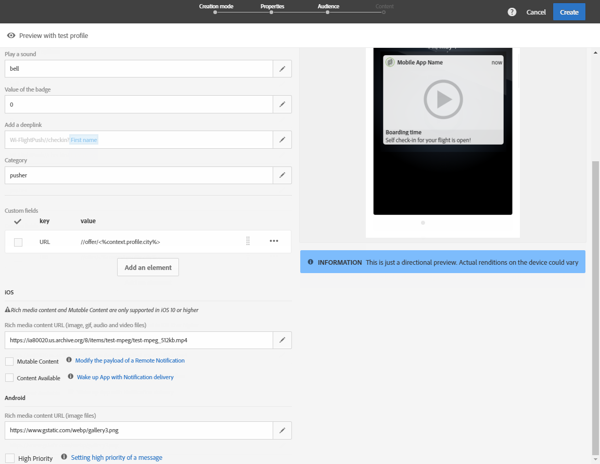
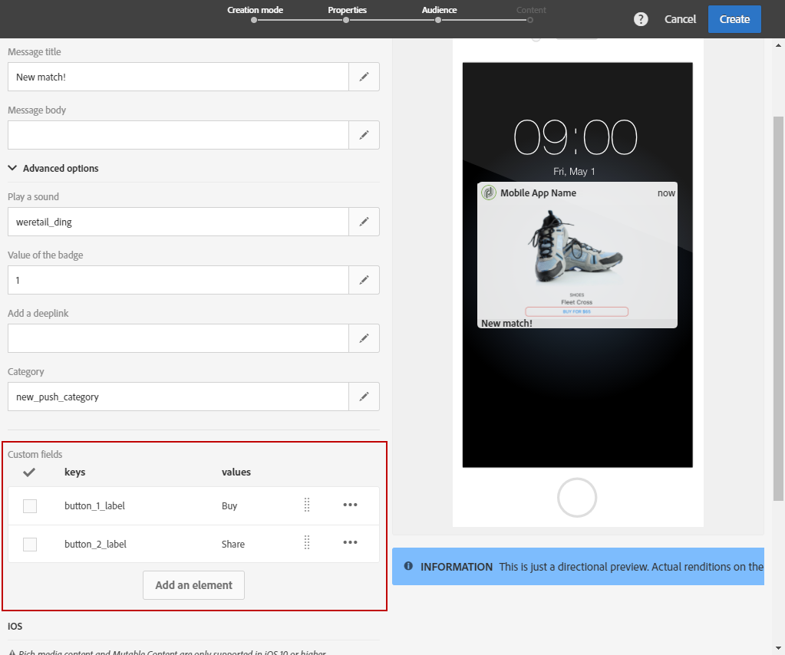

# Personalización de una notificación push{#customizing-a-push-notification}

Para modificar una notificación push, Adobe Campaign le permite acceder a un conjunto de opciones avanzadas mientras diseña una notificación push.

Para configurar aplicaciones móviles en Adobe Campaign como usuario experto, consulte la nota técnica [Explicación de la estructura de carga de notificaciones push de Campaign Standard](https://docs.adobe.com/content/help/es-ES/campaign-standard/using/communication-channels/push-notifications/push-payload.translate.html).

**Contenido relacionado:**

* [Informe de notificaciones push](../../reporting/using/push-notification-report.md)
* [Envío de una notificación push dentro de un flujo de trabajo](../../automating/using/push-notification-delivery.md)

## Reproducir un sonido {#play-a-sound}

La función **[!UICONTROL Play a sound]** permite a la aplicación reproducir sonidos en el dispositivo con el envío de una notificación push, aunque la aplicación no se haya ejecutado.

Un sonido alertará a los usuarios de una notificación push, lo que le da más visibilidad. Para incluir un sonido en la aplicación móvil:

1. Abra la notificación push y acceda a la sección **[!UICONTROL Advanced options]**.
1. En el campo **[!UICONTROL Play a sound]**, introduzca el nombre del archivo de sonido, sin la extensión, que se reproducirá en el dispositivo móvil cuando se reciba la notificación.

   Para obtener más información sobre los formatos multimedia admitidos, consulte las documentaciones de [Apple](https://support.apple.com/es-es/guide/motion/motn1252ada3/mac) y [Android](https://developer.android.com/guide/topics/media/media-formats).

   

1. El archivo de sonido se reproduce al enviar la notificación si el archivo está definido en el paquete de la aplicación móvil. Puede establecerlo en **default** para reproducir el sonido predeterminado del dispositivo.

   Si el campo **[!UICONTROL Play a sound]** se deja vacío, no se reproducirá ningún sonido.

El usuario recibe la notificación push con sonido solo si su teléfono no está silenciado.

## Actualizar el valor del distintivo {#refresh-the-badge-value}

Un distintivo se utiliza para mostrar directamente en el icono de la aplicación la cantidad de información nueva no leída. El valor del distintivo desaparece en cuanto el usuario abra o lea el nuevo contenido de la aplicación.

Cuando se recibe una notificación en un dispositivo, puede actualizar o añadir un valor de distintivo para la aplicación relacionada. Para enviar un valor de distintivo desde el servidor:

1. Abra la notificación push y acceda a la sección **[!UICONTROL Advanced options]**.
1. El valor del distintivo debe ser un número entero y puede actualizarse de diferentes maneras:

   * Para actualizar el distintivo, escriba 0 en el campo **[!UICONTROL Value of the badge]**. Esto elimina el distintivo del icono de la aplicación.
   * Para añadir un valor de distintivo, introduzca cualquier número en el campo **[!UICONTROL Value of the badge]**. Este número aparece automáticamente en el distintivo en cuanto el usuario reciba la notificación push.
   * Si el campo está vacío o no contiene un número entero, el valor del distintivo no cambia.

   Aquí, ingresamos 1 en el campo **[!UICONTROL Value of the badge]** para informar a los usuarios de que tienen información nueva en la aplicación.

   

1. Después de enviar el mensaje, los usuarios reciben la notificación push y su aplicación muestra automáticamente el nuevo valor de distintivo.

   

## Añadir un vínculo profundo {#add-a-deeplink}

Un vínculo profundo le permite llevar a los usuarios directamente al contenido ubicado dentro de la aplicación (en lugar de abrir una página del explorador web).

Un vínculo profundo puede incluir datos de personalización para una experiencia en la aplicación a medida. Por ejemplo, los nombres de los destinatarios se rellenan automáticamente en la página a la que la aplicación los dirige.

Para añadir un vínculo profundo en una notificación push:

1. Abra la notificación push y acceda a la sección **[!UICONTROL Advanced options]**.
1. Escriba el vínculo en el campo **[!UICONTROL Add a deeplink]**.

   

1. Después de enviar el mensaje, los usuarios reciben la notificación push y acceden a la página específica de la aplicación tras interactuar con la notificación, por ejemplo, tocando o haciendo clic en el botón que activa la acción.

   

## Definir una acción {#define-an-action}

Puede añadir un ID de categoría si está disponible en la aplicación móvil y, a continuación, mostrar los botones de acción. Estas notificaciones proporcionan al usuario una forma más rápida de realizar distintas tareas en respuesta a una notificación sin necesidad de abrir ni navegar por la aplicación.

El cuadro de diálogo que aparece en el teléfono del usuario exige una decisión para continuar. Cuando el usuario selecciona una de las acciones, el sistema notifica a la aplicación para que pueda realizar cualquier tarea asociada.

Para añadir una categoría en una notificación push:

1. Abra la notificación push y acceda a la sección **[!UICONTROL Advanced options]**.
1. Introduzca un nombre de categoría predeterminado en el campo **[!UICONTROL Category]** para mostrar los botones de acción cuando se reciba la notificación push.

   El desarrollador de aplicaciones móviles debe definir el ID de categoría y el comportamiento esperado de los botones en la aplicación. Para obtener más información, consulte la [documentación para desarrolladores de Apple](https://developer.apple.com/library/content/documentation/NetworkingInternet/Conceptual/RemoteNotificationsPG/SupportingNotificationsinYourApp.html) (sección **Configuración de categorías y notificaciones de acción**) o la [documentación para desarrolladores de Android](https://developer.android.com/guide/topics/ui/notifiers/notifications.html).

   

1. Después de enviar la notificación push, los usuarios la reciben y deben actuar con los botones de acción configurados previamente.

   

Según lo que haga el usuario, se notifica a la aplicación para que pueda realizar cualquier tarea asociada.

## Añadir una fecha de vencimiento {#add-expiration-date}

Configurar una fecha de vencimiento en la notificación push le permite establecer una fecha límite específica a partir de la cual Apple ([APNS](https://developer.apple.com/documentation/usernotifications/setting_up_a_remote_notification_server/sending_notification_requests_to_apns)) o Android ([FCM](https://firebase.google.com/docs/cloud-messaging/concept-options)) ya no enviarán el mensaje.

Para añadir una fecha de vencimiento a la notificación push:

1. Marque la opción **[!UICONTROL Expire message]** : al seleccionar la opción **[!UICONTROL Expire message]**, la duración se establece automáticamente en 0. Si no cambia el valor, APNS y FCM intentan enviar el mensaje inmediatamente. Si ocurre un error, el mensaje no se vuelve a enviar.

1. En el campo **[!UICONTROL Duration]**, seleccione la validez de la notificación push.

   

1. Después de enviar la notificación push, si el usuario no la ha recibido de inmediato debido a que el teléfono no estaba encendido o no tenía cobertura, la notificación push se envía dentro del intervalo de fecha de vencimiento.

Tenga en cuenta que si la notificación push no se ha enviado antes de la fecha de vencimiento, se descarta.

## Añadir campos personalizados {#add-custom-fields}

Los campos personalizados le permiten pasar datos personalizados en la carga en forma de par de valor clave. Esta opción se puede utilizar para pasar datos adicionales a la aplicación más allá de las claves predefinidas.

Para ello:

1. Abra la notificación push y acceda a la sección **[!UICONTROL Advanced options]**.
1. En la categoría **[!UICONTROL Custom fields]**, haga clic en el botón **[!UICONTROL Add an element]**.
1. Introduzca la **[!UICONTROL Keys]** y, después, el **[!UICONTROL Values]** asociado a cada clave.

   

1. El manejo y el propósito de los campos personalizados dependen totalmente de la aplicación móvil. En la notificación push siguiente, la aplicación ha utilizado campos personalizados para mostrar etiquetas de botón para la notificación push.

   

## Añadir contenido multimedia enriquecido {#add-rich-media-content}

El contenido multimedia enriquecido permite propiciar una mejor participación del usuario, quien puede estar más inclinado a abrir la notificación push.

Puede incluir un archivo de imagen, gif, audio o vídeo que se reproduce o se muestra en la propia notificación. Los usuarios de la aplicación no tienen que abrir la aplicación para verla.

Para incluir elementos multimedia enriquecidos en la notificación push:

1. Abra la notificación push y acceda a la sección **[!UICONTROL Advanced options]**.
1. Introduzca la dirección URL del archivo en el campo **[!UICONTROL Rich media content URL]** correspondiente a cada formato: iOS y Android.

   Para iOS 10 o superior, puede insertar archivos de imagen, gif, audio y vídeo. Para versiones anteriores de iOS, la notificación push se muestra sin contenido enriquecido. Para ver los pasos detallados sobre cómo mostrar una imagen desde una notificación push de Adobe Campaign en un dispositivo iOS, consulte esta [página](https://docs.adobe.com/content/help/es-ES/campaign-standard/using/communication-channels/push-notifications/image-push-notification.translate.html).

   Para Android, solo puede incluir imágenes.

   

1. Después de enviar el mensaje, el usuario recibe la notificación push y puede ver el contenido multimedia enriquecido.

   

## Cambiar el comportamiento de notificación para iOS {#change-the-notification-behavior-for-ios}

Para iOS 10 o superior, hay dos opciones adicionales disponibles en la sección **[!UICONTROL Advanced options]** de notificaciones push: **[!UICONTROL Mutable content]** y **[!UICONTROL Content available]**.

Cuando se selecciona la opción **[!UICONTROL Mutable content]** o se añade una URL de contenido multimedia enriquecido, el indicador de contenido mutable se envía en la carga push y permite que el contenido de la notificación push se modifique con una extensión de aplicación de servicio de notificación proporcionada en el SDK de iOS. Para obtener más información, consulte la [documentación para desarrolladores de Apple](https://developer.apple.com/library/content/documentation/NetworkingInternet/Conceptual/RemoteNotificationsPG/ModifyingNotifications.html).

Puede aprovechar las extensiones de la aplicación móvil para modificar aún más el contenido o la presentación de las notificaciones push entrantes enviadas desde Adobe Campaign. Por ejemplo, los usuarios pueden aprovechar esta opción para:

* Descifrar datos que se han entregado en formato cifrado.
* Descargar imágenes u otros archivos multimedia y añadirlos como datos adjuntos a una notificación.
* Cambiar el texto del cuerpo o del título de una notificación.
* Añadir un identificador de subproceso en una notificación.

Cuando se selecciona **[!UICONTROL Content available]**, el indicador de contenido disponible se envía en la carga push para garantizar que la aplicación se activa en cuanto recibe la notificación push, lo que significa que la aplicación puede acceder a los datos de carga. Esto funciona incluso si la aplicación se está ejecutando en segundo plano y sin necesidad de interacción del usuario (p. ej., al tocar la notificación push); sin embargo, no se aplica si la aplicación no se está ejecutando. Para obtener más información, consulte la [documentación para desarrolladores de Apple](https://developer.apple.com/library/content/documentation/NetworkingInternet/Conceptual/RemoteNotificationsPG/CreatingtheNotificationPayload.html).

## Cambiar el comportamiento de notificación para Android {#change-the-notification-behavior-for-android}

Para Android, puede introducir la dirección URL del archivo en el campo **URL de contenido multimedia enriquecido**. Al contrario que con la versión de iOS, para Android solo puede incluir imágenes y no archivos gif, de audio o de vídeo.

La casilla de verificación **[!UICONTROL High priority]** permite configurar una prioridad alta o normal para las notificaciones push. Para obtener más información sobre la prioridad de los mensajes, consulte la [documentación para desarrolladores de Google](https://firebase.google.com/docs/cloud-messaging/concept-options#setting-the-priority-of-a-message).

