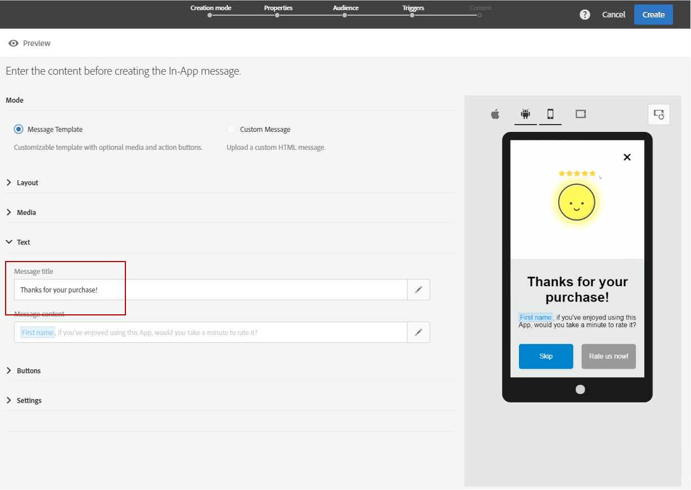
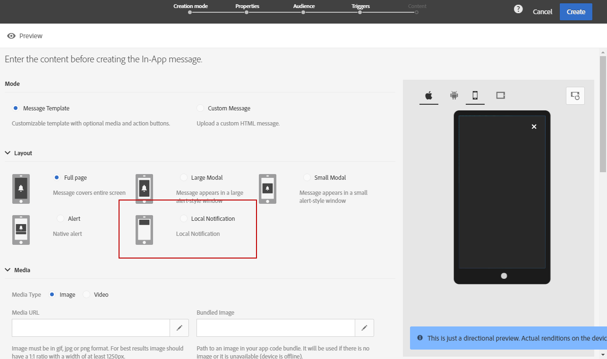

# Personalización de un mensaje en la aplicación{#customizing-an-in-app-message}

Para ajustar mejor el mensaje en la aplicación, Adobe Campaign le permite acceder a un conjunto de opciones avanzadas mientras diseña una aplicación.

El editor de contenido en la aplicación permite elegir entre dos modos de mensaje:

* [Plantilla de mensaje](#customizing-with-a-message-template): esta plantilla le permite personalizar completamente el mensaje de aplicación con imágenes o vídeos y botones de acción.
* [Mensaje personalizado](#customizing-with-a-custom-html-message): esta plantilla permite importar HTML personalizado.

>[!NOTE]
>
> La representación de mensajes en la aplicación solo es compatible con la API de Android 19 y versiones posteriores.

**Temas relacionados:**

* [Envío de un mensaje en la aplicación](../../channels/using/preparing-and-sending-an-in-app-message.md#sending-your-in-app-message)
* [Informes en la aplicación](../../reporting/using/in-app-report.md)
* [Implementación del seguimiento de notificaciones locales](../../administration/using/local-tracking.md)

## Personalización con una plantilla de mensaje {#customizing-with-a-message-template}

### Diseño {#layout}

La lista desplegable **[!UICONTROL Layout]** le ofrece cuatro opciones diferentes para elegir según lo que necesite para los mensajes:

* **[!UICONTROL Full page]**: este tipo de diseño cubre toda la pantalla de los dispositivos de destino.

   Admite componentes multimedia (imagen, vídeo), de texto y botones.

* **[!UICONTROL Large modal]**: este diseño aparece en una ventana grande como si fuera una alerta. La aplicación sigue visible en segundo plano.

   Admite componentes multimedia (imagen, vídeo), de texto y botones.

* **[!UICONTROL Small modal]**: este diseño aparece como una ventana pequeña como si fuera una alerta. La aplicación sigue visible en segundo plano.

   Admite componentes multimedia (imagen, vídeo), de texto y botones.

* **[!UICONTROL Alert]**: este tipo de diseño aparece como un mensaje de alerta de sistema operativo nativo.

   Solo admite componentes de texto y botones.

* **[!UICONTROL Local notification]**: este tipo de diseño aparece como un mensaje de banner.

   Solo admite sonido, texto y destino. Para obtener más información sobre las notificaciones locales, consulte [Personalización de un tipo de mensaje de notificación local](#customizing-a-local-notification-message-type).

Desde la ventana derecha del editor de contenido, se puede obtener una vista previa de todos los diseños en diferentes dispositivos, como teléfonos, tabletas o plataforma (por ejemplo Android o iOS) y según la orientación (por ejemplo horizontal o vertical).

### Multimedia {#media}

La lista desplegable **[!UICONTROL Media]** le permite añadir contenido multimedia al mensaje en la aplicación para crear una experiencia atractiva para el usuario final.

1. Seleccione el **[!UICONTROL Media Type]** entre imagen y vídeo.
1. Para el tipo de **[!UICONTROL Image]**, introduzca la dirección URL en el campo **[!UICONTROL Media URL]** en función de los formatos admitidos.

   Si es necesario, también puede introducir la ruta de acceso a una **[!UICONTROL Bundled image]** que se puede utilizar si el dispositivo está sin conexión.

   

1. Para el tipo de **[!UICONTROL Video]**, introduzca la dirección URL en el campo **[!UICONTROL Media URL]**.

   A continuación, introduzca el **[!UICONTROL Video poster]** que desea utilizar mientras se descarga el vídeo en los dispositivos de destino o hasta que los usuarios toquen el botón de reproducción.

   

### Texto {#text}

Si es necesario, también puede añadir un título y contenido de mensaje al mensaje en la aplicación. Para personalizar mejor el mensaje en la aplicación, puede añadir diferentes campos de personalización, bloques de contenido y texto dinámico al contenido.

1. En la lista desplegable **[!UICONTROL Text]**, añada un título en el campo **[!UICONTROL Message title]**.

   

1. Añada el contenido en el campo **[!UICONTROL Message content]**.
1. Para personalizar aún más el texto, haga clic en el icono  para añadir campos de personalización.

   

1. Escriba el contenido del mensaje y añada los campos de personalización si es necesario.

   Para obtener más información sobre los campos de personalización, consulte esta [sección](../../designing/using/personalization.md#inserting-a-personalization-field).

   

1. Compruebe el contenido del mensaje en la ventana de vista previa.

   

### Botones {#buttons}

Puede añadir hasta dos botones al mensaje en la aplicación.

1. En la lista desplegable **[!UICONTROL Buttons]**, escriba el texto del primer botón en la categoría **[!UICONTROL Primary]**.

   

1. Elija cuál de las dos acciones, **[!UICONTROL Dismiss]** o **[!UICONTROL Redirect]**, se asignará al botón principal.
1. En la categoría **[!UICONTROL Secondary]**, escriba el texto para añadir un segundo botón a la aplicación si es necesario.
1. Seleccione la acción asociada al segundo botón.
1. Si elige la acción **[!UICONTROL Redirect]**, introduzca la URL web o el vínculo profundo en el campo **[!UICONTROL Destination URL]**.

   

1. Introduzca la URL web o el vínculo profundo en el campo **[!UICONTROL Destination URL]**, si elige la acción **[!UICONTROL Redirect]**.
1. Compruebe el contenido del mensaje en la ventana de vista previa o haga clic en el botón Vista previa.

   Consulte la página [Vista previa del mensaje en la aplicación](../../channels/using/preparing-and-sending-an-in-app-message.md#previewing-the-in-app-message).

   

### Configuración {#settings}

1. En la categoría **[!UICONTROL Settings]**, seleccione el color de fondo entre claro u oscuro.
1. Elija mostrar o no un botón de cierre con la opción **[!UICONTROL Show close button]** para proporcionar a los usuarios una forma de descartar el mensaje en la aplicación.
1. Seleccione si la alineación del botón es horizontal o vertical con la opción **[!UICONTROL Button alignment]**.
1. Seleccione si el mensaje en la aplicación se descarta automáticamente o no después de unos segundos.

   

## Personalización de un tipo de mensaje de notificación local {#customizing-a-local-notification-message-type}

Las notificaciones locales solo se pueden activar mediante una aplicación en un momento determinado y en función de un evento. Avisan a los usuarios de que algo está pasando en su aplicación incluso sin tener acceso a Internet.
Para obtener información sobre el rastreo de las notificaciones locales, consulte esta [página](../../administration/using/local-tracking.md).

Para personalizar una notificación local:

1. En la página **[!UICONTROL Content]**, seleccione **[!UICONTROL Local notification]** en la categoría **[!UICONTROL Layout]**.

   

1. En la categoría **[!UICONTROL Text]**, escriba **[!UICONTROL Message title]** y **[!UICONTROL Message content]**.

   

1. En la categoría **[!UICONTROL Advanced option]**, en el campo **[!UICONTROL Wait to display]**, elija cuánto tiempo en segundos se debe mostrar la notificación local en la pantalla una vez que se active el evento.
1. En el campo **[!UICONTROL Sound]**, introduzca el nombre del archivo de sonido (con la extensión) que debe reproducir el dispositivo móvil cuando reciba la notificación local.

   El archivo de sonido se reproduce al enviar la notificación si el archivo está definido en el paquete de la aplicación móvil. De lo contrario, se reproduce el sonido predeterminado del dispositivo.

   

1. Especifique un destino para redirigir a los usuarios cuando interactúen con la notificación local en el campo **[!UICONTROL Deeplink URL]**.
1. Para pasar datos personalizados en la carga en forma de par de valor clave, puede añadir campos personalizados a la notificación local. En la categoría **[!UICONTROL Custom fields]**, haga clic en el botón **[!UICONTROL Create an element]**.
1. Introduzca la **[!UICONTROL Keys]** y, después, el **[!UICONTROL Values]** asociado a cada clave.

   Tenga en cuenta que el manejo y el propósito de los campos personalizados dependen totalmente de la aplicación móvil.

1. En la categoría **[!UICONTROL Apple options]**, rellene los campos de **[!UICONTROL Category]** para añadir un ID de acciones personalizadas si está disponible en la aplicación móvil de Apple.

## Personalización con un mensaje HTML personalizado {#customizing-with-a-custom-html-message}

>[!NOTE]
>
>El mensaje HTML personalizado no admite la personalización de contenido.

El modo **[!UICONTROL Custom message]** permite importar directamente uno de los mensajes HTML preconfigurados.

Para hacerlo, solo tiene que arrastrar y soltar o seleccionar el archivo desde el equipo.

El archivo debe tener un diseño específico que se pueda encontrar haciendo clic en la opción **Descargar el archivo de muestra**.

También puede encontrar una lista de los requisitos HTML personalizados para una importación correcta en Adobe Campaign.

Una vez importado el archivo HTML, puede ver una vista previa del archivo en diferentes dispositivos.
