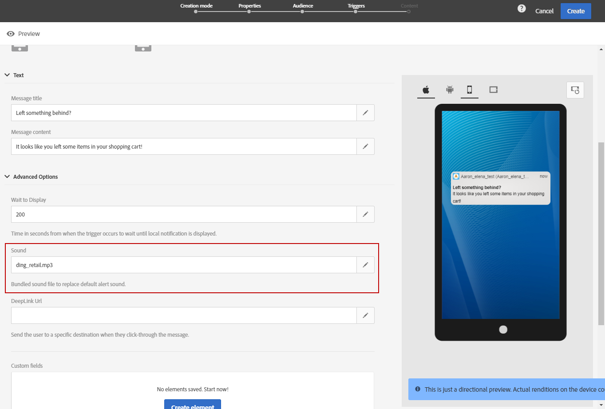

# Personalización de un mensaje en la aplicación{#customizing-an-in-app-message}

Para ajustar mejor el mensaje en la aplicación, Adobe Campaign le permite acceder a un conjunto de opciones avanzadas mientras diseña un In-App.

El editor de contenido en la aplicación permite elegir entre dos modos de mensaje en la aplicación:

* [Plantilla](../../channels/using/customizing-an-in-app-message.md#customizing-with-a-message-template)de mensaje: esta plantilla le permite personalizar completamente su In-App con imágenes o vídeos y botones de acción.
* [Mensaje](../../channels/using/customizing-an-in-app-message.md#customizing-with-a-custom-html-message)personalizado: esta plantilla permite importar HTML personalizado.

**Temas relacionados:**

* [Envío de un mensaje en la aplicación](../../channels/using/preparing-and-sending-an-in-app-message.md#sending-your-in-app-message)
* [Informes en la aplicación](../../reporting/using/in-app-report.md)

## Personalización con una plantilla de mensaje {#customizing-with-a-message-template}

### Diseño {#layout}

La **[!UICONTROL Layout]** lista desplegable le ofrece cuatro opciones diferentes para elegir según sus necesidades de mensajería:

* **[!UICONTROL Full page]**:: Este tipo de diseño cubre toda la pantalla de los dispositivos de audiencia.

   Admite componentes multimedia (imagen, vídeo), de texto y de botón.

* **[!UICONTROL Large modal]**:: Este diseño aparece en una ventana grande de estilo de alerta; la aplicación aún está visible en segundo plano.

   Admite componentes multimedia (imagen, vídeo), de texto y de botón.

* **[!UICONTROL Small modal]**:: Este diseño aparece como una pequeña ventana de tipo de alerta, la aplicación aún está visible en segundo plano.

   Admite componentes multimedia (imagen, vídeo), de texto y de botón.

* **[!UICONTROL Alert]**:: Este tipo de diseño aparece como un mensaje de alerta de SO nativo.

   Solo admite componentes de texto y botón.

* **[!UICONTROL Local notification]**:: Este tipo de diseño aparece como un mensaje de pancarta.

   Solo admite sonido, texto y destino. Para obtener más información sobre la notificación local, consulte [Personalización de un tipo](../../channels/using/customizing-an-in-app-message.md#customizing-a-local-notification-message-type)de mensaje de notificación local.

Cada tipo de maquetaciones se puede previsualizar en diferentes dispositivos, como teléfono, tablet o plataforma, por ejemplo Android o iOS, y en orientación, por ejemplo horizontal o vertical, en la ventana derecha del editor de contenido.

### Medios {#media}

La **[!UICONTROL Media]** lista desplegable le permite agregar medios al mensaje en la aplicación para crear una experiencia atractiva para el usuario final.

1. Seleccione el **[!UICONTROL Media Type]** entre imagen y vídeo.
1. Para el tipo de **[!UICONTROL Image]** medio, introduzca la dirección URL en el **[!UICONTROL Media URL]** campo según los formatos admitidos.

   Si es necesario, también puede introducir la ruta a una **[!UICONTROL Bundled image]** que se puede utilizar si el dispositivo está sin conexión.

   

1. Para el tipo de **[!UICONTROL Video]** medio, introduzca la dirección URL en el **[!UICONTROL Media URL]** campo.

   A continuación, introduzca el **[!UICONTROL Video poster]** que desea utilizar mientras se descarga el vídeo en los dispositivos de audiencia o hasta que los usuarios toquen el botón de reproducción.

   

### Texto {#text}

Si es necesario, también puede añadir un título y contenido de mensaje al mensaje en la aplicación. Para personalizar mejor el mensaje en la aplicación, puede añadir diferentes campos de personalización, bloques de contenido y texto dinámico al contenido.

1. En la **[!UICONTROL Text]** lista desplegable, agregue un título en el **[!UICONTROL Message title]** campo.

   

1. Agregue el contenido en el **[!UICONTROL Message content]** campo.
1. Para personalizar aún más el texto, haga clic en el  icono para agregar campos de personalización.

   

1. Escriba el contenido del mensaje y agregue los campos de personalización si es necesario.

   Para obtener más información sobre el campo de personalización, consulte esta [sección](../../designing/using/personalization.md#inserting-a-personalization-field).

   

1. Compruebe el contenido del mensaje en la ventana de vista previa.

   

### Botones {#buttons}

Puede agregar hasta dos botones al mensaje en la aplicación.

1. En la **[!UICONTROL Buttons]** lista desplegable, escriba el texto del primer botón en la **[!UICONTROL Primary]** categoría.

   

1. Elija cuál de las dos acciones **[!UICONTROL Dismiss]** y **[!UICONTROL Redirect]** se asignará al botón principal.
1. En la **[!UICONTROL Secondary]** categoría, escriba el texto para agregar un segundo botón a la aplicación si es necesario.
1. Seleccione la acción asociada al segundo botón.
1. Si elige la **[!UICONTROL Redirect]** acción, introduzca la URL web o el vínculo profundo en el **[!UICONTROL Destination URL]** campo.

   

1. Introduzca la URL web o el vínculo profundo en el **[!UICONTROL Destination URL]** campo, si elige la **[!UICONTROL Redirect]** acción,
1. Compruebe el contenido del mensaje en la ventana de vista previa o haga clic en el botón Vista previa.

   Consulte la página [Vista previa del mensaje](../../channels/using/customizing-an-in-app-message.md#previewing-the-in-app-message) en la aplicación.

   

### Configuración {#settings}

1. En la **[!UICONTROL Settings]** categoría, seleccione el color de fondo entre luz y oscuridad.
1. Elija mostrar o no un botón de cierre con la **[!UICONTROL Show close button]** opción de proporcionar a los usuarios una forma de descartar el mensaje en la aplicación.
1. Seleccione si la alineación del botón será horizontal o vertical con la **[!UICONTROL Button alignment]** opción.
1. Seleccione si el mensaje en la aplicación se puede descartar automáticamente o no después de unos segundos.

   

## Personalización de un tipo de mensaje de notificación local {#customizing-a-local-notification-message-type}

Las notificaciones locales solo se pueden activar mediante una aplicación en un momento determinado y en función de un evento. Alertarán a los usuarios de que algo está pasando en su aplicación incluso sin tener acceso a Internet.

Para personalizar una notificación local:

1. En la **[!UICONTROL Content]** página, seleccione **[!UICONTROL Local notification]** en la **[!UICONTROL Layout]** categoría

   

1. En la **[!UICONTROL Text]** categoría, escriba **[!UICONTROL Message title]** y **[!UICONTROL Message content]**.

   

1. En la **[!UICONTROL Advanced option]** categoría, en el **[!UICONTROL Wait to display]** campo, elija cuánto tiempo en segundos se mostrará la notificación local en la pantalla una vez que se active el evento.
1. En el **[!UICONTROL Sound]** campo, introduzca el nombre de archivo del archivo de sonido, con la extensión, que reproducirá el dispositivo móvil cuando se reciba la notificación local.

   El archivo de sonido se reproduce al enviar la notificación si el archivo está definido en el paquete de la aplicación móvil. De lo contrario, se reproduce el sonido predeterminado del dispositivo.

   

1. Especifique un destino para redirigir a los usuarios cuando interactúen con la notificación local en el **[!UICONTROL Deeplink URL]** campo.
1. Para pasar datos personalizados en la carga útil en forma de par de valor clave, puede agregar campos personalizados a la notificación local. En la **[!UICONTROL Custom fields]** categoría, haga clic en el **[!UICONTROL Create an element]** botón.
1. Introduzca **[!UICONTROL Keys]** el valor **[!UICONTROL Values]** asociado a cada clave.

   Tenga en cuenta que la gestión y el propósito de los campos personalizados dependen totalmente de la aplicación móvil.

1. En la **[!UICONTROL Apple options]** categoría, rellene los **[!UICONTROL Category]** campos para agregar un ID de categoría para acciones personalizadas si está disponible en la aplicación móvil de Apple.

## Personalización con un mensaje HTML personalizado {#customizing-with-a-custom-html-message}

>[!NOTE]
>
>El mensaje HTML personalizado no admite la personalización de contenido.

El **[!UICONTROL Custom message]** modo permite importar directamente uno de los mensajes HTML preconfigurados.

Para hacerlo, sólo tiene que arrastrar y soltar o seleccionar el archivo desde el equipo.

El archivo debe tener un diseño específico que se pueda encontrar haciendo clic en la opción **Descargar el archivo** de muestra.

También puede encontrar una lista de requisitos HTML personalizados para una importación correcta en Adobe Campaign.

Una vez importado el HTML, puede encontrar una vista previa del archivo en diferentes dispositivos en la ventana de vista previa.

## Vista previa del mensaje en la aplicación {#previewing-the-in-app-message}

Antes de enviar un mensaje en la aplicación, puede realizar pruebas con sus perfiles de prueba para comprobar qué verá la audiencia objetivo cuando reciba la entrega.

1. Haga clic en el **[!UICONTROL Preview]** botón.

   

1. Haga clic en el **[!UICONTROL Select a test profile]** botón y seleccione uno de los perfiles de prueba para empezar a previsualizar la entrega. Para obtener más información sobre los perfiles de prueba, consulte esta [sección](../../sending/using/managing-test-profiles-and-sending-proofs.md).
1. Compruebe el mensaje en distintos dispositivos, como Android, iPhone o incluso tablets. También puede comprobar si los campos de personalización están recuperando los datos correctos.

   

1. Ahora puede enviar el mensaje y medir su impacto con los informes de envío. For more on reporting, refer to [this section](../../reporting/using/in-app-report.md).

