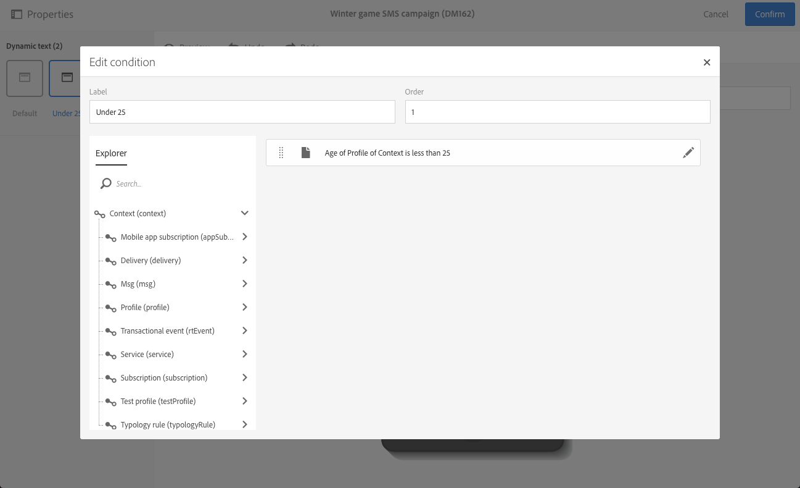
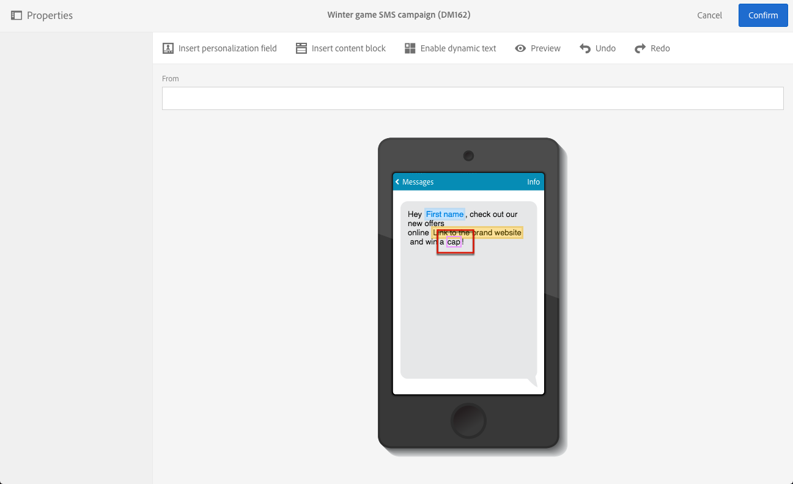

# Definición de texto dinámico{#defining-dynamic-text}

El texto dinámico se define del mismo modo que el contenido dinámico. Consulte la sección [Definición de contenido dinámico](../../designing/using/personalization.md#defining-dynamic-content-in-an-email).

>[!NOTE]
>
>Para SMS y push, solo puede definir texto dinámico. Puede definir contenido dinámico y texto en una página de aterrizaje. Si desea definir texto dinámico con [Email Designer](../../designing/using/designing-content-in-adobe-campaign.md), consulte [Definición de contenido dinámico en un correo electrónico](../../designing/using/personalization.md#defining-dynamic-content-in-an-email).

Tenga en cuenta que los pares sustitutos, caracteres no incluidos en el plano multilingüe básico del conjunto de caracteres Unicode, no se pueden almacenar en 2 bytes (16 bits) y deben codificarse en 2 caracteres UTF-16. Estos caracteres incluyen algunos ideogramas CJK, la mayoría de emojis y algunos idiomas.
 Estos caracteres pueden causar algunos problemas de incompatibilidad en el texto dinámico. Debe realizar pruebas sólidas antes de enviar los mensajes.

El ejemplo siguiente muestra cómo definir texto dinámico en un mensaje SMS.

1. Seleccione texto en el cuerpo del mensaje o de la página de aterrizaje.
1. Haga clic **[!UICONTROL Enable dynamic text]**.

   

   La opción **[!UICONTROL Dynamic text]** se muestra en la paleta. Se configura de la misma manera que el contenido dinámico.

1. Seleccione una variante.

   

1. Defina una condición para esta variante.

   

Una vez que se define una condición para al menos una variante, se muestra un marco morado alrededor del texto dinámico.

