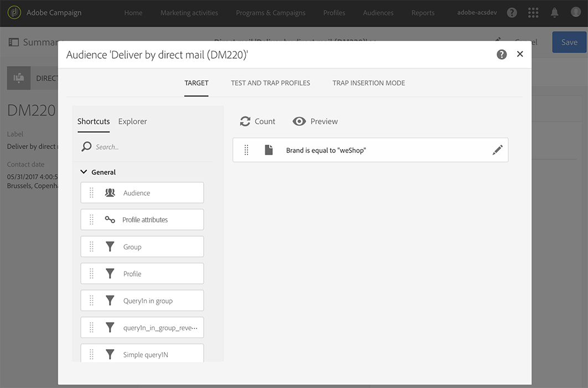

# Definición del público de correo directo{#defining-the-direct-mail-audience}

Puede definir la audiencia en el asistente de creación o haciendo clic en la sección de **Audiencia** del panel de control de envío.

## Definición del objetivo principal {#defining-the-main-target}

Para el correo directo, los perfiles de destino son los que se incluyen en el archivo de extracción que ha de enviar a su proveedor de correo directo.

Para cada perfil de destino se añade una nueva línea en el archivo de extracción. La cantidad de información de perfiles que se incluye para cada destinatario se define en la pantalla [Definición de la extracción](../../channels/using/defining-the-direct-mail-content.md#defining-the-extraction).

>[!IMPORTANT]
>
>Asegúrese de que los perfiles incluyan una dirección postal, ya que esta información es esencial para el proveedor de correo. Asegúrese también de haber marcado la casilla **[!UICONTROL Address specified]** en la información de los perfiles. Consulte [Recomendaciones](../../channels/using/about-direct-mail.md#recommendations).

## Adición de perfiles de prueba y trampa {#adding-test-and-trap-profiles}

Añada perfiles de prueba para poder probar el archivo con un pequeño número de perfiles. Permite crear rápidamente un ejemplo de archivo para probar y validar la estructura antes de preparar el archivo real. Consulte [Administración de perfiles de prueba](../../audiences/using/managing-test-profiles.md).

El uso de trampas es esencial para dirigir envíos de correo directo. Permiten comprobar que su proveedor de correo directo realmente envía la comunicación y que no relega la lista de su cliente a otro proveedor. Consulte [Uso de trampas](../../sending/using/using-traps.md).

Para las entregas de correo directo, las trampas se añaden durante la extracción y la mezcla en el documento de salida. De forma predeterminada, se insertan en el orden de clasificación del archivo de salida, pero se puede elegir insertarlos al final o al principio del archivo. Al definir el público, seleccione la opción que desee en la pestaña **[!UICONTROL Trap insertion mode]**.

