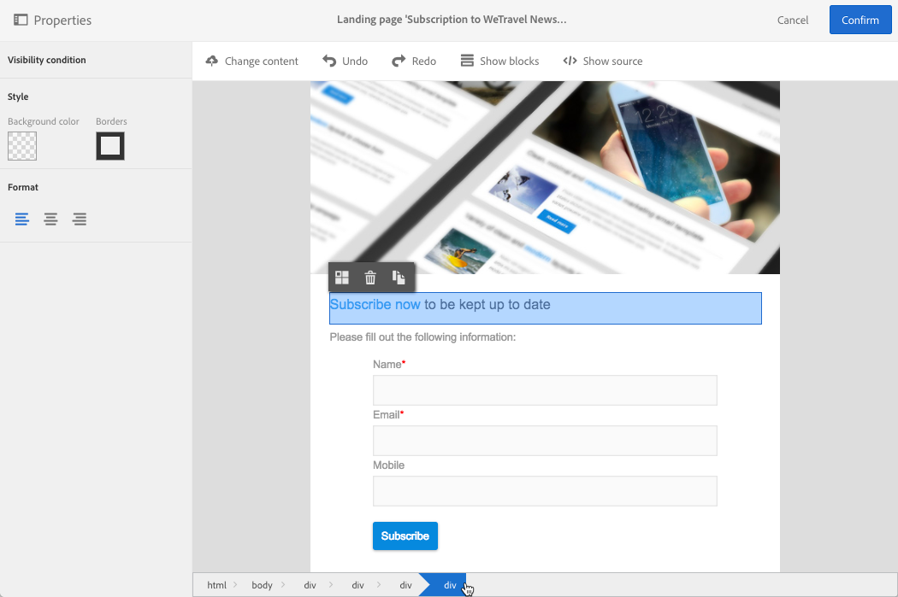

# Diseño de una página de aterrizaje{#designing-a-landing-page}

## Acerca del diseño de contenido de una página de aterrizaje {#about-content-design}

Las páginas de aterrizaje se crean como cualquier [actividad de marketing](../../start/using/marketing-activities.md#about-marketing-activities).

Al diseñar una página de aterrizaje, debe definir el contenido de la propia página, la página de confirmación y la página de error. Utilice el selector situado debajo de la barra de acciones para mostrar y configurar cada una de estas páginas.

El contenido de las páginas de aterrizaje se diseña mediante el editor de contenido de Campaign.

>[!NOTE]
>
>Para el diseño de correo electrónico, si la instancia se instaló antes de la versión 19.0 de Adobe Campaign Standard, seguirá teniendo acceso al editor de contenido de correo electrónico anterior. La interfaz, los principios de uso y la configuración son esencialmente los mismos que se describen a continuación para páginas de aterrizaje. Sin embargo, es posible que todas las funciones no estén disponibles ni se mantengan en el editor de contenido de correo electrónico anterior, que ya no se utiliza en la versión 19.0. Para editar rápidamente el contenido del correo electrónico mediante una interfaz de arrastrar y soltar con funciones extendidas, utilice el [Diseñador de correo electrónico](../../designing/using/designing-content-in-adobe-campaign.md).

En esta página se describen las características específicas del editor de contenido de páginas de aterrizaje. Para obtener más información sobre las acciones comunes para una o varias actividades de marketing, consulte estas secciones en la guía **Diseño de contenido de correo electrónico**:

* [Inserción de un campo de personalización.](../../designing/using/personalization.md#inserting-a-personalization-field)
* [Añadir un bloque de contenido](../../designing/using/personalization.md#adding-a-content-block)
* [Inserción de un enlace](../../designing/using/links.md#inserting-a-link)
* [Inserción de imágenes](../../designing/using/images.md)
* [Prácticas recomendadas generales para el diseño de contenido](../../designing/using/designing-content-in-adobe-campaign.md#content-design-best-practices)

>[!NOTE]
>Si tiene una página de aterrizaje que ya está predefinida en formato HTML, puede importarla directamente con el botón **[!UICONTROL Change content]**.
>
>Antes de importar una página HTML en Adobe Campaign, asegúrese de que se abra y se muestre correctamente en los distintos navegadores. Si la página HTML contiene secuencias de comandos JavaScript, deben ejecutarse sin errores fuera del editor. En general, evite utilizar secuencias de comandos en el contenido del mensaje para asegurarse de que los clientes de correo electrónico lo procesan correctamente.

## Interfaz del editor de contenido de página de aterrizaje{#landing-page-content-editor-interface}

El editor de contenido de páginas de aterrizaje le permite definir, modificar y personalizar fácilmente el contenido en Adobe Campaign. Para acceder a él, haga clic en el bloque **[!UICONTROL Content]** del panel de una página de aterrizaje.

El editor de contenido está organizado en tres secciones diferentes. Estas secciones le permiten ver y editar el contenido.

1. La **paleta** de la parte izquierda de la pantalla permite modificar las opciones generales vinculadas a un bloque seleccionado. Las opciones que se pueden modificar son: color de fondo, borde, alineación del texto, condición de visibilidad, etc. Consulte [Inserción de un campo de personalización](../../designing/using/personalization.md#inserting-a-personalization-field).
1. La **barra de acciones** contiene las opciones generales de la página. Puede seleccionar una plantilla y cambiar el modo de visualización.
1. La **zona de edición** principal le permite interactuar directamente con el contenido mediante la barra de herramientas contextual: insertar un vínculo en una imagen, cambiar la fuente, eliminar un campo, etc.

La **barra de acciones** contiene diferentes botones que le permiten interactuar con el contenido que se está creando.

<table> 
 <thead> 
  <tr> 
   <th> Icono  </th> 
   <th> Nombre del botón  </th> 
   <th> Canal  </th> 
   <th> Descripción  </th> 
  </tr> 
 </thead> 
 <tbody> 
  <tr> 
   <td>    </td> 
   <td> Cambiar contenido   </td> 
   <td> Página de aterrizaje y correo electrónico  </td> 
   <td> Le permite seleccionar contenido listo para usar o importar su propio contenido HTML. Consulte <a href="../../designing/using/using-existing-content.md">Carga de contenido existente</a>.  </td> 
  </tr> 
  <tr> 
   <td>    </td> 
   <td> Deshacer   </td> 
   <td> Todo  </td> 
   <td> Cancela la última acción realizada.  </td> 
  </tr> 
  <tr> 
   <td>    </td> 
   <td> Rehacer   </td> 
   <td> Todo  </td> 
   <td> Rehace la última acción que se ha cancelado.  </td> 
  </tr> 
  <tr> 
   <td>    </td> 
   <td> Mostrar bloques   </td> 
   <td> Página de aterrizaje y correo electrónico  </td> 
   <td> Permite mostrar los cuadros alrededor de los bloques de contenido (corresponde a la etiqueta HTML <strong>&lt;div&gt;</strong>).  </td> 
  </tr> 
  <tr> 
   <td>    </td> 
   <td> Mostrar origen   </td> 
   <td> Página de aterrizaje y correo electrónico  </td> 
   <td> Permite mostrar el código fuente HTML de la página.  </td> 
  </tr> 
 </tbody> 
</table>

La **barra de herramientas** es un elemento contextual de la interfaz del editor que incluye varias funciones según la zona seleccionada. Contiene botones de acción y botones que permiten cambiar el estilo del texto. Las modificaciones realizadas se aplican siempre a la zona seleccionada. Una vez seleccionado un bloque, puede eliminarlo o duplicado, por ejemplo. Después de seleccionar el texto dentro de un bloque, puede convertirlo en un vínculo o ponerlo en negrita.

>[!IMPORTANT]
>
>Algunas funciones de la barra de herramientas permiten dar formato al contenido HTML. Sin embargo, si la página contiene una hoja de estilos CSS, las **instrucciones** de dicha hoja pueden tener **prioridad** sobre las instrucciones especificadas con la barra de herramientas.

<table> 
 <thead> 
  <tr> 
   <th> Icono  </th> 
   <th> Nombre del botón  </th> 
   <th> Contexto  </th> 
   <th> Descripción  </th> 
  </tr> 
 </thead> 
 <tbody> 
  <tr> 
   <td>    </td> 
   <td> Vínculo a una URL externa   </td> 
   <td> Cualquier elemento  </td> 
   <td> Permite añadir un vínculo a una dirección URL. Los detalles de cómo configurar un vínculo se describen en la sección <a href="../../designing/using/links.md#inserting-a-link">Inserción de un vínculo</a>.  </td> 
  </tr> 
  <tr> 
   <td>    </td> 
   <td> Vincular a una página de aterrizaje   </td> 
   <td> Cualquier elemento  </td> 
   <td> Permite acceder a una página de aterrizaje de Adobe Campaign. Los detalles de cómo configurar un vínculo se describen en la sección <a href="../../designing/using/links.md#inserting-a-link">Inserción de un vínculo</a>.  </td> 
  </tr> 
  <tr> 
   <td>    </td> 
   <td> Vínculo de suscripción   </td> 
   <td> Cualquier elemento  </td> 
   <td> Permite insertar un vínculo de suscripción a un servicio. Los detalles de cómo configurar un vínculo se describen en la sección <a href="../../designing/using/links.md#inserting-a-link">Inserción de un vínculo</a>.  </td> 
  </tr> 
  <tr> 
   <td>    </td> 
   <td> Vínculo de cancelación de suscripción   </td> 
   <td> Cualquier elemento  </td> 
   <td> Permite insertar un vínculo para cancelar la suscripción a un servicio. Los detalles de cómo configurar un vínculo se describen en la sección <a href="../../designing/using/links.md#inserting-a-link">Inserción de un vínculo</a>.  </td> 
  </tr> 
  <tr> 
   <td>    </td> 
   <td> Quitar vínculo   </td> 
   <td> Vínculo  </td> 
   <td> Permite eliminar el vínculo, así como todas las configuraciones enlazadas a él, después de confirmarlo.  </td> 
  </tr> 
  <tr> 
   <td>    </td> 
   <td> Insertar un campo personalizado   </td> 
   <td> Elemento de texto  </td> 
   <td> Permite añadir un campo de la base de datos al contenido. Consulte <a href="../../designing/using/personalization.md#inserting-a-personalization-field">Inserción de un campo de personalización</a>.  </td> 
  </tr> 
  <tr> 
   <td>    </td> 
   <td> Insertar un bloque de contenido   </td> 
   <td> Elemento de texto  </td> 
   <td> Permite añadir un bloque de personalización al contenido. Consulte <a href="../../designing/using/personalization.md#adding-a-content-block">Añadir un bloque de contenido</a>.  </td> 
  </tr> 
  <tr> 
   <td>    </td> 
   <td> Habilitar contenido dinámico   </td> 
   <td> Elemento de texto  </td> 
   <td> Permite insertar contenido dinámico en el contenido. Consulte <a href="../../channels/using/designing-a-landing-page.md#defining-dynamic-content-in-a-landing-page">Definición de contenido dinámico</a>.  </td> 
  </tr> 
  <tr> 
   <td>    </td> 
   <td> Deshabilitar contenido dinámico   </td> 
   <td> Elemento de texto  </td> 
   <td> Permite eliminar contenido dinámico.  </td> 
  </tr> 
  <tr> 
   <td>    </td> 
   <td> Ampliar fuente   </td> 
   <td> Elemento de texto  </td> 
   <td> Aumenta el tamaño del texto seleccionado (añade <strong>&lt;span style="font-size:"&gt;</strong>).  </td> 
  </tr> 
  <tr> 
   <td>    </td> 
   <td> Reducir fuente   </td> 
   <td> Elemento de texto  </td> 
   <td> Reduce el tamaño del texto seleccionado (añade <strong>&lt;span style="font-size:"&gt;</strong>).  </td> 
  </tr> 
  <tr> 
   <td>    </td> 
   <td> Negrita   </td> 
   <td> Elemento de texto  </td> 
   <td> Añade el estilo en negrita al texto seleccionado (ajusta el texto con las etiquetas <strong>&lt;strong&gt;</strong><strong>&lt;/strong&gt;</strong>).  </td> 
  </tr> 
  <tr> 
   <td>    </td> 
   <td> Cursiva   </td> 
   <td> Elemento de texto  </td> 
   <td> Añade el estilo en cursiva al texto seleccionado (ajusta el texto con las etiquetas <strong>&lt;em&gt;</strong><strong>&lt;/em&gt;</strong>).  </td> 
  </tr> 
  <tr> 
   <td>    </td> 
   <td> Subrayado   </td> 
   <td> Elemento de texto  </td> 
   <td> Subraya el texto seleccionado (ajusta el texto seleccionado con la etiqueta <strong>&lt;span style="text-decoration: underline;"&gt;</strong>).  </td> 
  </tr> 
  <tr> 
   <td>    </td> 
   <td> Cambiar color de fondo   </td> 
   <td> Elemento de texto  </td> 
   <td> Permite cambiar el color de fondo del bloque seleccionado (añade style="background-color: rgba(170, 86, 255, 0,87)).  </td> 
  </tr> 
  <tr> 
   <td>    </td> 
   <td> Cambiar color de fuente   </td> 
   <td> Elemento de texto  </td> 
   <td> Permite cambiar el color de todo el texto del bloque o solo el texto seleccionado (<strong>&lt;span style="color: #56ff56;"&gt;</strong>).  </td> 
  </tr> 
  <tr> 
   <td>    </td> 
   <td> Imagen   </td> 
   <td> Bloque que contiene una imagen  </td> 
   <td> Permite insertar una imagen de un archivo guardado localmente.  </td> 
  </tr> 
  <tr> 
   <td>    </td> 
   <td> Eliminar   </td> 
   <td> Cualquier bloque  </td> 
   <td> Elimina el bloque y su contenido.  </td> 
  </tr> 
  <tr> 
   <td>    </td> 
   <td> Duplicar   </td> 
   <td> Cualquier bloque  </td> 
   <td> Duplica el bloque, incluidos los estilos vinculados a él.  </td> 
  </tr> 
 </tbody> 
</table>

## Administración de la estructura y el estilo de página de aterrizaje{#managing-landing-page-structure-and-style}

### Administración de bloques en el editor de contenido {#managing-blocks-in-the-content-editor}

Los diferentes elementos de contenido HTML se muestran en la página de aterrizaje como bloques, correspondientes a la etiqueta **&lt;div>** **&lt;/div>**. Seleccione un bloque para interactuar con él. Después, aparece rodeado por un recuadro azul.

Si se selecciona un bloque, los objetos principales del elemento HTML correspondiente se muestran en una ruta de exploración ubicada en la parte inferior de la zona de edición.

Cuando el ratón se sitúa sobre uno de los elementos de la ruta de exploración, este aparece resaltado. Por lo tanto, puede desplazarse fácilmente entre los diferentes bloques y seleccionar exactamente el elemento HTML que desea modificar.

Utilice las opciones de la paleta y la barra de herramientas contextual para modificar, eliminar o duplicado el bloque.

Para los bloques que contienen texto, vuelva a hacer clic en el bloque para activar el modo de edición de texto. El marco alrededor del bloque se vuelve verde. A continuación, puede seleccionar o introducir texto. Utilice las opciones de la paleta y la barra de herramientas contextual para añadir un vínculo o modificar el formato del texto.

Los parámetros definidos para un elemento de un bloque (vínculos, campos de personalización, bloques de contenido, etc.) pueden modificarse en cualquier momento desde la paleta.

### Añadir un borde y un fondo en el editor de contenido {#adding-a-border-and-a-background-in-the-content-editor}

Asimismo, se puede definir un **de fondo** seleccionando un color en la tabla de colores. Este color se aplica al bloque seleccionado.

Se puede añadir un **borde** al bloque seleccionado.

### Cambio del estilo de texto en el editor de contenido {#changing-the-text-style-in-the-content-editor}

Para cambiar el estilo del texto, debe hacer clic dentro de un bloque de texto.

Para cambiar la alineación del texto, seleccione uno de los tres iconos siguientes en la paleta de la izquierda:

* **Alinear a la izquierda**: alinea el texto a la izquierda del bloque seleccionado (añade style=&quot;text-align: left;&quot;).
* **Centrar**: centra el texto en el bloque seleccionado (añade style=&quot;text-align: center;&quot;).
* **Alinear a la derecha**: alinea el texto a la derecha del bloque seleccionado (añade style=&quot;text-align: right;&quot;).

También puede utilizar la barra de herramientas para cambiar los atributos de la fuente: adaptar el tamaño de letra, poner el texto en negrita o en cursiva, subrayar o cambiar el color del texto. Consulte [esta sección](../../channels/using/designing-a-landing-page.md#landing-page-content-editor-interface).

### Inserción de imágenes en una página de aterrizaje {#inserting-images-in-a-landing-page}

1. En el contenido de una página de aterrizaje, seleccione un bloque que contenga una imagen.
1. Seleccione el botón **[!UICONTROL Insert]**.

   

1. Elija **[!UICONTROL Local image]** en la barra de herramientas contextual.

   

1. Seleccione un archivo.

   

1. Ajuste las propiedades de la imagen según sea necesario.

   

## Definición de contenido dinámico en una página de aterrizaje{#defining-dynamic-content-in-a-landing-page}

Para definir contenido dinámico en una página de aterrizaje, seleccione un bloque con la ruta de exploración o haga clic directamente en un elemento.

Algunos bloques, como las imágenes, no se pueden seleccionar directamente. En este caso, seleccione el bloque principal mediante la ruta de exploración. A continuación, puede modificar todos los elementos incluidos en este elemento principal, incluidas las imágenes. La condición se aplica a todos los elementos secundarios dentro del bloque principal.

La ruta de exploración se presenta en la sección [Administración de bloques](../../channels/using/designing-a-landing-page.md#managing-landing-page-structure-and-style).

Los siguientes pasos para definir contenido dinámico en una página de aterrizaje son similares a los pasos que se deben seguir para un correo electrónico. Consulte [esta sección](../../designing/using/personalization.md#defining-dynamic-content-in-an-email).

>[!NOTE]
>
>Si un elemento de variante está delineado en rojo, significa que aún no se ha definido una expresión.

Puede desplazarse entre los distintos elementos del contenido dinámico de un bloque. Para ello:

1. Seleccione el bloque.

   Aparecen flechas a ambos lados de la imagen.

1. Haga clic en la flecha derecha para navegar por el contenido dinámico disponible.

   

   Las flechas de cada lado se atenúan según se haya alcanzado el último o el primer elemento del contenido dinámico disponible.

   

1. Para eliminar todas las condiciones aplicadas a un bloque, selecciónelo y haga clic en el icono **[!UICONTROL Disable dynamic content]**.
1. Seleccione el contenido dinámico que desea conservar.

   

En la paleta:

* El contenido que tiene una expresión incluida ya no está delineado en rojo y se muestra en gris.
* El contenido seleccionado actualmente aparece en azul.

