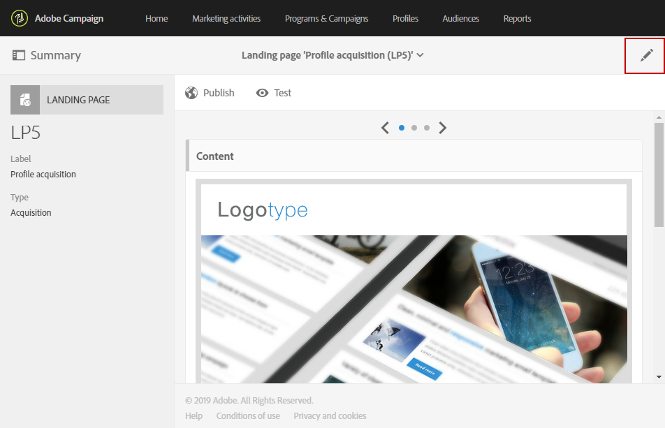
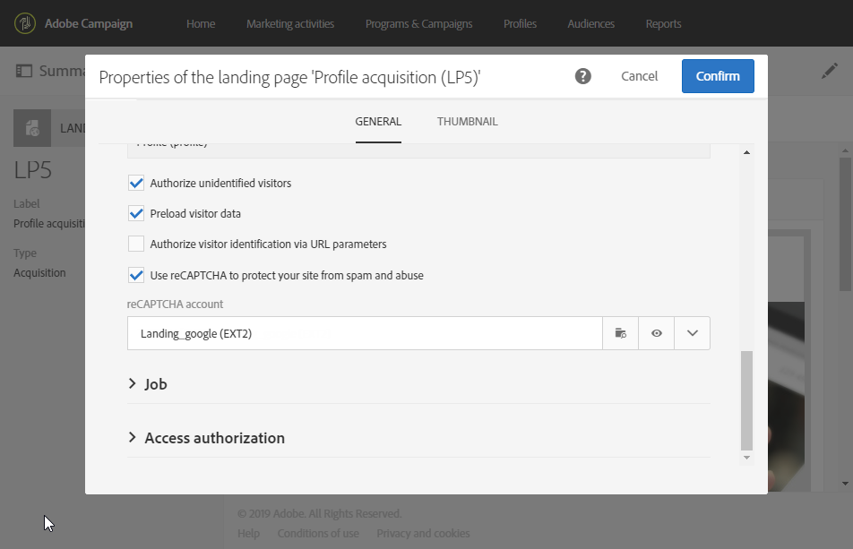
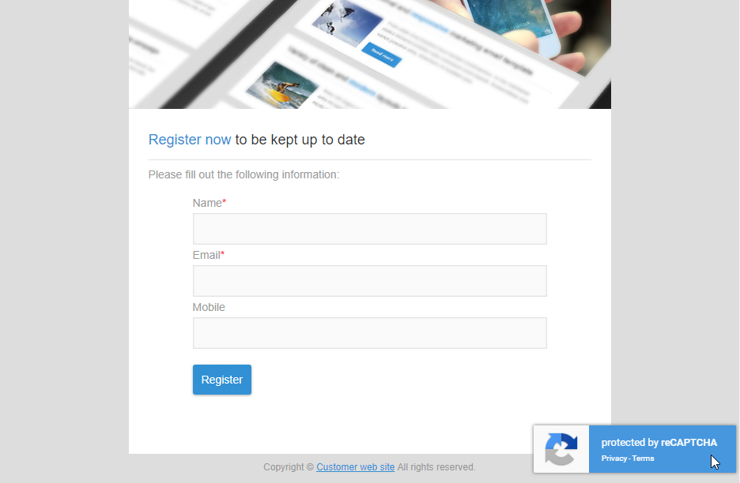

# Diseño de una página de aterrizaje{#designing-a-landing-page}

## Acerca del diseño del contenido del diseño de contenido de la página de aterrizaje {#about-content-design}

Las páginas de aterrizaje se crean como cualquier actividad [de mercadotecnia](../../start/using/marketing-activities.md#about-marketing-activities).

Al diseñar una página de aterrizaje, debe definir el contenido de la propia página, la página de confirmación y la página de error. Utilice el conmutador situado debajo de la barra de acciones para mostrar y configurar cada una de estas páginas.

El contenido de las páginas de aterrizaje se diseña mediante el editor de contenido de Campaign.

>[!NOTE]
>
>Si la instancia se instaló antes de la versión 19.0 de Adobe Campaign Standard, aún tendrá acceso al editor de contenido de correo electrónico heredado. La interfaz, los principios de uso y la configuración son mayormente los mismos que se describen a continuación para las páginas de aterrizaje. Sin embargo, es posible que todas las funciones no estén disponibles ni se mantengan en el editor de contenido de correo electrónico heredado, que ya no se utiliza en la versión 19.0. Para editar rápidamente el contenido del correo electrónico mediante una interfaz de arrastrar y soltar con funciones extendidas, utilice el Diseñador de [correo electrónico](../../designing/using/overview.md).

Esta página describe las características específicas del editor de contenido de la página de aterrizaje. Para obtener más información sobre las acciones comunes a una o varias actividades de marketing, consulte estas secciones en la guía **Diseño de contenido** de correo electrónico:

* [Inserción de un campo personalizado](../../designing/using/personalization.md#inserting-a-personalization-field)
* [Adición de un bloque](../../designing/using/personalization.md#adding-a-content-block)de contenido.
* [Inserción de un enlace](../../designing/using/links.md#inserting-a-link).
* [Inserción de imágenes](../../designing/using/images.md).
* [Prácticas recomendadas generales para el diseño](../../designing/using/overview.md#content-design-best-practices)de contenido.

>[!NOTE]
>Si tiene una página de aterrizaje que ya está predefinida en formato HTML, puede importarla directamente con el **[!UICONTROL Change content]** botón.
>
>Antes de importar una página HTML en Adobe Campaign, asegúrese de que se abre y se muestra correctamente en los distintos navegadores. Si la página HTML contiene secuencias de comandos JavaScript, deben ejecutarse sin errores fuera del editor. En general, evite utilizar secuencias de comandos en el contenido del mensaje para asegurarse de que los clientes de correo electrónico lo procesan correctamente.

## Interfaz del editor de contenido de la página de aterrizaje{#landing-page-content-editor-interface}

El editor de contenido de la página de aterrizaje permite definir, modificar y personalizar fácilmente el contenido en Adobe Campaign. Para acceder a él, haga clic en el **[!UICONTROL Content]** bloque de un tablero de página de aterrizaje.

El editor de contenido está organizado en tres secciones diferentes. Estas secciones le permiten ver y editar el contenido.

1. La **paleta** de la parte izquierda de la pantalla permite modificar las opciones generales vinculadas a un bloque seleccionado. Las opciones que se pueden modificar son: color de fondo, borde, alineación de texto, condición de visibilidad, etc. See [Inserting a personalization field](../../designing/using/personalization.md#inserting-a-personalization-field).
1. La barra de **acciones** contiene las opciones generales de la página. Puede seleccionar una plantilla y cambiar el modo de visualización.
1. La zona **de** edición principal le permite interactuar directamente con el contenido mediante la barra de herramientas contextual: insertar un vínculo en una imagen, cambiar la fuente, eliminar un campo, etc.

La barra **de** acciones contiene diferentes botones que le permiten interactuar con el contenido que se está creando.

<table> 
 <thead> 
  <tr> 
   <th> Icono  </th> 
   <th> Nombre del botón  </th> 
   <th> Canal  </th> 
   <th> Descripción  </th> 
  </tr> 
 </thead> 
 <tbody> 
  <tr> 
   <td>    </td> 
   <td> Cambiar contenido  </td> 
   <td> Página de aterrizaje y correo electrónico  </td> 
   <td> Le permite seleccionar contenido listo para usar o importar su propio contenido HTML. Consulte <a href="../../designing/using/using-existing-content.md">Carga de contenido</a>existente.  </td> 
  </tr> 
  <tr> 
   <td>    </td> 
   <td> Deshacer  </td> 
   <td> Todos  </td> 
   <td> Cancela la última acción realizada.  </td> 
  </tr> 
  <tr> 
   <td>    </td> 
   <td> Rehacer  </td> 
   <td> Todos  </td> 
   <td> Rehace la última acción que canceló.  </td> 
  </tr> 
  <tr> 
   <td>    </td> 
   <td> Mostrar bloques  </td> 
   <td> Página de aterrizaje y correo electrónico  </td> 
   <td> Permite mostrar los cuadros alrededor de los bloques de contenido (corresponde a la etiqueta <strong>&lt;div&gt;</strong> HTML).  </td> 
  </tr> 
  <tr> 
   <td>    </td> 
   <td> Mostrar origen  </td> 
   <td> Página de aterrizaje y correo electrónico  </td> 
   <td> Permite mostrar el código fuente HTML de la página.  </td> 
  </tr> 
 </tbody> 
</table>

La **barra de herramientas** es un elemento contextual de la interfaz del editor que ofrece diversas funcionalidades en función de la zona seleccionada. Contiene botones de acción y botones que le permiten cambiar el estilo del texto. Las modificaciones realizadas se aplican siempre a la zona seleccionada. Una vez seleccionado un bloque, puede eliminarlo o duplicarlo, por ejemplo. Después de seleccionar el texto dentro de un bloque, puede convertirlo en un vínculo o ponerlo en negrita.

>[!CAUTION]
>
>Algunas funciones de la barra de herramientas permiten dar formato al contenido HTML. However, if the page contains a CSS style sheet, the **instructions** from the style sheet may prove to take **priority** over the instructions specified via the toolbar.

<table> 
 <thead> 
  <tr> 
   <th> Icono  </th> 
   <th> Nombre del botón  </th> 
   <th> Contexto  </th> 
   <th> Descripción  </th> 
  </tr> 
 </thead> 
 <tbody> 
  <tr> 
   <td>    </td> 
   <td> Vínculo a una dirección URL externa   </td> 
   <td> Cualquier elemento  </td> 
   <td> Permite agregar un vínculo a una dirección URL. Los detalles de cómo configurar un vínculo se presentan en la sección <a href="../../designing/using/links.md#inserting-a-link">Insertar un vínculo</a> .  </td> 
  </tr> 
  <tr> 
   <td>    </td> 
   <td> Vínculo a una página de aterrizaje   </td> 
   <td> Cualquier elemento  </td> 
   <td> Permite acceder a una página de aterrizaje de Adobe Campaign. Los detalles de cómo configurar un vínculo se presentan en la sección <a href="../../designing/using/links.md#inserting-a-link">Insertar un vínculo</a> .  </td> 
  </tr> 
  <tr> 
   <td>    </td> 
   <td> Vínculo de suscripción   </td> 
   <td> Cualquier elemento  </td> 
   <td> Permite insertar un vínculo de suscripción al servicio. Los detalles de cómo configurar un vínculo se presentan en la sección <a href="../../designing/using/links.md#inserting-a-link">Insertar un vínculo</a> .  </td> 
  </tr> 
  <tr> 
   <td>    </td> 
   <td> Vínculo de cancelación de suscripción   </td> 
   <td> Cualquier elemento  </td> 
   <td> Le permite insertar un vínculo de cancelación de suscripción a un servicio. Los detalles de cómo configurar un vínculo se presentan en la sección <a href="../../designing/using/links.md#inserting-a-link">Insertar un vínculo</a> .  </td> 
  </tr> 
  <tr> 
   <td>    </td> 
   <td> Eliminar vínculo  </td> 
   <td> Enlace  </td> 
   <td> Permite eliminar el vínculo, así como todas las configuraciones vinculadas a él, después de confirmarlo.  </td> 
  </tr> 
  <tr> 
   <td>    </td> 
   <td> Insertar un campo de personalización   </td> 
   <td> Elemento Texto  </td> 
   <td> Permite agregar un campo de la base de datos al contenido. Consulte <a href="../../designing/using/personalization.md#inserting-a-personalization-field">Inserción de un campo</a>de personalización.  </td> 
  </tr> 
  <tr> 
   <td>    </td> 
   <td> Insertar un bloque de contenido   </td> 
   <td> Elemento Texto  </td> 
   <td> Permite agregar un bloque de personalización al contenido. Consulte <a href="../../designing/using/personalization.md#adding-a-content-block">Adición de un bloque</a>de contenido.  </td> 
  </tr> 
  <tr> 
   <td>    </td> 
   <td> Habilitar contenido dinámico   </td> 
   <td> Elemento Texto  </td> 
   <td> Permite insertar contenido dinámico en el contenido. Consulte <a href="../../channels/using/designing-a-landing-page.md#defining-dynamic-content-in-a-landing-page">Definición de contenido</a>dinámico.  </td> 
  </tr> 
  <tr> 
   <td>    </td> 
   <td> Deshabilitar contenido dinámico   </td> 
   <td> Elemento Texto  </td> 
   <td> Permite eliminar contenido dinámico.  </td> 
  </tr> 
  <tr> 
   <td>    </td> 
   <td> Ampliar fuente  </td> 
   <td> Elemento Texto  </td> 
   <td> Aumenta el tamaño del texto seleccionado (agrega <strong>&lt;span style="font-size:"&gt;</strong>).  </td> 
  </tr> 
  <tr> 
   <td>    </td> 
   <td> Reducir fuente  </td> 
   <td> Elemento Texto  </td> 
   <td> Reduce el tamaño del texto seleccionado (agrega <strong>&lt;span style="font-size:"&gt;</strong>).  </td> 
  </tr> 
  <tr> 
   <td>    </td> 
   <td> Negrita  </td> 
   <td> Elemento Texto  </td> 
   <td> Agrega el estilo de negrita al texto seleccionado (ajusta el texto con las etiquetas <strong>&lt;strong&gt;</strong><strong>&lt;/strong&gt;</strong> ).  </td> 
  </tr> 
  <tr> 
   <td>    </td> 
   <td> Cursiva  </td> 
   <td> Elemento Texto  </td> 
   <td> Agrega el estilo en cursiva al texto seleccionado (ajusta el texto con las etiquetas <strong>&lt;em&gt;</strong><strong>&lt;/em&gt;</strong> ).  </td> 
  </tr> 
  <tr> 
   <td>    </td> 
   <td> Subrayado  </td> 
   <td> Elemento Texto  </td> 
   <td> Subraya el texto seleccionado (ajusta el texto seleccionado con la <strong>&lt;span style="text-decoration: underline;"&gt;</strong> tag).  </td> 
  </tr> 
  <tr> 
   <td>    </td> 
   <td> Cambiar color de fondo   </td> 
   <td> Elemento Texto  </td> 
   <td> Permite cambiar el color de fondo del bloque seleccionado (agrega style="background-color: rgba(170, 86, 255, 0,87)).  </td> 
  </tr> 
  <tr> 
   <td>    </td> 
   <td> Cambiar color de fuente   </td> 
   <td> Elemento Texto  </td> 
   <td> Permite cambiar el color de todo el texto del bloque o solo el texto seleccionado en el bloque (<strong>&lt;span style="color: #56ff56;"&gt;</strong>).  </td> 
  </tr> 
  <tr> 
   <td>    </td> 
   <td> Imagen  </td> 
   <td> Bloque que contiene una imagen  </td> 
   <td> Permite insertar una imagen de un archivo guardado localmente.  </td> 
  </tr> 
  <tr> 
   <td>    </td> 
   <td> Eliminar  </td> 
   <td> Cualquier bloque  </td> 
   <td> Elimina el bloque y su contenido.  </td> 
  </tr> 
  <tr> 
   <td>    </td> 
   <td> Duplicar  </td> 
   <td> Cualquier bloque  </td> 
   <td> Duplica el bloque, incluidos los estilos vinculados a él.  </td> 
  </tr> 
 </tbody> 
</table>

## Administración de la estructura y el estilo de la página de aterrizaje{#managing-landing-page-structure-and-style}

### Administración de bloques en el editor de contenido {#managing-blocks-in-the-content-editor}

Los diferentes elementos de contenido HTML se muestran en la página de aterrizaje como bloques, correspondientes a la etiqueta **&lt;div&gt;** **&lt;/div&gt;** . Seleccione un bloque para interactuar con él. Luego estará rodeada por una caja azul.

Si se selecciona un bloque, los objetos principales del elemento HTML correspondiente se mostrarán en una ruta de exploración ubicada en la parte inferior de la zona de edición.

Cuando el ratón se sitúa sobre uno de los elementos de la ruta de exploración, se resalta el elemento correspondiente. Por lo tanto, puede desplazarse fácilmente entre los diferentes bloques y seleccionar exactamente el elemento HTML que desea modificar.

Utilice las opciones de la paleta y la barra de herramientas contextual para modificar, eliminar o duplicar el bloque.

Para los bloques que contienen texto, vuelva a hacer clic en el bloque para activar el modo de edición de texto. El marco alrededor del bloque se vuelve verde. A continuación, puede seleccionar o introducir texto. Utilice las opciones de la paleta y la barra de herramientas contextual para agregar un vínculo o modificar el formato del texto.

Parámetros definidos para un elemento de un bloque (vínculos, campos de personalización, bloques de contenido, etc.) puede modificarse en cualquier momento desde la paleta.

### Adición de un borde y un fondo en el editor de contenido {#adding-a-border-and-a-background-in-the-content-editor}

Asimismo, se puede definir un **de fondo** seleccionando un color en la tabla de colores. Este color se aplica al bloque seleccionado.

You can add a **border** to the selected block.

### Cambio del estilo de texto en el editor de contenido {#changing-the-text-style-in-the-content-editor}

Para cambiar el estilo del texto, debe hacer clic dentro de un bloque de texto.

Para cambiar la alineación del texto, seleccione uno de los tres iconos siguientes en la paleta de la izquierda:

* **Alinear a la izquierda**: alinea el texto a la izquierda del bloque seleccionado (agrega style="text-align: left;").
* **Centro**: centra el texto del bloque seleccionado (agrega style="text-align: center;").
* **Alinear a la derecha**: alinea el texto a la derecha del bloque seleccionado (agrega style="text-align: right;").

También puede utilizar la barra de herramientas para cambiar los atributos de fuente: adaptar el tamaño de fuente, poner el texto en negrita o en cursiva, subrayar o cambiar el color del texto. Consulte [esta sección](../../channels/using/designing-a-landing-page.md#landing-page-content-editor-interface).

### Inserción de imágenes en una página de aterrizaje {#inserting-images-in-a-landing-page}

1. En el contenido de una página de aterrizaje, seleccione un bloque que contenga una imagen.
1. Seleccione el **[!UICONTROL Insert]** botón.

   

1. Elija **[!UICONTROL Local image]** en la barra de herramientas contextual.

   

1. Seleccione un archivo.

   

1. Ajuste las propiedades de la imagen según sea necesario.

   

## Definición de contenido dinámico en una página de aterrizaje{#defining-dynamic-content-in-a-landing-page}

Para definir el contenido dinámico en una página de aterrizaje, seleccione un bloque con la ruta de exploración o haga clic directamente en un elemento.

Algunos bloques, como las imágenes, no se pueden seleccionar directamente. En este caso, seleccione el bloque principal mediante la ruta de exploración. A continuación, puede modificar todos los elementos incluidos en este elemento principal, incluidas las imágenes. La condición se aplicará a todos los elementos secundarios dentro del bloque principal.

La ruta de exploración se presenta en la sección [Administración de bloques](../../channels/using/designing-a-landing-page.md#managing-landing-page-structure-and-style) .

Los siguientes pasos para definir contenido dinámico en una página de aterrizaje son similares a los pasos a seguir para un correo electrónico. Consulte [esta sección](../../designing/using/personalization.md#defining-dynamic-content-in-an-email).

>[!NOTE]
>
>Si un elemento de variante se describe en rojo, significa que aún no se ha definido una expresión.

Puede desplazarse entre los distintos contenidos dinámicos de un bloque. Para ello:

1. Seleccione el bloque.

   Las flechas aparecen en los lados derecho e izquierdo de la imagen.

1. Haga clic en la flecha derecha para navegar por el contenido dinámico disponible.

   

   Las flechas de cada lado se atenuan según se haya alcanzado el último o el primer contenido dinámico disponible.

   

1. Para eliminar todas las condiciones aplicadas a un bloque, selecciónelo y haga clic en el **[!UICONTROL Disable dynamic content]** icono .
1. Seleccione el contenido dinámico que desea conservar.

   

En la paleta:

* El contenido que tiene una expresión ingresada ya no está delineado en rojo, se muestra en gris.
* El contenido seleccionado actualmente aparece en azul.

## Confirmar un envío de página de aterrizaje {#confirm-a-landing-page-submission}

Cuando un visitante envía una página de aterrizaje, puede configurar las acciones activadas. Para ello:

1. Edite las propiedades de la página de aterrizaje a las que se accede mediante el icono  del tablero de la página de aterrizaje y muestre los **[!UICONTROL Job]** parámetros.

   

1. En la **[!UICONTROL Specific actions]** sección , seleccione **[!UICONTROL Start sending message]** para determinar el envío de un mensaje automático, por ejemplo para confirmar la suscripción a un servicio. A continuación, debe seleccionar una plantilla de envío de correo electrónico.

   Tenga en cuenta que si un mensaje de confirmación ya está configurado en el nivel de servicio, no debe seleccionar uno en esta pantalla para evitar enviar varios mensajes de confirmación. Consulte [Configurar un servicio](../../audiences/using/creating-a-service.md).

1. Crear **[!UICONTROL Additional data]** para habilitar el almacenamiento de datos adicionales cuando se envía la página de aterrizaje. Estos datos no son visibles para las personas que visitan la página. Solo se tienen en cuenta los valores constantes.

   

## Configuración de permisos y precarga de datos {#setting-permissions-and-pre-loading-data}

El acceso a una página de aterrizaje puede restringirse a los visitantes identificados, que provienen de un vínculo en un mensaje enviado por Campaña, por ejemplo, o a una unidad organizativa específica.
En el caso de los visitantes identificados, puede cargar previamente sus datos en la página de aterrizaje. Para ello:

1. Edite las propiedades de la página de aterrizaje a las que se accede mediante el icono  del tablero de la página de aterrizaje y muestre los **[!UICONTROL Access & loading]** parámetros.

   

1. Select **[!UICONTROL Preload visitor data]**.

   Si un visitante de la página corresponde a un perfil de la base de datos, sus datos se muestran en los campos del formulario asignados a los datos de la base de datos y se tienen en cuenta los elementos de personalización de la página de aterrizaje.

   

También puede:

* Utilice los parámetros de URL para identificar a los visitantes mediante la **[!UICONTROL Authorize visitor identification via URL parameters]** opción: a continuación, debe elegir la clave de carga y asignar los parámetros del filtro con los parámetros de la URL correspondiente.
* Autorice a cualquier visitante a acceder a la página de aterrizaje mediante la **[!UICONTROL Authorize unidentified visitors]** opción .

Las páginas de aterrizaje también se pueden vincular a una unidad organizativa. Esto definirá el acceso de los usuarios a las diferentes páginas de aterrizaje. Para asignar una unidad organizativa:

1. Acceda a las propiedades de la página de aterrizaje mediante el **[!UICONTROL Edit properties]** icono .

   

1. Despliegue el **[!UICONTROL Access authorization]**.

1. Haga clic en el menú desplegable y seleccione la unidad organizativa. For more information on how to create organization unit, refer to this [page](../../administration/using/organizational-units.md).

   

1. Los campos **[!UICONTROL Created by]**, **[!UICONTROL Created]****[!UICONTROL Access authorization]** y **[!UICONTROL Last modified]** se completan automáticamente.

1. Haga clic en **[!UICONTROL Confirm]** luego **[!UICONTROL Save]**.

Ahora solo los usuarios de la unidad organizativa seleccionada pueden acceder a la página de aterrizaje y administrarla.

## Configuración de Google reCAPTCHA {#setting-google-recaptcha}

Puede configurar Google reCAPTCHA V3 con su página de aterrizaje para protegerla del spam y los abusos causados por los bots. Para poder utilizarlo con la página de aterrizaje, primero debe crear una cuenta externa. Para obtener más información sobre cómo configurarla, consulte esta [sección](../../administration/using/external-accounts.md#google-recaptcha-external-account).

Una vez configurada la cuenta externa de Google reCAPTCHA V3, puede agregarla a la página de aterrizaje:

1. Antes de publicar la página de aterrizaje, acceda a las propiedades de página a las que se accede mediante el icono del tablero de la página de aterrizaje. 

   

1. Despliegue el **[!UICONTROL Access & loading]** menú.
1. Marque la **[!UICONTROL Use reCAPTCHA to protect your site from spam and abuse]** opción.
1. Seleccione la cuenta externa de Google reCAPTCHA creada anteriormente.

   

1. Click **[!UICONTROL Confirm]**.

La página de aterrizaje ahora está configurada con Google reCAPTCHA, que se puede ver en la parte inferior de la página.

Google reCAPTCHA devolverá una puntuación basada en las interacciones de los usuarios con su página. Para comprobar su puntuación, conéctese a su consola [de administración de](https://g.co/recaptcha/admin)Google.
